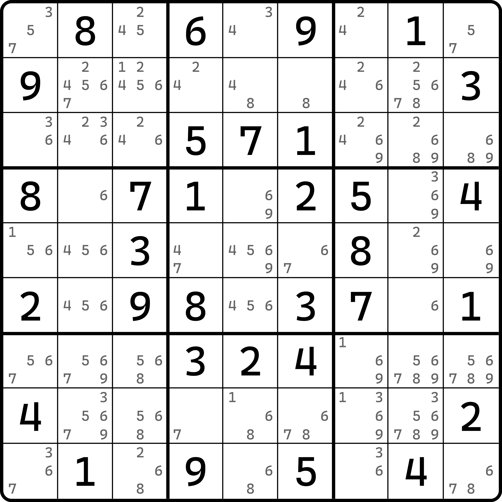
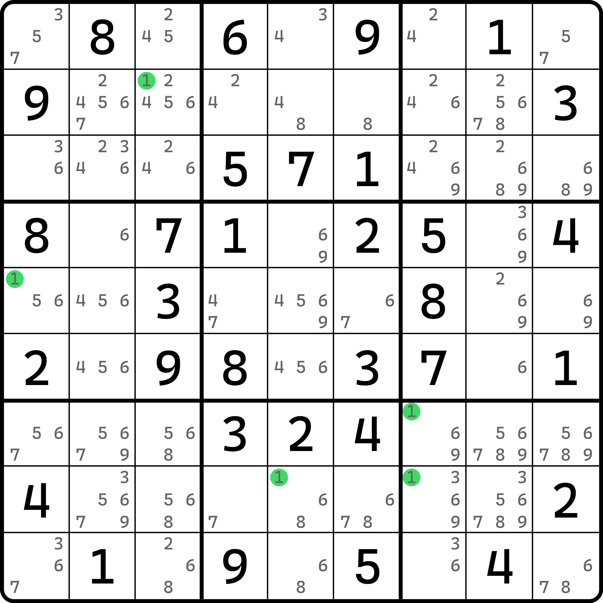
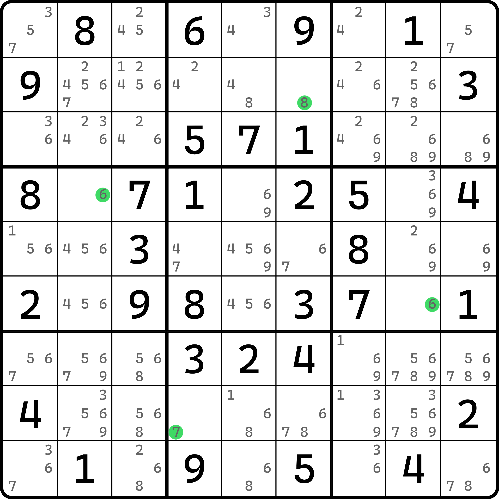
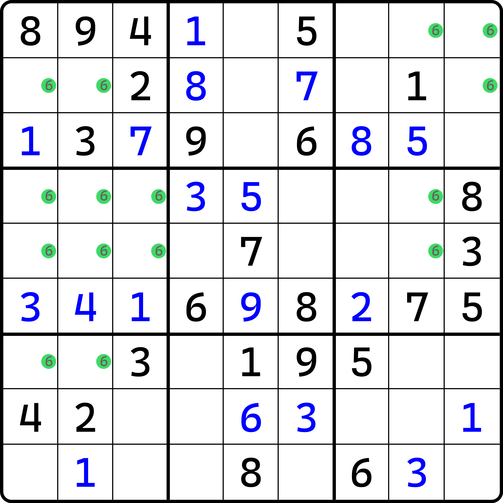
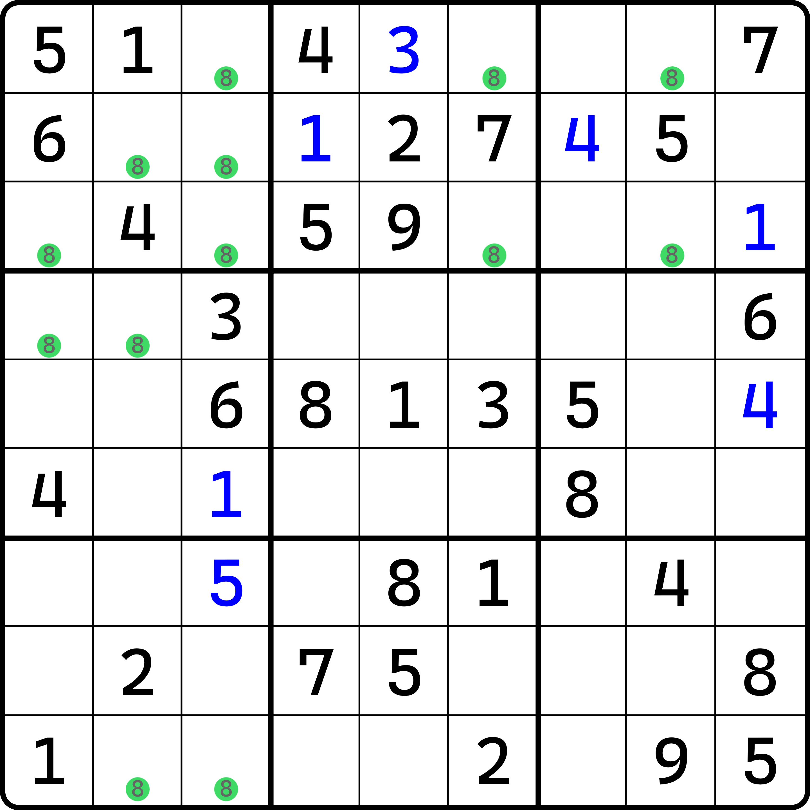
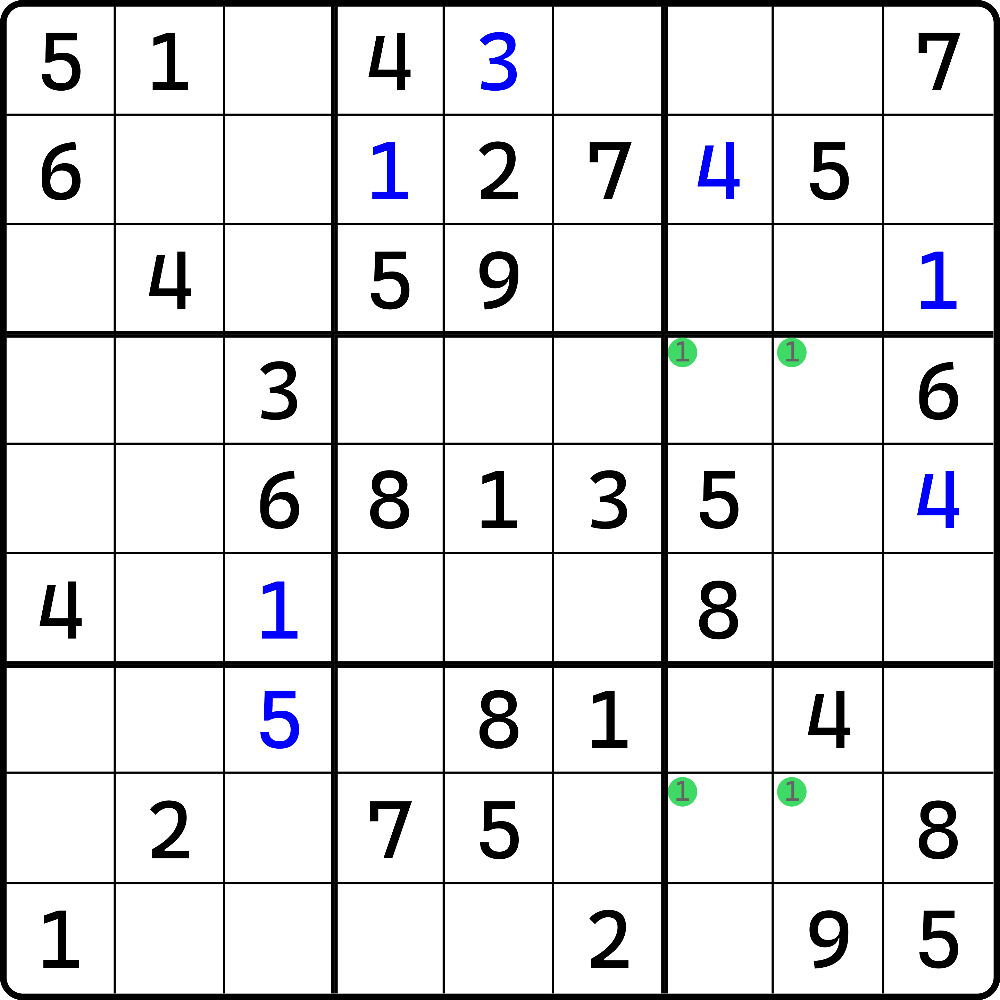
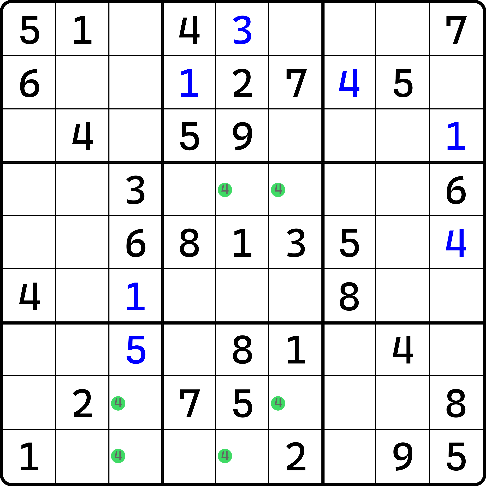
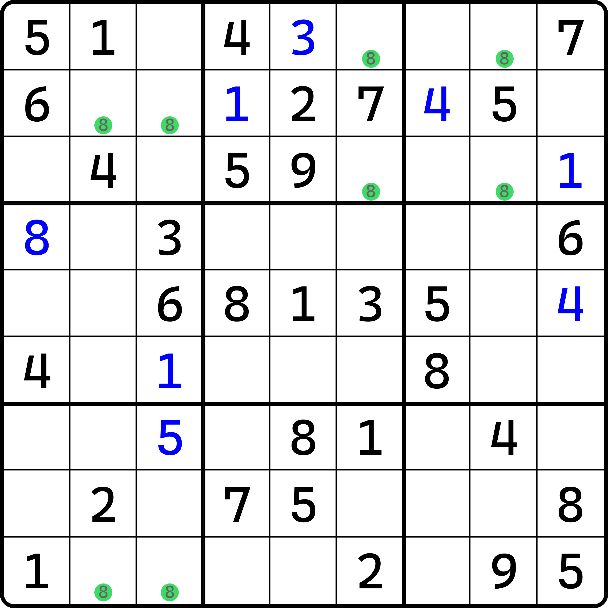
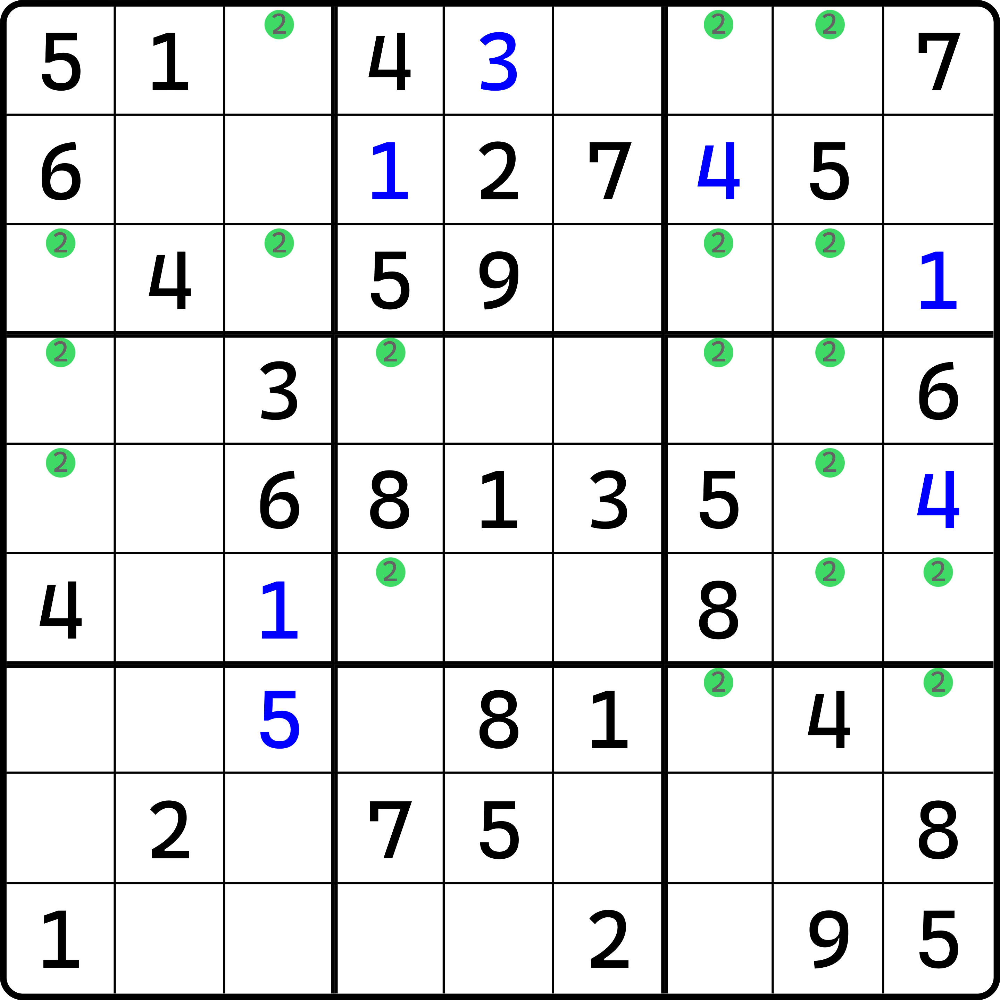

# 笔记的概念

下面我们来看如何快速确定数字是否存在可用填数位置的办法。

## 笔记的概念 

现如今电子产品越来越多，玩家更多会采用手机、iOS 等设备使用数独相关 app 游玩数独的游戏。主流的一些数独产品里会提及一种全新的概念。这个概念在早期尚未让数独游戏在电子设备上风靡的时期是没有的。

当用户在使用 app 的时候，按钮里多数会提供一个功能，它可以快速让我们进入到候选数的状态，即前面看到的全盘都有候选数的这个状态。这个功能在应用端一般称为**一键笔记**或**自动笔记**（Auto Notes）。其**笔记**（Note）的概念需要我着重说明一下。

所谓笔记，指的是玩家可操作的候选数单位。是的，它就是候选数，不过是从行为上判断的。当我们在一个直观的盘面上找一些辅助技巧（如我们需要区块排除，此时可能会依赖于区块）的时候，我们方便之后的步骤可能继续使用该位置的结构，我们可能会临时作出标记，避免遗忘。所谓的笔记，就是你往盘面里填充的候选数。它是一点一点往上标的，所以才称为笔记，因为它就跟笔记一样是一点一点写的。

虽然笔记也可能全盘标记，但我们仍然将其称作笔记而非候选数，并不是因为它不是候选数，而是因为它这种行为是我们所需要强调的。

## 全笔记盘面的快速定位 

当你标记了笔记后，你看到的盘面可能是这样的：

<figure><figcaption>
全盘笔记后的样貌
</figcaption></figure>

如图所示。针对于这种盘面，我们一般会有如下两种直观技巧可用。

### 隐性唯一（排除） 

为了强调，我按照数独 app 的习惯展示数字的高亮效果：

<figure><figcaption>
隐性唯一
</figcaption></figure>

如图所示。我们会显然发现，`b1` 和 `b4` 的高亮非常“稀疏”。对于 `b1` 而言，很显然我们知道的是，数字 1 能填入的位置就只有 `r2c3` 这一个位置。那么自然结论就很明显了，它就是必须填 1 的，否则 1 就没位置填了。因此，`r2c3 = 1` 就直接可以得到。

从直观的角度来看，这其实就是一个很简单的排除，而且是宫排除（毕竟 1 是在 `b1` 这个宫内出的）；但在笔记标满了的情况下，玩家可能不会按提示数 1 去找排除项，所以这个 1 的本质定位是依赖的“宫内就这一个高亮位置”的思维方式上的。这个逻辑我们在数独里也有名字，叫**隐性唯一**（Hidden Single）。隐性唯一和隐性数组的取名是一致的，因为它在笔记全开的情况下确实是隐藏在盘面之中。虽然隐性唯一本身比隐性数对、隐性三数组这些情况更容易看到，但客观事实是，它确实是藏在盘面里的，你必须要先聚焦于某个行列宫里，确保它真的只有一处可填位置，那么它才能是结论。

哦对，`r7c7 = 1` 可以通过 `r7` 得到隐性唯一的结论。所以，隐性唯一并非只会发生在宫里，只是说宫内的隐性唯一最好定位到。

### 显性唯一（唯一余数） 

**显性唯一**（Naked Single）就更轻松了。恰好和前一节的内容匹配，显性唯一其实就是唯一余数。只是说，唯一余数看的更侧重于直观，即利用提示数和自己填入的数字来进行推导，但如果你已经笔记标满了，那就大胆一点。

<figure><figcaption>
显性唯一
</figcaption></figure>

如图所示。这四个单元格刚好只有唯一的一个笔记。如果你的笔记是确实标全了，那么这四个位置的唯一可填数字必然是这四个单元格的结论。

## 区块定位 

### 宫区块定位 

我们换一个题。这次尝试一下给各位不展示其他数字的笔记。

当我们要定位区块的时候，我们只需要找到这个区块的笔记位置，然后确保它能够按前一节描述的那样形成区块即可。

<figure><figcaption>
区块定位
</figcaption></figure>

如图所示。当我们知晓数字 6 的所有可填位置有这些时，那么我们必须要形成一个意识和快速判断的方式：很明显，`r1c8` 和 `r2c9` 是不能填 6 的。

这个思路依赖于宫区块的特性——宫内得到只能在同一个行/列上填数。显然，`b1` 就能够形成非常清晰的、数字 6 的区块。同理，`b6` 也是如此。

当我们快速得到这两个区块后，我们自然会有一个结论：`b3` 里填 6 的位置就只有右上角这个 `r1c9` 了。这便是区块技巧的定位的方式。

### 行列区块定位 

<figure><figcaption>
行列区块定位
</figcaption></figure>

如图所示。很显然，行列区块就没那么好看了。

这个题里数字 8 就藏了一个行列区块在里面。在哪里呢？`r2` 上。我们只需要确保数字 8 在某个行列上只会出现在同一个宫里就行。也就是反过来看。很显然，数字 8 在 `r2` 上就是行区块。

那么受影响的位置呢？显然就是图里的 `r1c3` 和 `r3c13` 了。这些位置不能填 8。接着呢？接着我们可以用一下前面组合区块的内容：因为 `b19` 里 8 此时已经形成了组合区块，所以 `r4c2 <> 8`，于是 `b4` 就可以填出数字 8 的确切位置了：`r4c1 = 8`。是不是很巧妙？

当然了，打一开始 `r2` 形成区块之前，8 就客观存在组合区块的技巧，因为它不受 `r1c3`、`r3c13` 这三个单元格删除 8 的影响。而且，就算行区块有了之后，删除 8 的情况后，`c1` 上就有了隐性唯一。不过，从初学的角度而言，我个人并不认为玩家可以立刻看见 `r2` 的行区块和出了区块结论之后得到的这个隐性唯一。可能更多的玩家会按部就班地进行区块删数，然后组合区块删数，然后出数的三步流程，毕竟，除了第一步的行区块确实比较困难以外，组合区块和最后 `b4` 里出 1 的隐性唯一的这个做法确实都只依赖于宫这种区域类型，它比较容易看见。

不管怎么说，无论你使用哪一种思路，行列区块的定位就是这样，只需要将宫区块的逻辑反过来找就行了。

## 循环态的概念 

既然你习惯了笔记的内容，那么这里不得不为各位介绍一下数字是否还存在前文所描述的结论的办法。

<figure><figcaption>
循环态介绍
</figcaption></figure>

如图所示。这还是刚才那个题，不过我换了一个数字高亮呈现。很显然，数字 1 此时一定存在两种填法：

* `r4c7` 和 `r8c8` 填 1；
* `r4c8` 和 `r8c7` 填 1。

这两种情况似乎填哪种都不会影响后续填数的逻辑。换言之，我们没有任何办法可以立刻判断出来这两种填法哪一种正确。我们把这种 1 的摆放效果称为**循环态**（Cycling Pattern）。

对于这种循环态，我们是具有一些快速判断的办法的。只要一个数字的所有摆放位置形成了循环态，那么我们就可以认为这个数字目前不能有结论，于是我们需要跳转到别的数字再看。

很显然，上面的例子里数字 1 是形成了一个可置换的情况的。但是，这种可置换的情况看起来还比较简单，所以不费吹灰之力我们就可以知道它不能填数；不过更多的时候它不会这样。

<figure><figcaption>
数字 4 的循环态
</figcaption></figure>

如图所示。同一个题里的数字 4 也是循环的。它和数字 1 的循环态的区别只在它多用了一个宫——数字 4 用了三个宫。不过，把 4 提取出来就可以发现，每一行、每一列和每一个宫都有两个可以填充的摆放位置，我们显然无法正确定位它的具体填法，所以它也是循环态。

<figure><figcaption>
数字 8 的循环态
</figcaption></figure>

如图所示。这种也属于循环态。看起来分配的位置有很多（足足 8 个可填位置），但实际上是俩独立的组合区块。这很显然无法造成可用结论。

<figure><figcaption>
数字 2 不是循环态
</figcaption></figure>

如图所示。数字 2 就不是循环态。这看起来非常复杂，不过没事，本身也确实有问题。可以看到 `b4` 明显形成了区块，所以至少可以去掉 `r3c1(2)` 这个情况。

不过余下的结构是否是循环态，我们还需要更为复杂的讨论。按照循环态的标准定义规则，它其实是满足的，它内部无法继续确保合理的填数具体是哪个组合。但是，我更建议大家在做题的时候，先确保其他数字的、关于前面介绍过的基础技巧都用完了，确实用无可用时，再来看这种结构。

循环态的用法并非想强调定义是如何的，而是希望各位看到它的时候能有个意识，认为它无法有结论，进而快速跳过此数，以节省做题时间。
