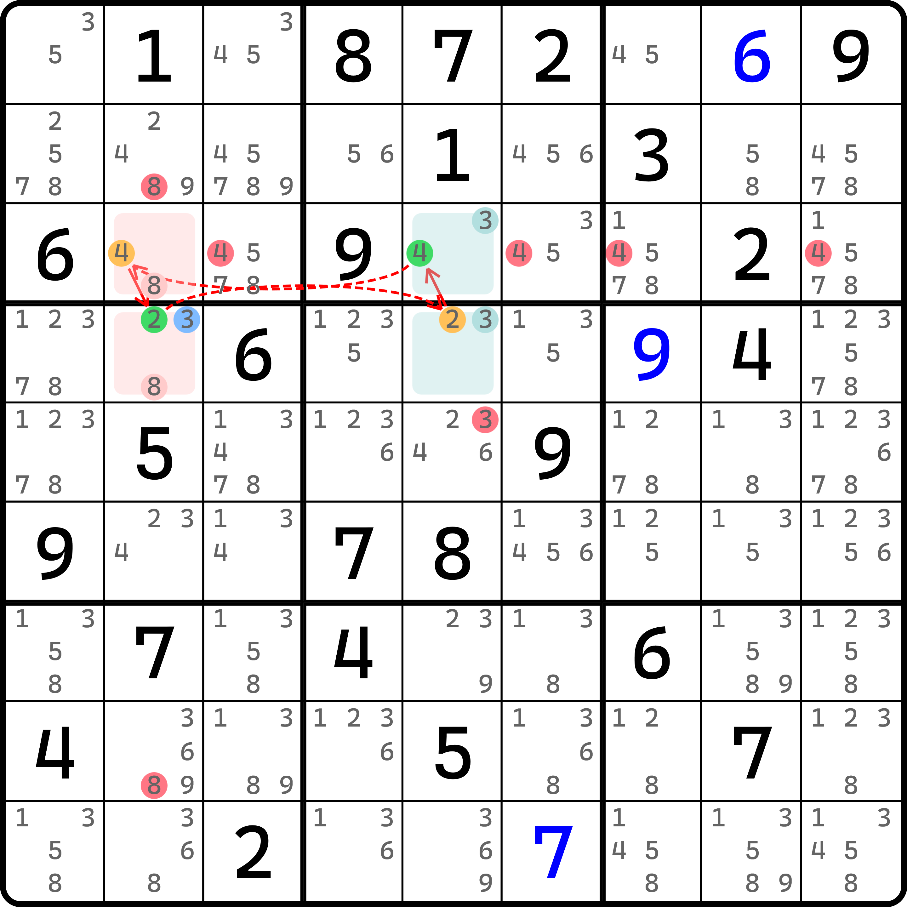
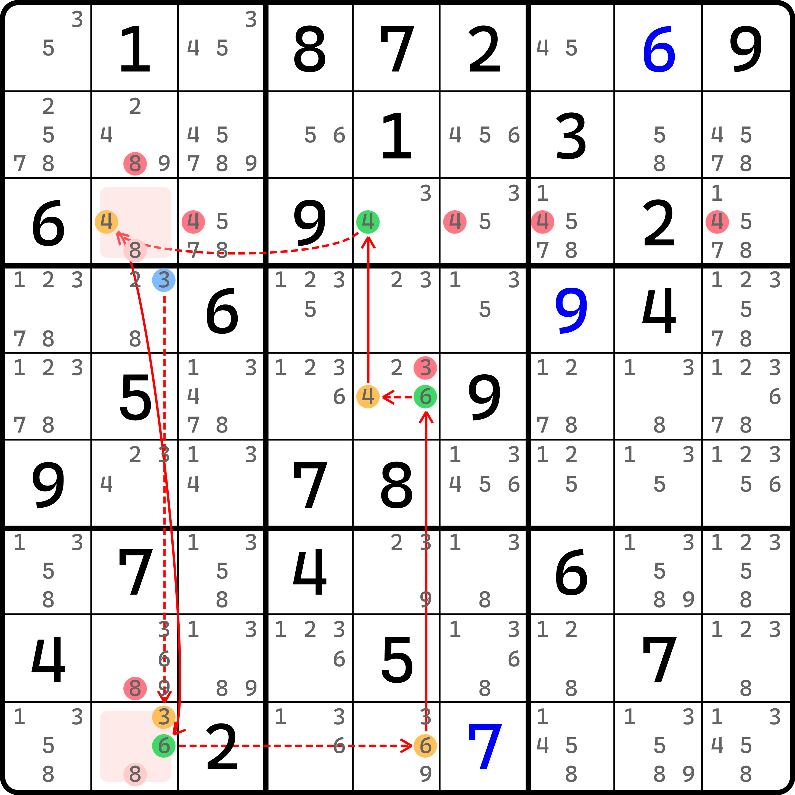
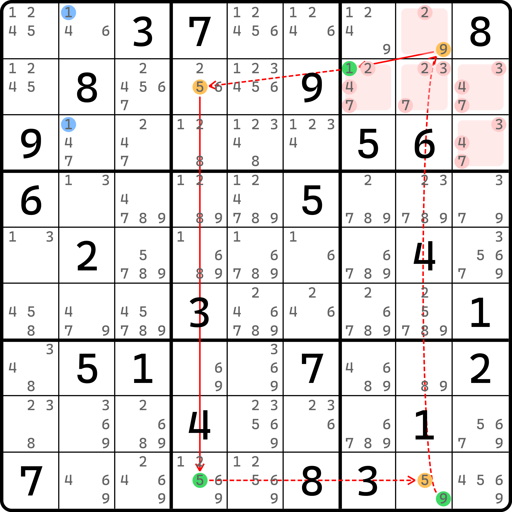
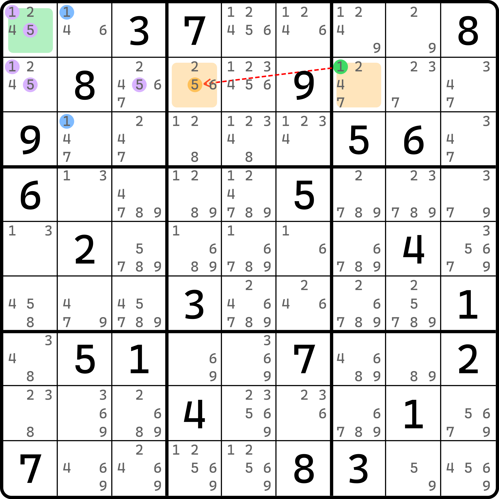
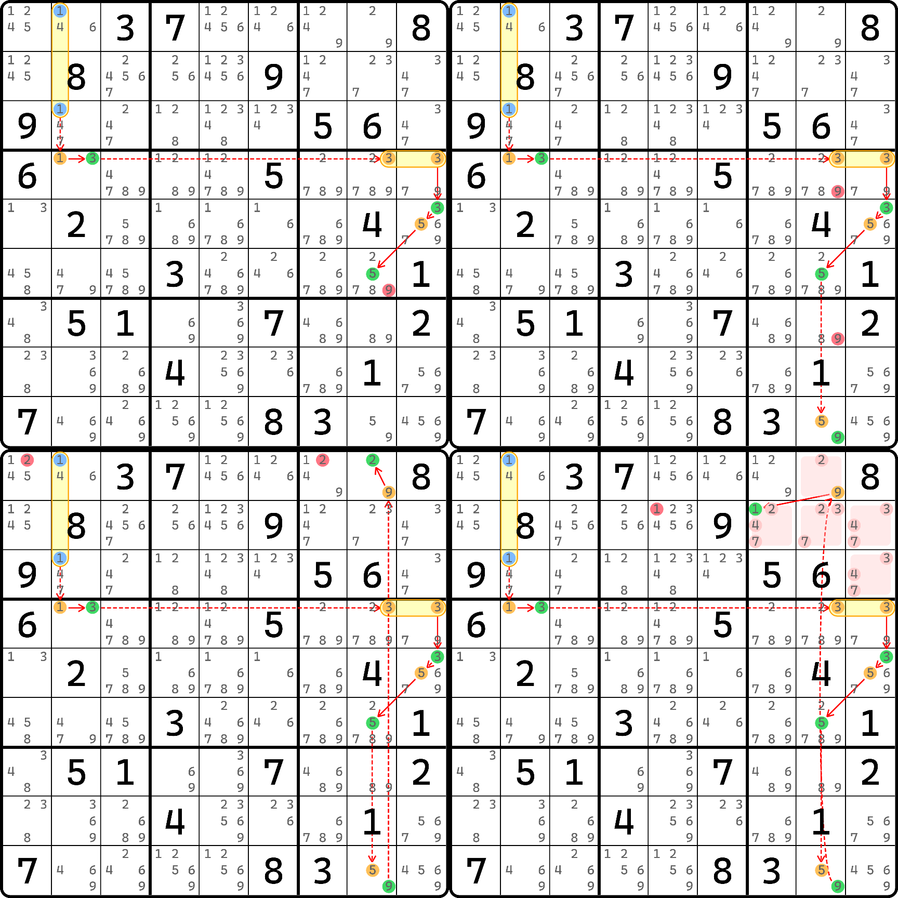
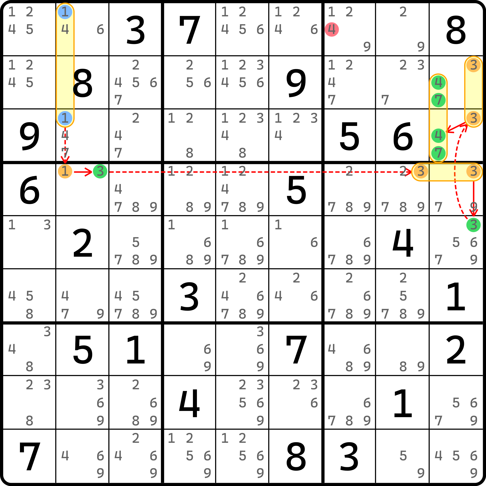
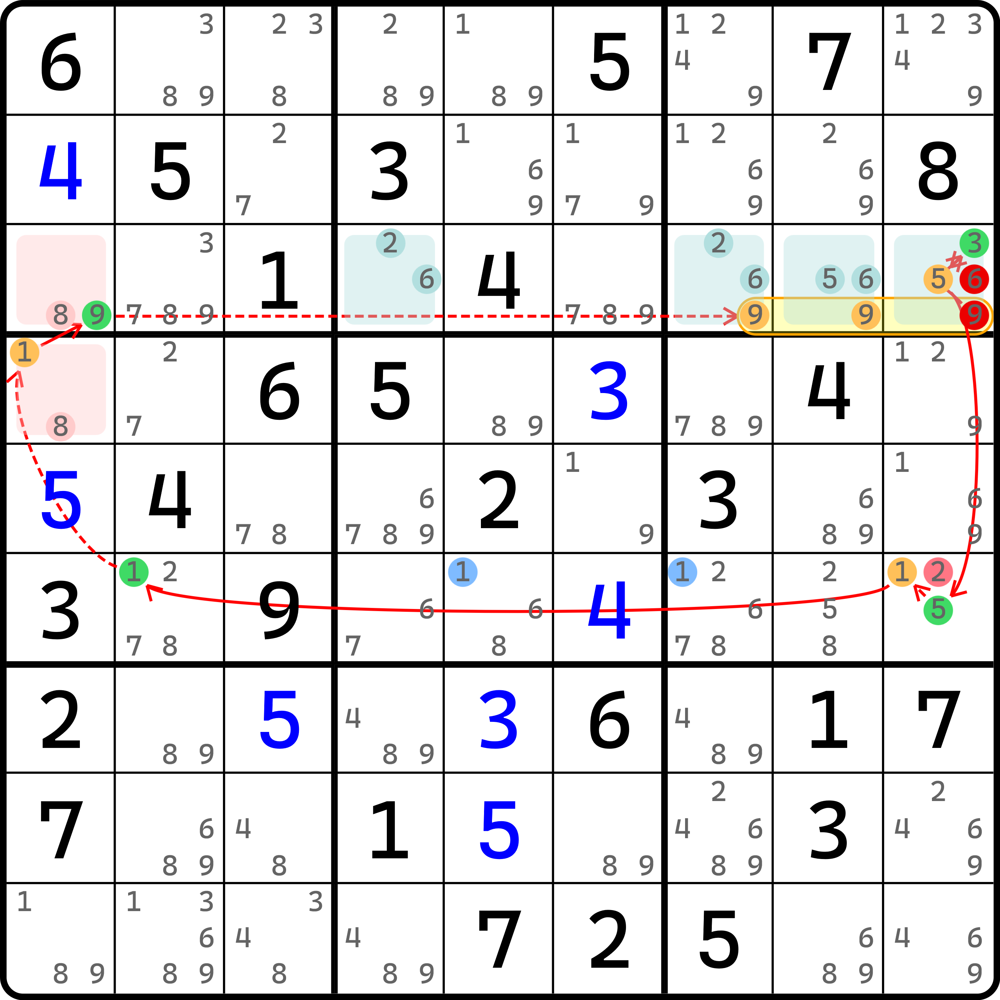
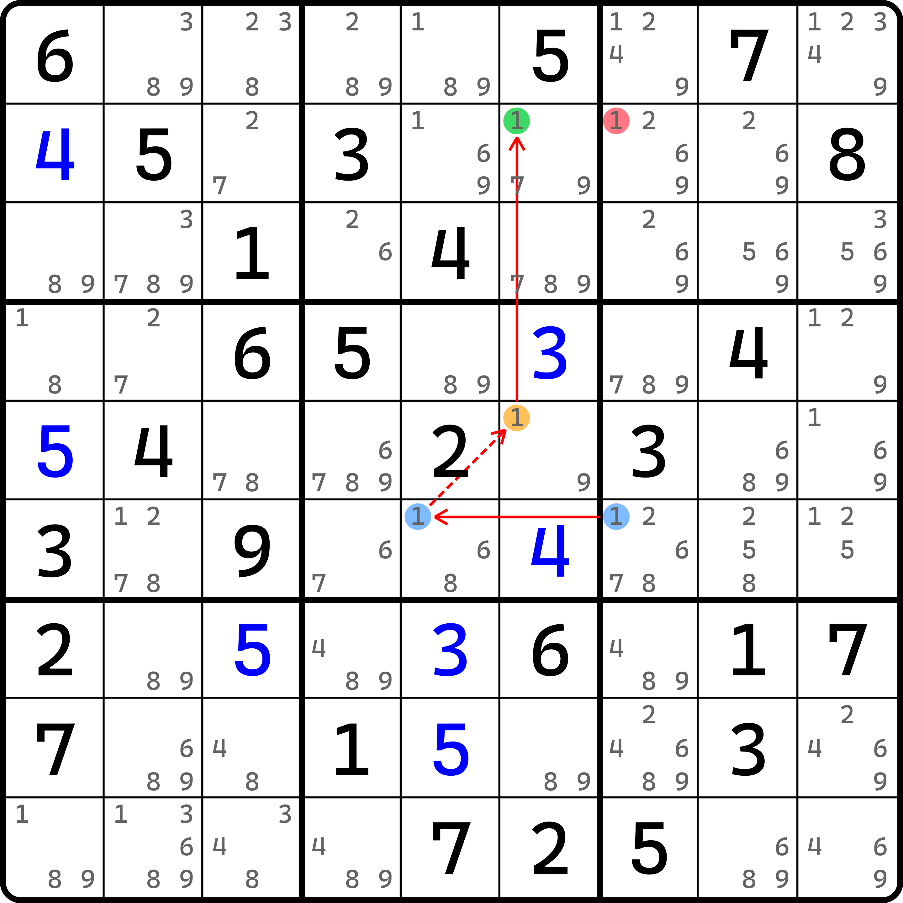
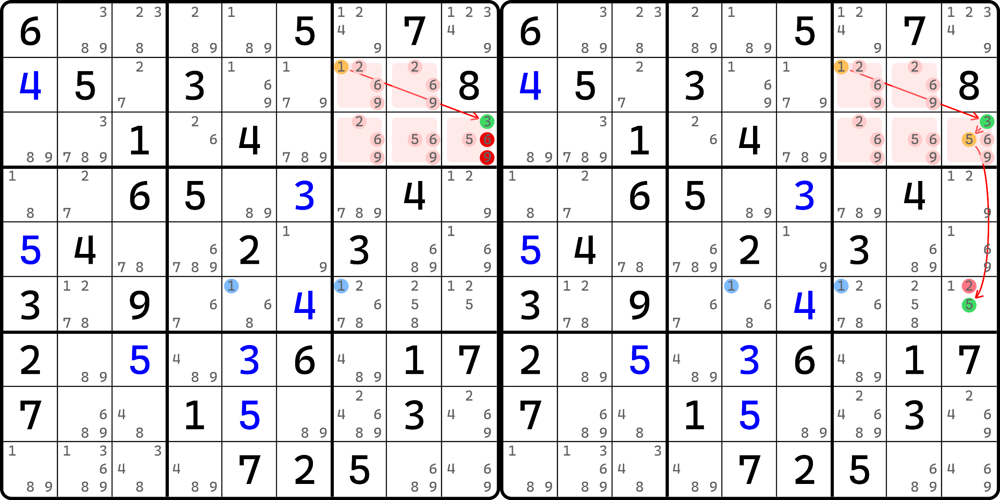

# 毛刺环和毛边环

前面我们花了几篇内容介绍了基础的毛刺和毛边的用法。下面我们来补充几个带环的例子。之前毛刺和毛边的技巧命名已经提过，毛刺和毛边技巧搭配的结构是看当毛刺均为假时才会产生的结构，把他称为毛刺的对应技巧。下面我们来看，毛刺环和毛边环（毛刺为假时会有环）的一些使用方式。

## 例子 1：毛刺 ALS-XZ 环 <a href="#example-1" id="example-1"></a>

让我们从一个轻松写意的毛刺环出发，学习今天的内容。

<figure><figcaption><p>毛刺 r4c2(3) 为假有 ALS-XZ 环</p></figcaption></figure>

如图所示。当 `r4c2(3)` 作为毛刺来看的话，需要讨论真假性。

如果它为假，那么我们可以找到一个双严格共享候选数的待定数组 XZ 技巧（再不说这名字都快忘了）。因为有这么个技巧，所以所有弱链可以删数，所有待定数组用到的其他数字也均可以用于删数（视为数组），所以可以找到很多删数。

> 图中标注的是其中一部分删数，因为这些删数仍然可以用在毛刺真时作为删数出现，所以其他的就不展示了。

<figure><figcaption><p>毛刺 r4c2(3) 为真时有连续环</p></figcaption></figure>

如图所示。当毛刺 `r4c2(3)` 为真的时候，我们可以得到 `r9c2 <> 3`（直接排除），于是就有了图中这个连续环（因为 `r9c2(3)` 不存在之后，`r39c2` 就构成了一个待定数组，于是就有 `4r3c2=6r9c2` 的强链关系了）。

因为两种情况的删数我们需要用于取交集，而对于毛刺真的情况也可以删除上一幅图里给的那些，所以这个题的删数就是这一些了。

## 例子 2：毛刺欠一数对构造环 <a href="#example-2" id="example-2"></a>

这是一个复杂的例子。下面我们逐步拆解介绍，避免你看不懂这个例子。

### 毛刺为假的情况 <a href="#when-burrs-are-false" id="when-burrs-are-false"></a>

<figure><figcaption><p>毛刺 r13c2(1) 为假时的欠一数对构造环</p></figcaption></figure>

如图所示。假设此时我们将 `r13c2(1)` 视为毛刺，那么我们可假设他们为假后构成这个连续环。这个构造的连续环比较难以理解的地方只有构造出来的弱链关系 `1r2c7-5r2c4`。这个需要借助的是欠一数对。

<figure><figcaption><p>弱链同真时欠一数对矛盾</p></figcaption></figure>

如图所示。当我们尝试假设这两个候选数同真时，由于我们尝试假设了毛刺 `r13c2(1)` 为假，所以 `b1` 的 1 和 5 无法合理地放进去，因为 1 和 5 均作排除后都只能填在 `r1c1` 里，但一个单元格不可能填两个数，所以矛盾了。

> 什么？你问我这为什么是欠一数对？来人，这有一个跳着学的人，把他拖回去重新学！

顺带一说，这个图我忘了标删数了，但是因为制图太过麻烦所以这里就不改了。不过你可以先自己思考一下这个毛刺为假构成的这个连续环都能删除哪些数字。请自己思考一下再看后面的内容，因为后面展示的毛刺为真产生的删数会“剧透”给你删数的具体位置。

### 毛刺为真的情况 <a href="#when-burrs-are-true" id="when-burrs-are-true"></a>

下面我们来看毛刺为真的情况。这个题毛刺为真会稍微复杂一些。

<figure><figcaption><p>毛刺为真引发的延伸的线路 1</p></figcaption></figure>

如图所示。我们从毛刺 `r13c2(1)` 为真进行出发，当走到 `r5c9(3)` 的时候此候选数为真。这里我们就有两个走向了。上面展示的四个不同情况而造成的删数是其中第一个走向。

之前我们提到过，我们要找的删数是取毛刺真和假两种情况均可删的候选数。而这个题比较奇特的点在于，毛刺为假的那个环删数非常多，那个情况包含的一些删数在这个情况的这些走向都可以用来删，所以我为此拆了四个图给各位理解。不对，是五个图，因为这是第一个走向的四个不同删数的情况。这个走向经过 `r5c9(5)`，然后往下逐步展开延伸。

下面我们来看路径 2。

<figure><figcaption><p>毛刺为真引发的延伸的线路 2</p></figcaption></figure>

如图所示。这是第二个线路。当走到 `r5c9(3)` 为真时，我们走 `r23c9(3)` 为假的这个路径，于是可以得到 `r23c9(47)` 的毛刺显性数对为真。

所以，整合毛刺为真的情况，我们会连续得出 7 个删数。这 7 个删数全部是毛刺为假那个欠一数对构造环里可以删的数字，所以这个题一连可以删这 7 个。

### 为什么 r1c1(2) 和 r2c5(1) 可删？ <a href="#why-2r1c1-and-1r2c5-can-be-removed" id="why-2r1c1-and-1r2c5-can-be-removed"></a>

下面我们回到欠一数对构造环。我知道你肯定有两个删数理解不了。就是 `r1c1(2)` 和 `r2c5(1)`。这个删数在毛刺为真的时候可以轻松删除，但毛刺为假的这个连续环似乎并没有走到这里，为什么这俩也能删呢？

我记得我在讲环的时候说过一点。欠一数对其实是一个区块环的结构。这里欠一数对的完整连接方式被我们省略了（我们只保留了图中的异数弱链关系），所以才导致看不懂的。其实他的完整走法是这样的：

<figure><figcaption><p>弱链关系可以这么展开</p></figcaption></figure>

如图所示。当这么展开后我们就知道弱链多出来了哪里：`r1c1(1)` 此时为真，所以 `r1c1(5)` 为假，所以弱链关系经过了 `r1c1`；而 `r2c7(1)` 为真时，可以得到 `r2c1(1)` 为假，所以弱链关系用到了 `r2`。这便是为什么删数多了两个看起来不太好懂的地方。

当然了，如果你非要使用欠一数对的视角来看也可以知道为什么能删它俩，因为 1 和 5 不同真，而嵌入环之中值得保证两端只有一端为真（一真一假），所以讨论一下：

* 如果 `r2c7 = 1`，则 `r1c1` 填 1，可删 `r1c1(2)` 和 `r2c5(1)`；
* 如果 `r2c4 = 5`，则 `r1c1` 填 5、`r2c1` 填 1，此时也可以删除 `r1c1(2)` 和 `r2c5(1)`。

不管你怎么理解吧，总之肯定是可以删除的。

## 例子 3：毛边区块连续环 <a href="#example-3" id="example-3"></a>

看够了两个毛刺环，现在我们来看毛边环。

<figure><figcaption><p>毛刺 r6c57(1) 为假时有区块连续环</p></figcaption></figure>

如图所示，可以看到，如果假设毛刺 `r6c57(1)` 为假时，可以构造出一个区块连续环的结构。可以删的数字有很多，图中标注的是可以用于整题结论的数字。

需要注意的是，`b3` 这几个标注了颜色的格子看起来稍微有点绕，先是进来到 `r3c789(9)` 为假，所以根据 `r3c4789` 的待定数组可得 `r3c9(3)` 为真。然后利用单元格内弱链的特性得到 `r3c9(5)` 为假，然后继续走 `r6c9(5)` 为真，这么从 `b3` 出去的。

当毛刺不同假的时候，我们可以构造强链毛边关系，于是就有这么个双线风筝：

<figure><figcaption><p>毛刺不同假时得到的强毛边双线风筝</p></figcaption></figure>

如图所示。此时可以得到 `r2c7(1)` 为假。

<figure><figcaption><p>延伸 r2c7(1) 可得到的删数</p></figcaption></figure>

如图所示。当我们认定 `r2c7(1)` 后，因为不能得到前面给的那些删数，所以需要延长。

当 `r2c7(1)` 为假时可得 `r3c9(3)` 为真，这里是借用的 `r2c78` 和 `r3c789` 的待定数组得到的。然后因为 `r3c9(3)` 为真，自然同一个单元格里就不能填别的数了，所以 `r3c9(69)` 为假（删数）；与此同时，因为 `r3c9(5)` 为假，所以我们可以走出 `b3`，然后到 `r6c9(5)` 为真，于是 `r6c9(2)` 也为假（删数）。

所以这三个候选数删数逻辑均可得到。

## 结构节点的真假性讨论 <a href="#how-to-determine-whether-a-pattern-node-is-true" id="how-to-determine-whether-a-pattern-node-is-true"></a>

### 何为结构节点为真或为假？ <a href="#what-is-state-of-a-pattern-node" id="what-is-state-of-a-pattern-node"></a>

前面的内容里我们已经完整介绍了毛刺和毛边的几乎所有内容，下一节会开始讲这个思路的诞生历史以及命名上的一些内容。为了衔接之后的一些内容，这里需要补充一个非常重要的点。**结构节点**（Pattern Node）。结构节点是区块节点的延伸，而对于待定数组这种情况，就不属于结构节点，仅属于区块节点。

那么什么是结构节点呢？结构节点指的是，将一些数独技巧直接纳入链的推理，并且自身会参与真假性假设（成立或不成立），强行产生的一种节点类型。

举个例子。我们拿之前的毛刺例子来说。

<figure><figcaption><p>毛刺 r6c9(6) 为假</p></figcaption></figure>

如图所示。这是毛刺为假的情况。

<figure><figcaption><p>毛刺 r6c9(6) 为真</p></figcaption></figure>

如图所示。这是毛刺为真的情况。

这个例子是提取自之前毛刺 XYZ 半环。那个例子里，我们是按毛刺分开看的视角。如果我们想要强行将其改造为一条早期学到的普通链的话，那么我们就需要将这个 XYZ 半环作为一整个节点纳入推理过程，于是这个链的写法就变为了这样：

```
145r6c69|r8c9|r9c67=6r6c9-(6=4)r6c7
```

图我就不重复做了，因为就是把前面的链给并到一个图里而已。大概就是想表示，当 XYZ 半环整体纳入之后，就是它自己和毛刺 `r6c9(6)` 形成强链关系。

说一下这个的意思。当我们强行将 XYZ 半环作为一个节点看待时，此时它是不包含毛刺 `r6c9(6)` 的。或者当它不存在于结构之中。虽然它客观成立，但是我们为了让推理可以进行，强行拆成了毛刺和结构本体两部分来看。那么，起头的这个强链关系就意味着 XYZ 半环和它的毛刺 `r6c9(6)` 不同假。

什么叫不同假呢？XYZ 半环是个结构，我们认定它的真假性为成立或者不成立。也就是说，一个技巧成立，那么它作为链的节点时就认为是为真的；反之，如果一个技巧结构不成立，那么它相应地就会被视为为假的状态。

为真很好理解，就是毛刺不存在的时候结构合法呗。那么什么叫结构为假呢？结构为假的意思大多数时候指的是结构不可稳定存在，比如外来的一个或一些候选数的填写，或者是结构内部的一个或一些候选数凭空消失后，造成结构无法稳定成立的状态。比如说这个 XYZ 半环，要让其成立，那么 XYZ-Wing 的部分和强链的部分就都不可少；如果我们用了特殊办法将其中的单元格给填上了其他数字（比如这个例子 `r6c9` 填了 6 之后，就再也拿不出合理的 XYZ-Wing 结构形成了），那么 XYZ 半环无论如何都无法再成立了，此时我们就称为这个技巧结构不成立（为假）。

那么这么去想的话，那么毛刺显然就和结构本体是强链关系了，因为当毛刺为假时，结构直接就成立了（因为少了毛刺之后，结构必需的部件全部齐全，所以结构此时会客观成立），所以结构直接为真，因此我们就认为是这个毛刺和结构本体形成强链关系。

换言之，借用逆否命题将链路反转，当 XYZ 半环不成立（为假时），就必须有毛刺 `r6c9(6)` 为真，因为它是唯一一个在这个题里可以破坏结构、使其不成立的地方。所以它必须此时为真，XYZ 半环才会被破坏，所以我们把这种现象称为为假，仍然可以知道毛刺此时为真，故仍然是强链关系。

### 结构节点如何看删数？ <a href="#how-to-find-eliminations-from-a-pattern-node" id="how-to-find-eliminations-from-a-pattern-node"></a>

那么结构节点的删数怎么看呢？所谓的看链的两头的删数的交集，当一个节点为真时可以造成的删数，就是节点的删数（这不废话吗）。

当如果一个节点为区块节点时，我们需要考虑的地方只有一个：它的删数是什么。当结构作为节点的时候其实和它在普通情况下完全一样，也是视为普通的结构，然后去找删数就行。比如 XYZ 半环的删数包含这个题里的 `r6c1(4)`，那么它就是链头可以造成的删数（的一部分）；而链尾是 `r6c7(4)`，所以造成的删数则是整个行列宫以外其他位置的候选数 4。

这么看的话，其实找交集就行。对于这个题而言，你可以认为是两个节点自己删数的候选数集合的交集，你也可以稍微认为是这个 `r6c7(4)` 和 `r6c69(4)` 可以用于删数的交集。为什么是 `r6c69(4)`？因为 XYZ 半环可以删数，还能被链尾所看见的删数，要用到的结构的数字就是这两个。

所以，这里我们就可以得到两个说法：

* **结构节点和它可造成的删数形成弱链关系**；
* **结构节点和它的毛刺形成强链关系**。

这两点足以胜任几乎所有的场景。虽然说起来很轻松，但是还是需要你自己知道为什么。

### 结构节点远比你想象得要复杂 <a href="#extra-consideration-on-pattern-nodes" id="extra-consideration-on-pattern-nodes"></a>

实际上，结构节点远比你想象得要复杂。对于前面的例子来说，我们其实就是把技巧直接纳入推理。但是对于毛刺环和毛边环而言，非要强行纳入推理的话，也不是不行，但需要注意的一点是，它此时的结构节点就是一个真正的环。换言之就是，毛刺环其实等于说是一个**结构链**（Patterned Chain），即带结构节点的链，而结构节点自身是一个环。

不信你可以细细揣摩一下我这句话想表达的意思。环为假时有毛刺为真（或者倒过来，毛刺为假时环为真）。是不是细思极恐？
