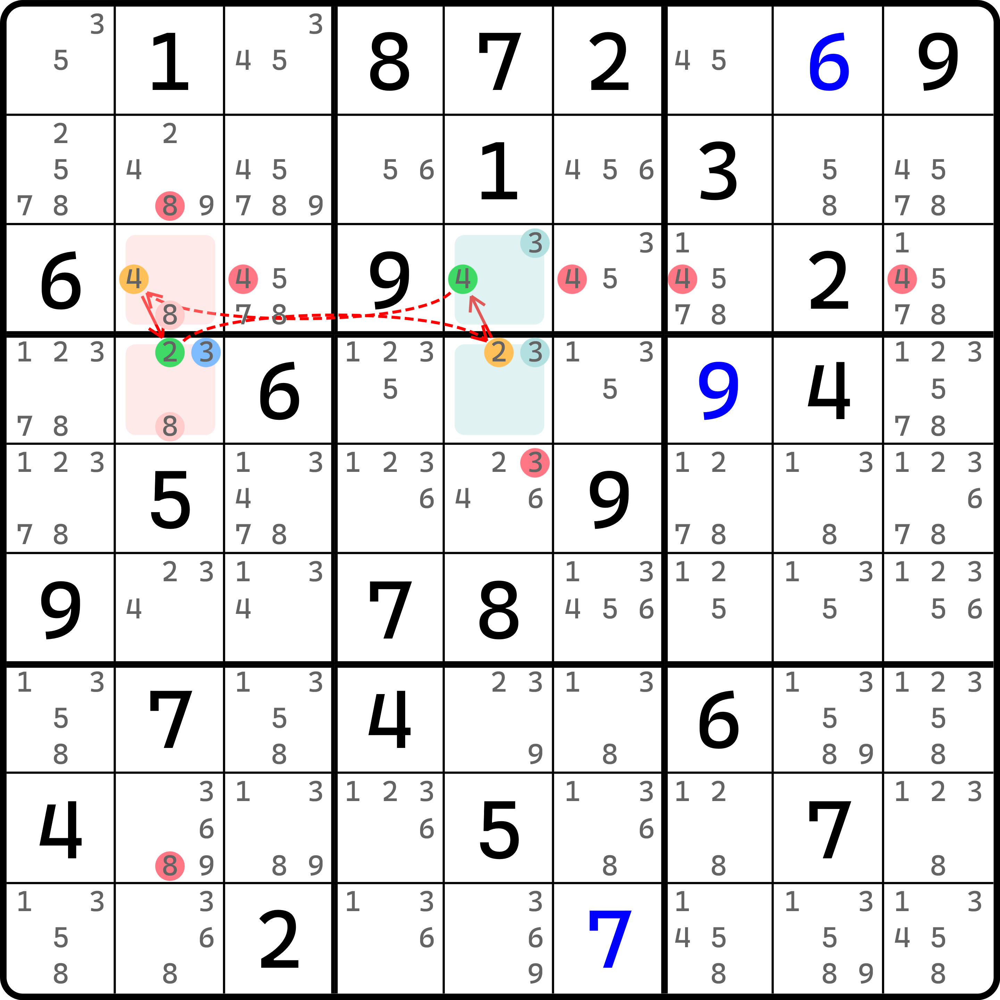
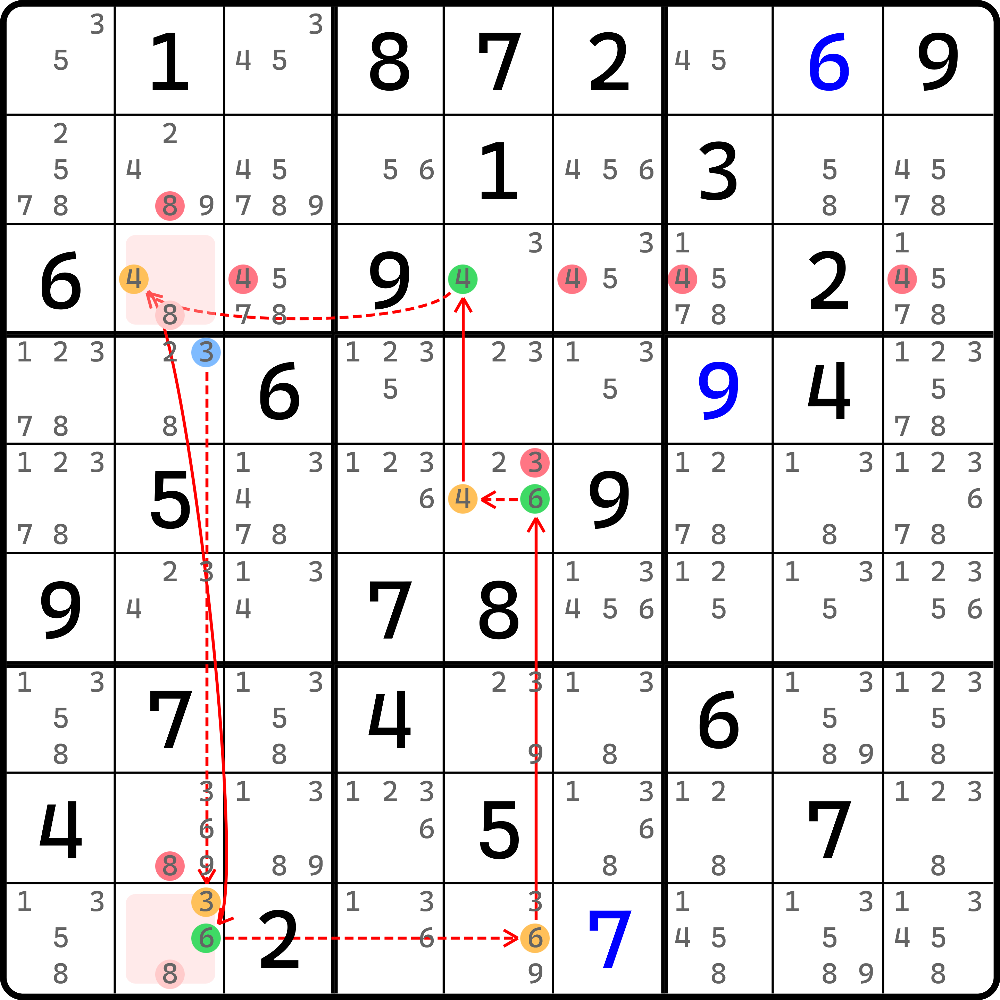
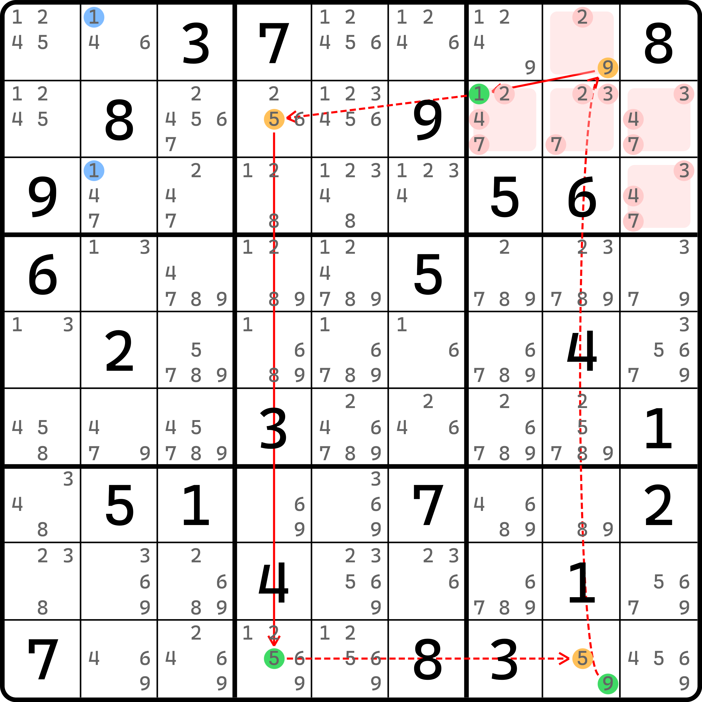
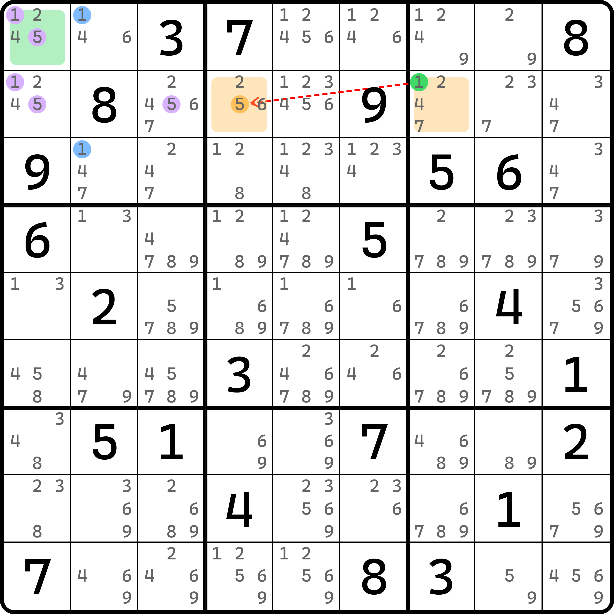
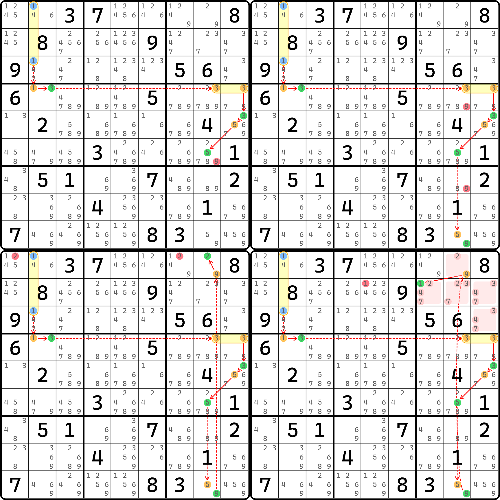
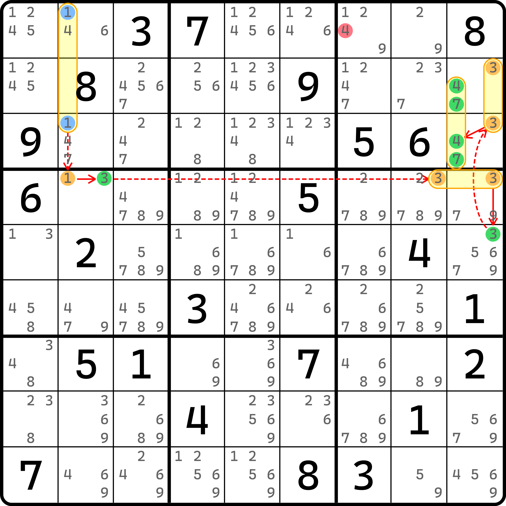
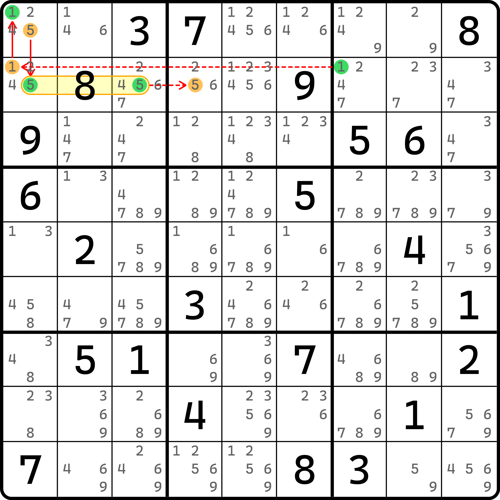

# 环里使用毛刺的情况

前面我们花了几篇内容介绍了基础的毛刺和毛边的用法。下面我们来补充两个例子，使用环的毛刺的情况。

## 例子 1：毛刺 ALS-XZ 环 

让我们从一个轻松写意的技巧出发，学习今天的内容。

<figure><figcaption>
毛刺 r4c2(3) 为假有 ALS-XZ 环
</figcaption></figure>

如图所示。当 `r4c2(3)` 作为毛刺来看的话，需要讨论真假性。

如果它为假，那么我们可以找到一个双严格共享候选数的待定数组 XZ 技巧（再不说这名字都快忘了）。因为有这么个技巧，所以所有弱链可以删数，所有待定数组用到的其他数字也均可以用于删数（视为数组），所以可以找到很多删数。

> 图中标注的是其中一部分删数，因为这些删数仍然可以用在毛刺真时作为删数出现，所以其他的就不展示了。

<figure><figcaption>
毛刺 r4c2(3) 为真时有连续环
</figcaption></figure>

如图所示。当毛刺 `r4c2(3)` 为真的时候，我们可以得到 `r9c2 <> 3`（直接排除），于是就有了图中这个连续环（因为 `r9c2(3)` 不存在之后，`r39c2` 就构成了一个待定数组，于是就有 `4r3c2=6r9c2` 的强链关系了）。

因为两种情况的删数我们需要用于取交集，而对于毛刺真的情况也可以删除上一幅图里给的那些，所以这个题的删数就是这一些了。

## 例子 2：毛刺欠一数对构造环 

这是一个复杂的例子。下面我们逐步拆解介绍，避免你看不懂这个例子。

### 毛刺为假的情况 

<figure><figcaption>
毛刺 r13c2(1) 为假时的欠一数对构造环
</figcaption></figure>

如图所示。假设此时我们将 `r13c2(1)` 视为毛刺，那么我们可假设他们为假后构成这个连续环。这个构造的连续环比较难以理解的地方只有构造出来的弱链关系 `1r2c7-5r2c4`。这个需要借助的是欠一数对。

<figure><figcaption>
弱链同真时欠一数对矛盾
</figcaption></figure>

如图所示。当我们尝试假设这两个候选数同真时，由于我们尝试假设了毛刺 `r13c2(1)` 为假，所以 `b1` 的 1 和 5 无法合理地放进去，因为 1 和 5 均作排除后都只能填在 `r1c1` 里，但一个单元格不可能填两个数，所以矛盾了。

> 什么？你问我这为什么是欠一数对？来人，这有一个跳着学的人，把他拖回去重新学！

顺带一说，这个图我忘了标删数了，但是因为制图太过麻烦所以这里就不改了。不过你可以先自己思考一下这个毛刺为假构成的这个连续环都能删除哪些数字。请自己思考一下再看后面的内容，因为后面展示的毛刺为真产生的删数会“剧透”给你删数的具体位置。

### 毛刺为真的情况 

下面我们来看毛刺为真的情况。这个题毛刺为真会稍微复杂一些。

<figure><figcaption>
毛刺为真引发的延伸的线路 1
</figcaption></figure>

如图所示。我们从毛刺 `r13c2(1)` 为真进行出发，当走到 `r5c9(3)` 的时候此候选数为真。这里我们就有两个走向了。上面展示的四个不同情况而造成的删数是其中第一个走向。

之前我们提到过，我们要找的删数是取毛刺真和假两种情况均可删的候选数。而这个题比较奇特的点在于，毛刺为假的那个环删数非常多，那个情况包含的一些删数在这个情况的这些走向都可以用来删，所以我为此拆了四个图给各位理解。不对，是五个图，因为这是第一个走向的四个不同删数的情况。这个走向经过 `r5c9(5)`，然后往下逐步展开延伸。

下面我们来看路径 2。

<figure><figcaption>
毛刺为真引发的延伸的线路 2
</figcaption></figure>

如图所示。这是第二个线路。当走到 `r5c9(3)` 为真时，我们走 `r23c9(3)` 为假的这个路径，于是可以得到 `r23c9(47)` 的毛刺显性数对为真。

所以，整合毛刺为真的情况，我们会连续得出 7 个删数。这 7 个删数全部是毛刺为假那个欠一数对构造环里可以删的数字，所以这个题一连可以删这 7 个。

### 为什么 r1c1(2) 和 r2c5(1) 可删？ 

下面我们回到欠一数对构造环。我知道你肯定有两个删数理解不了。就是 `r1c1(2)` 和 `r2c5(1)`。这个删数在毛刺为真的时候可以轻松删除，但毛刺为假的这个连续环似乎并没有走到这里，为什么这俩也能删呢？

我记得我在讲环的时候说过一点。欠一数对其实是一个区块环的结构。这里欠一数对的完整连接方式被我们省略了（我们只保留了图中的异数弱链关系），所以才导致看不懂的。其实他的完整走法是这样的：

<figure><figcaption>
弱链关系可以这么展开
</figcaption></figure>

如图所示。当这么展开后我们就知道弱链多出来了哪里：`r1c1(1)` 此时为真，所以 `r1c1(5)` 为假，所以弱链关系经过了 `r1c1`；而 `r2c7(1)` 为真时，可以得到 `r2c1(1)` 为假，所以弱链关系用到了 `r2`。这便是为什么删数多了两个看起来不太好懂的地方。

当然了，如果你非要使用欠一数对的视角来看也可以知道为什么能删它俩，因为 1 和 5 不同真，而嵌入环之中值得保证两端只有一端为真（一真一假），所以讨论一下：

* 如果 `r2c7 = 1`，则 `r1c1` 填 1，可删 `r1c1(2)` 和 `r2c5(1)`；
* 如果 `r2c4 = 5`，则 `r1c1` 填 5、`r2c1` 填 1，此时也可以删除 `r1c1(2)` 和 `r2c5(1)`。

不管你怎么理解吧，总之肯定是可以删除的。

至此，我们就把毛刺和毛边的内容全部结束了。想必你可能会问我为什么只有毛刺环而没有毛边环的内容，说实话……我已经无心制图，找毛边环的例子和作图实在是太难了，那么任务就交给各位读者朋友，希望各位能自己做题的时候灵活使用这些推理方式。

下一节的内容我们将学习的是鱼的构造。
