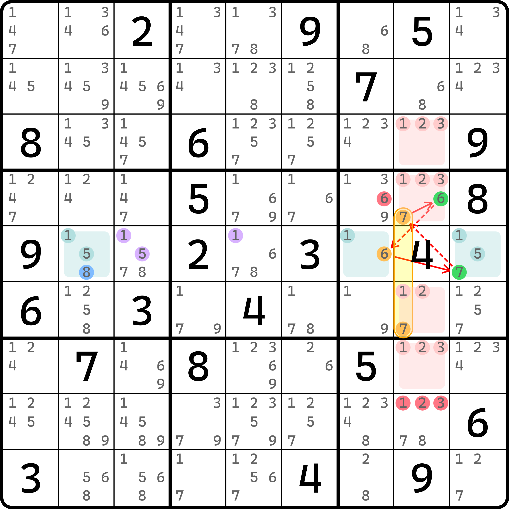
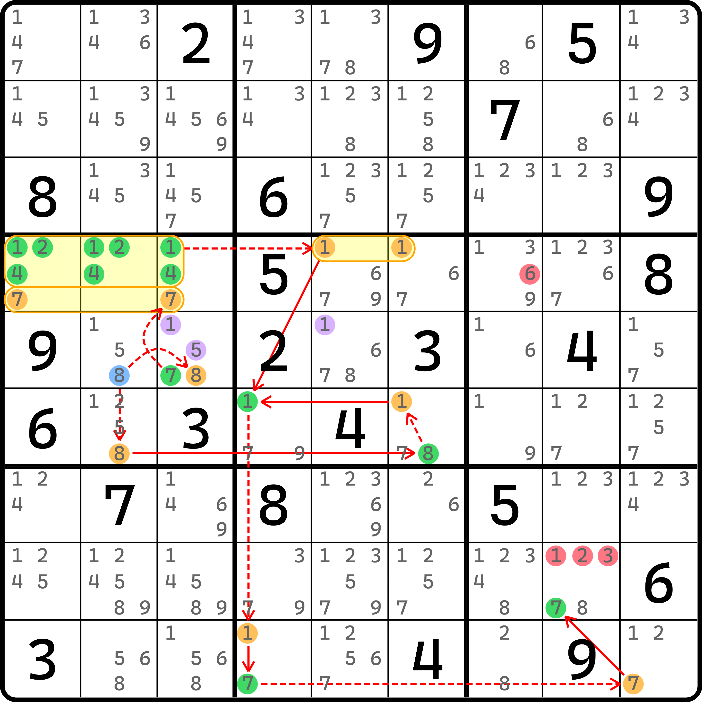
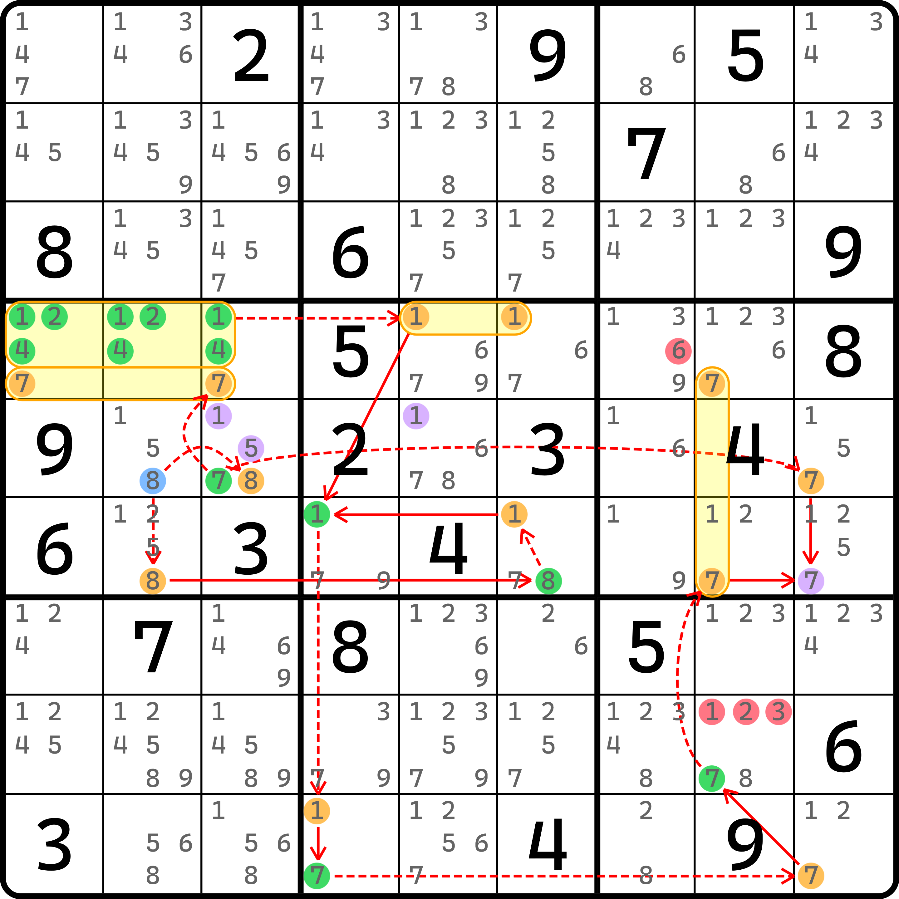
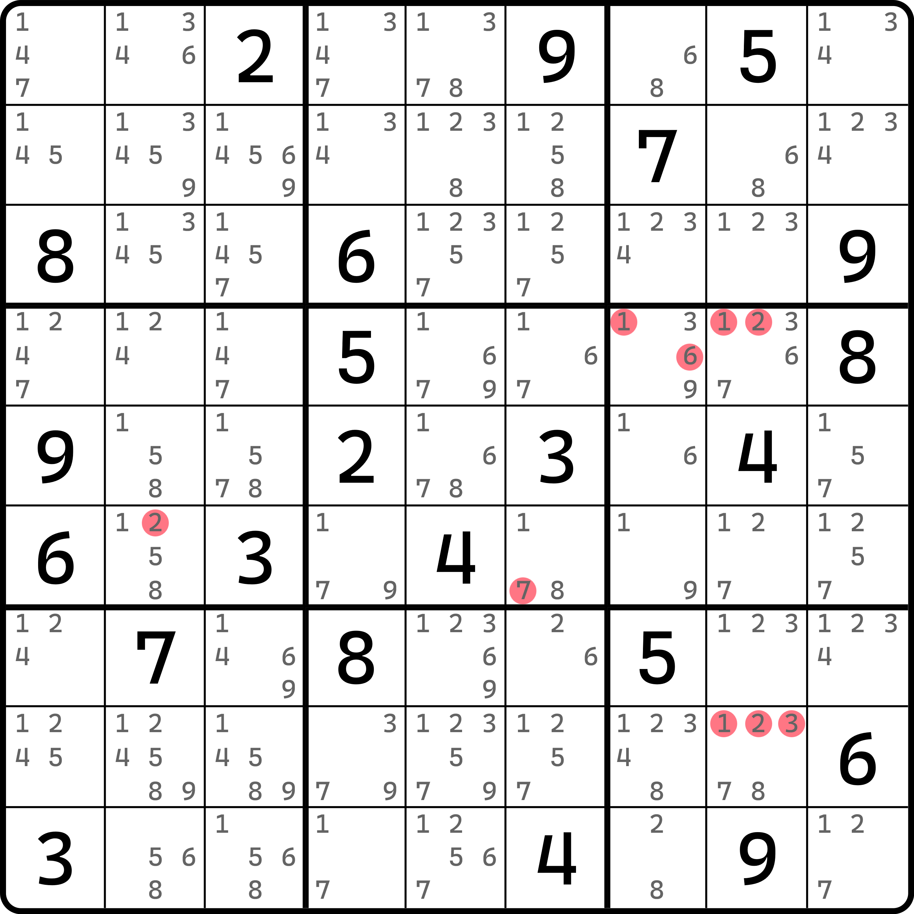
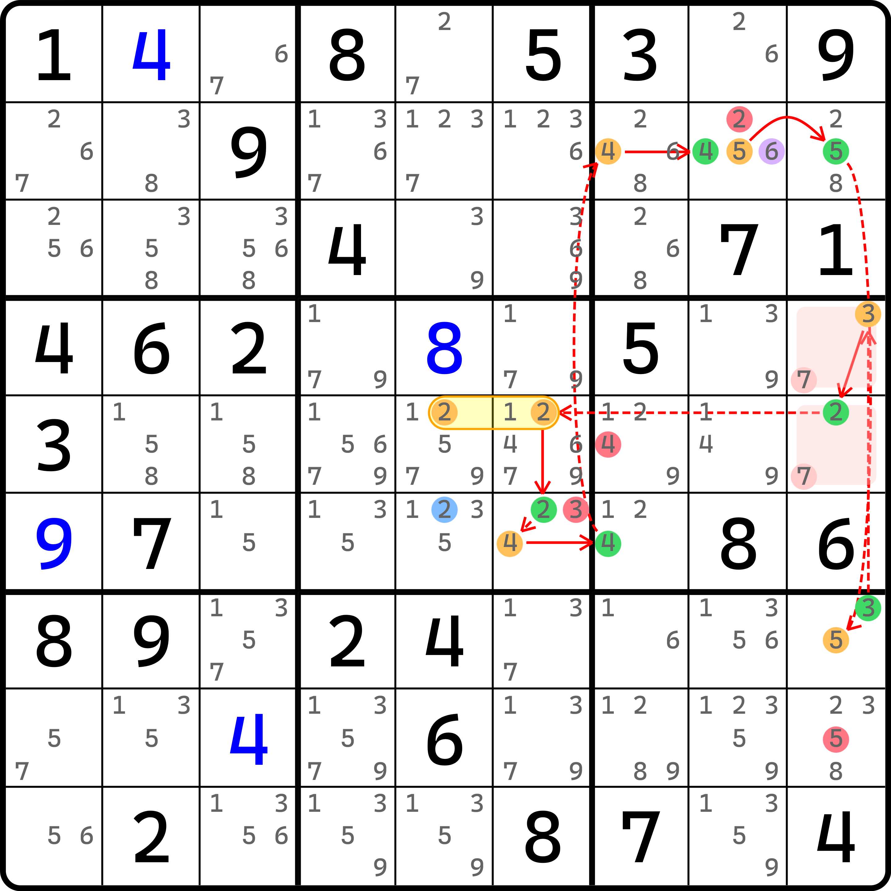

# 牺牲绽放环

前面我们看了牺牲的基础用法和一些实例。因为他的逻辑本身就比较难以理解，所以前面展示的例子几乎都只使用了同样的一种处理方式。

今天我们继续来看牺牲，不过这次我们会将牺牲的用法进行推广。他们的使用是需要证明可用性的，但都已经证明过，所以大方使用；但是证明逻辑我们就不在这里细致讨论了，因为他们也都基于基本的牺牲规则推广得来，因此不难得到，所以就留给各位读者自己去证明。

## 牺牲绽放环（Sacrifice Blossom Loop） 

<figure><figcaption>
牺牲绽放环例子，毛刺假的情况
</figcaption></figure>

如图所示。当我们忽略毛刺 `r5c2(8)` 的时候，有这个 ALS-XZ 环的结构。

<figure><figcaption>
牺牲绽放环例子，毛刺真的情况（只有牺牲删数）
</figcaption></figure>

如图所示。如果我们牺牲这三个数的话，我们可以找到这样的动态强制链分支，得到最终 `r8c8(7)` 为真，因此可以删除 `r8c8(123)` 三个预备删数。这里稍微说一下，起点是 `r5c2(8)` 毛刺，然后走两个分支，一边到 `r6c6(1)` 为假，一边是走上方可以得到毛刺显性三数组 `r4c123(124)` 为真，于是 `r4c56(1)` 为假。因为两头是同时得到，所以可以汇合到 `r6c4(1)` 为真。此时利用了牺牲 `r5c5(1)` 才能得到此强链关系。

不过，这么做只能有一般删数。下面我们延续一下推理。注意起点 `r5c2(8)` 可以直接排除的一些地方。

<figure><figcaption>
牺牲绽放环例子，毛刺真的情况（绽放）
</figcaption></figure>

如图所示。我们延续 `r8c8(7)` 为真，并在 `r5c3(7)` 为真的时候直接排除 `r5c9(7)` 的情况，于是我们可以得到这样的结构。

我们发现，当我们得到 `r8c9(7)` 和 `r5c3(7)` 为真时，`b6` 此时只能将 7 填入到 `r6c9` 里。但是请参考最开始的图（毛刺 ALS-XZ 环这个图），`r6c9(7)` 似乎也是预备删数。

是的。我们通过假设毛刺真时得到了预备删数为真。之前我们说到，因为这个规则称为绽放，所以我们可以删除所有其他预备删数。本题有哪些呢？还有一个 `r4c7(6)`。所以这个题牺牲了三个数后换来了绽放，于是得到了四个删数。

……吗？

实际上，这个题还能多删五个数。

<figure><figcaption>
牺牲绽放环例子，完整的删数
</figcaption></figure>

如图所示。本题除了前面提到的四个删数外还有 5 个额外的删数，本题可以删 9 个数。这几个删数就自己理解了吧。

总之，这个利用牺牲来换取绽放的特殊绽放环就称为**牺牲绽放环**（Sacrifice Blossom Loop）。牺牲绽放的视角几乎和绽放一样，删数规则也差不多，不过本题的绽放环使用了动态，因此并不是所有分支都在主线上，故绽放环在此时并不是全环状态。它属于是分支里套了分支。

## 牺牲节点 

### 先看例子 

之前我们了解到，牺牲逻辑的本质是干掉其中一些预备删数，则可以用于推得别的预备删数可为假的状态。下面我们来思考另外一个问题。如果我们牺牲的不是预备删数，而是节点呢？

<figure><figcaption>
毛刺连续环，毛刺为假的情况
</figcaption></figure>

如图所示。这是一个毛刺连续环，其中毛刺是 `r6c5(2)`。预备删数是图上这些，包括 `r2c8(6)` 也是预备删数。

<figure><figcaption>
毛刺连续环，毛刺为真的情况（牺牲节点）
</figcaption></figure>

如图所示。我们先不讲原理，先牺牲掉 `r7c9(5)` 这个节点。这个节点为啥是牺牲的呢？因为它是原本毛刺连续环里的其中一个为假的节点。这一点很重要，我们稍后说明细节。

总之我们先牺牲掉它。牺牲了之后，我们可以可以得到 `r7` 的强链关系，于是可以得到这个动态强制链分支，并得到 `b3` 里数字 6 只能填入到 `r2c8` 里。

因为它是原本毛刺连续环里的预备删数，所以这次我们利用毛刺真推理回到了预备删数为真的结论，所以和前一题一样，也绽放了。

绽放的删数肯定就是除了预备删数那个不算的其他数字，因此本题的删数包含图中的 `r2c8(2)`、`r5c7(4)`、`r6c6(3)` 和 `r8c9(5)` 这四个。

### 为什么牺牲节点也行？ 

下面来回答一下前面的问题。为什么这次我们把毛刺连续环里这个节点牺牲了，而不是牺牲删数，却仍然可以奏效？以及为什么非得是牺牲的这个节点，而不是其他的？

我们的本质目的是想得到删数成立，那么我们就尝试给牺牲的节点位置设为真和假两种情况，看看是不是能成立。

比如这个例子，我们试着让牺牲的节点 `r7c9(5)` 为假和为真都分别看一下。因为有毛刺连续环的加持，所以除了毛刺的那个所在宫的特殊强链关系我们不能直接用以外，其他任何一个地方的强弱链关系均是客观成立的。那么，我们假设为真和为假分别沿着连续环的推理方向走两个完全不同的方向就可以回到预备删数的位置上去，使得其为假。

举个例子。假设我让 `r7c9(5)` 为真，此时我们就看这个例子最开始那个毛刺连续环的线路，沿着环的逆时针方向回去。因为此时 `r7c9(5)` 假设为真时，它需要利用下一个节点为假的特性才可进行推理。但是这个毛刺连续环刚好提供了一个弱链关系（真到假的关系），于是我们可以回到 `r2c9(5)` 为假的位置上。然后继续逆时针前进，它的前一个节点是 `r2c8(5)`。因为原本这里是强链关系，所以 `r2c9(5)` 为假也可以利用此强链关系回去，这不就串起来了么？于是我们得到了，`r2c8(5)` 为真的结论，故这个单元格里的预备删数 `r2c8(2)` 在此时（`r7c9(5)` 为真时）可以为假；其他的预备删数也同理，继续逆时针回去就行，也都可以得到预备删数为假的情况。但请注意，此时因为 `b5` 这里有毛刺的缘故，所以毛刺连续环按这个方向（能一路走到 `r6c6(2)` 为真）此时无法继续往后推理，因为我们并不清楚毛刺在此时的真假性（仅假设的是 `r7c9(5)` 的真假性）。

那么换一下真假性。假设 `r7c9(5)` 为假的话，这就方便了。因为我们知道它为假，所以 `r7` 的强链关系（和牺牲节点时产生的强链关系是完全一样的）可以被我们利用起来：这里讨论两个分支走向，一个往毛刺的方向往回走，一个则是继续往下走到绽放的 `r2c8(6)` 处。也就是说，节点为假时还能继续分成两个情况讨论。

当走的是回毛刺的分支时，毛刺会得到为假（因为强弱链关系并未篡改，只是反了个方向），所以毛刺假，连续环成立；当走的是继续往后绽放的分支时（即可得 `r2c8(6)` 为真），于是，`r2c8` 剩下的候选数 4 和 5（参与毛刺连续环的两个节点）均在此时为假。恰好，这两个节点两头都是强链关系，也就意味着，两头回去会分别得到为真的结论，于是我们仍然此时可以延伸其走向得到这些预备删数成立的结果。

总之就是，分情况讨论：

1. 当牺牲节点为真时，沿着毛刺连续环逆向回到毛刺的这一截上的预备删数均为假；
2. 当牺牲节点为假时，牺牲造成的强链关系成立，所以：
   1. 其中一端可以回到毛刺，并得到其为假，于是毛刺连续环升级为连续环（直接成立），预备删数升级为直接删数；
   2. 其中一端可以继续到绽放处（预备删数）为真，于是使得毛刺连续环接入绽放的位置两头的候选数的强链关系分别利用起来，使得预备删数也都可以删除。

所以，按照取出三种情况的交集来看的话，情况 1 涵盖的删数（**沿着毛刺连续环逆向回到毛刺的这一截上的预备删数均为假**）是最终可以得到的结论。

### 牺牲节点需要假设其为假 

那么，既然这么说的话，我们来思考一个问题。假设如果我们这次牺牲不是这个 `r7c9(5)`，而是旁边的 `r7c9(3)` 呢？牺牲节点是允许牺牲任意环内的节点的，只不过稍微麻烦的一点是，因为此处我们在图中画出来的效果是它此时为真，所以前面的推导看起来就失效了：因为此时它假设为真，而“为真”这种状态根本就不能用于消除产生强链关系。

实际上，我们可以利用环的双向性质将环完全换一个方向。这样，这个节点就变为假了。也就是说，将环换个方向之后，假设为真的这一组节点就会改成为假；那么方向就倒过来就行了。也就是说：

* **如果牺牲节点在原来的毛刺连续环里为假，那么逆向回到毛刺的这一截遇到的预备删数作为实际删数；**
* **如果牺牲节点在原来的毛刺连续环里为真，那么正向回到毛刺的这一截遇到的预备删数作为实际删数。**

之所以是“正向”，是因为本身需要把环给调换方向，而调换后我们还得逆向回去的部分才能删数，所以“负负得正”。

至此，我们就把牺牲的内容也全部结束了。
