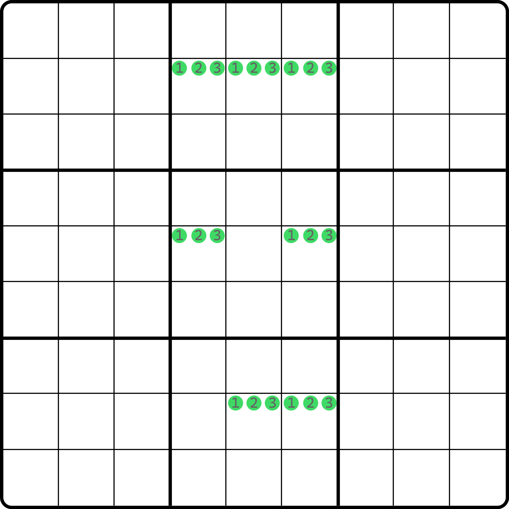
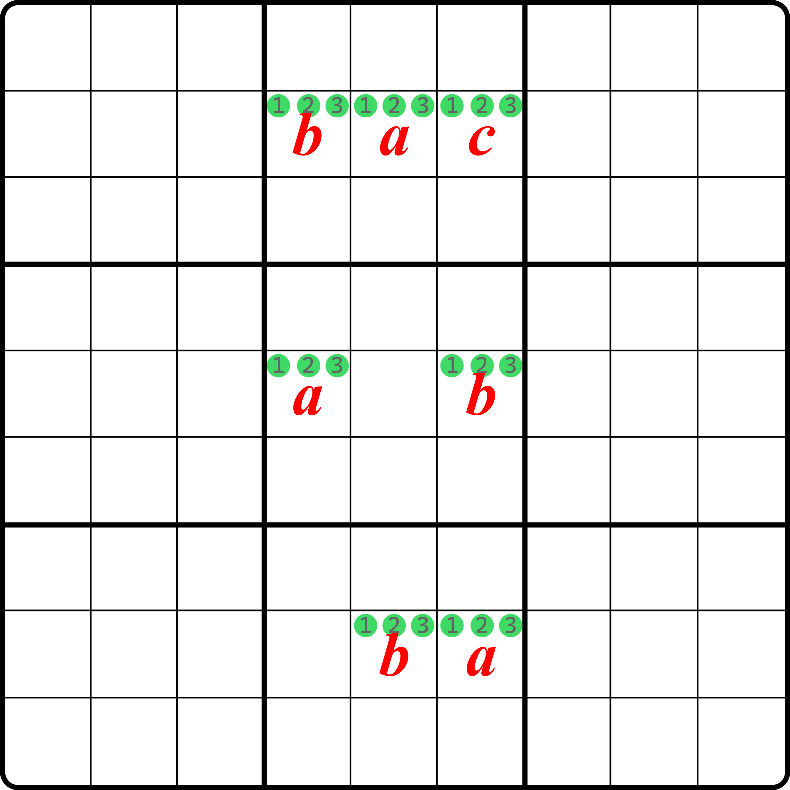
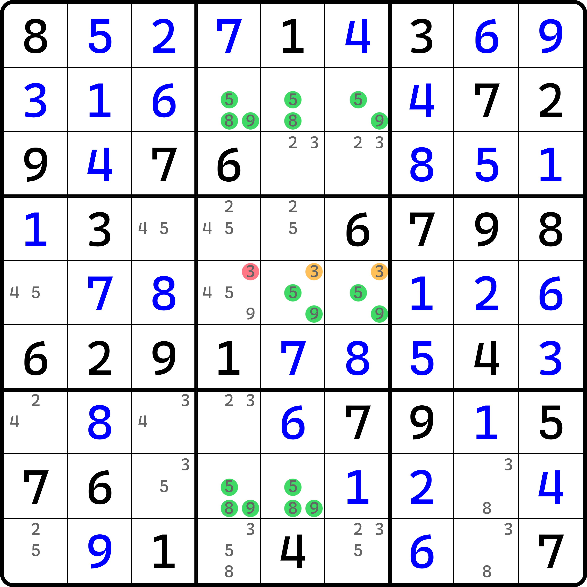
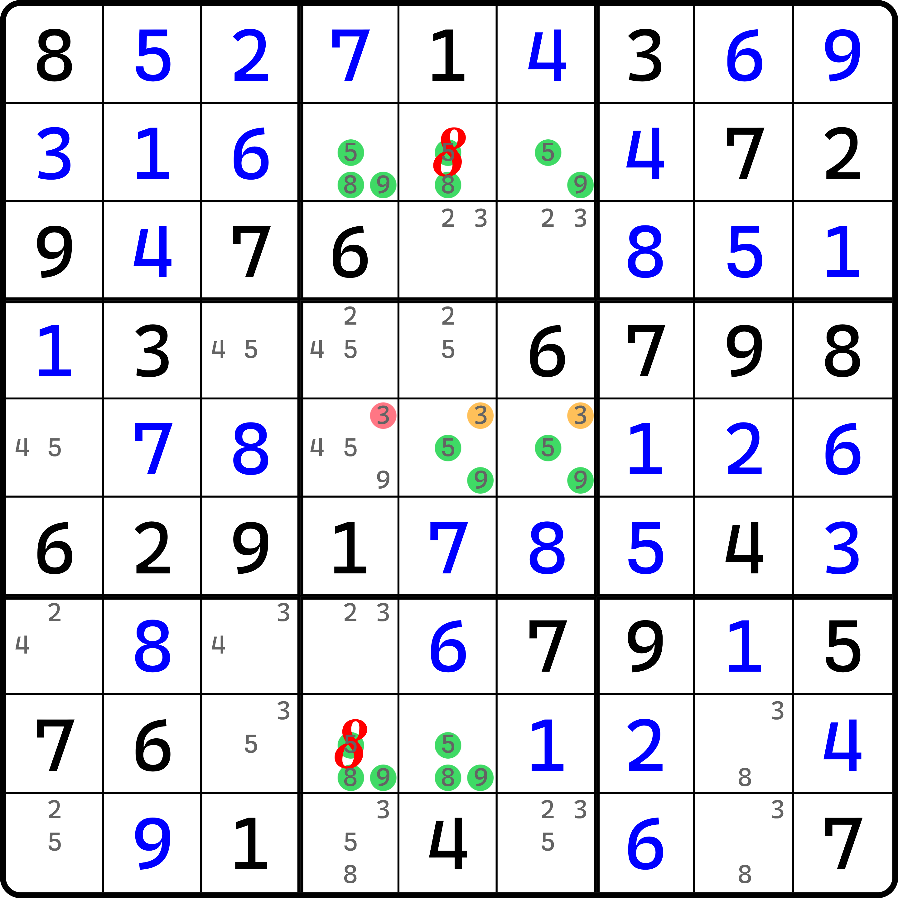
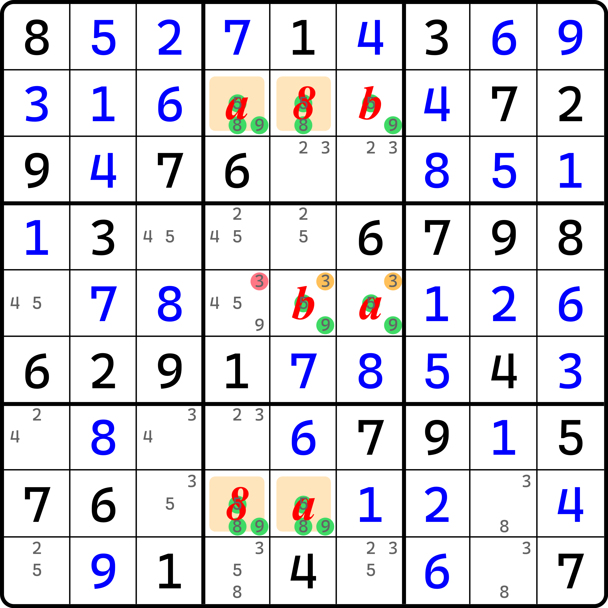
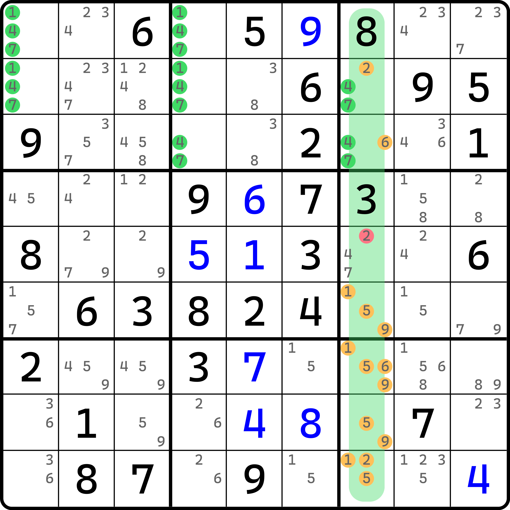

# 三数缺二矩阵结构

下面我们来介绍一个将前面的结构进一步减小规模的另外一个情况。

## 三数缺二矩阵结构的形成条件 

我们先来看下结构长啥样。

### 结构的长相 

考虑这个结构：

<figure><figcaption>
三数矩阵缺两个格
</figcaption></figure>

如图所示。这是一个 $$3 \times 3$$ 的矩阵，但少了两个位置。并且，它和之前的矩阵不同的是，它缺少了两个单元格，而且还只用三种不同的数字。这个结构没有名字，本教程暂时称其为**三数三阶缺二矩阵**（"3x3-2" Pattern）；三阶和之前唯一矩阵保持一致，所以可以省略，即**三数缺二矩阵**。

这个结构本身也不是致命的，但我们需要缩减一下条件。探长给出了一种条件设计，如果满足此条件的话，这个结构就是致命的。

### 造成致命的条件 

我们把两个空位视作锚点。两个空位首先得互相看不见才行（不同行列）。然后，此时它俩是斜着放的，所以我们可以找出一个矩形的四个格子，其中俩是这俩空位，余下俩是第二层锚点。比如这个题里空位是 `r5c5` 和 `r8c4`，那么第二层的锚点就是 `r5c4` 和 `r8c5` 了。

接着，我们把这两个单元格选其中一个出来按直角横向和纵向分别画线，它会经过 5 个单元格。比如 `r8c5` 选中后，横向会经过 `r8c456`，纵向会经过 `r258c5`，因为 `r8c5` 本身被重算两次，所以确实整体是 5 个单元格。然后，我们选出这两个横向和纵向的线的两个远离空位的那一端的两个单元格（如图中是 `r8c456` 的 `r8c6`，以及 `r258c5` 里的 `r2c5`）。这两个单元格如果填数相同，则这个结构是致命的。

这说起来略微抽象了一些，不过它要想证明其实也不是难事。我们先用代数的思路假设这两个单元格的填数都是 $$a$$，然后结构余下的部分仍然无法确定。没事，我们整个行或列有三个单元格的我们直接上手用 $$a$$、$$b$$ 和 $$c$$ 整个表示完就行（因为字母之间是不讲顺序的，所以它致命了，就不用把字母再调换过来再重复证明了）。比如，我们选 `r2` 分别假设出来 $$a$$、$$b$$ 和 $$c$$，于是有这样的图：

<figure><figcaption>
代数得到的结果
</figcaption></figure>

如图所示。我们选中的是 `r2c5` 和 `r8c6` 并假设为 $$a$$ 之后，按 `r2` 讨论可得这个图里的填法。其中 `r5c4` 只能填 $$a$$ 是因为填 $$c$$ 后会使得 `r25c46` 形成唯一矩形致命；同理 `r8c5` 也不能填 $$c$$。

但是这么填之后可以看到，`r2c45`、`r5c46` 和 `r8c56` 这六个单元格构成了唯一环的致命形式。所以矛盾。

不过很遗憾的是，探长这个条件设计在我电脑里没有存有任何实际题目的例子。所以我们只能灵活处理和运用类似的证明思路，对不同的情况进行不同的讨论了。

> 既然没有实际例子，那我提它干嘛呢？第一是避免我以后遗忘，万一以后又有例子了呢？第二是对于这种信息，即使它只存在于理论层面，但它确实属于是在私底下对结构进行推演和挖掘所必不可少的一环。所以，就算没有实际的例子，那也有它存在的意义和价值。

## 不太搭的例子 

下面我们来看两个（和前面条件不太搭的）例子。

### 例子 1：类型 2 

<figure><figcaption>
例子 1
</figcaption></figure>

如图所示。假设 `r5c56 <> 3` 的话，不难看到 `r2c5` 会直接填 8（否则 `r25c56` 构成唯一矩形）；与此同时，因为为了规避 `r2c46`、`r5c56` 和 `r8c45` 六个单元格唯一环造成致命，此时我们只能让 `r8c4` 填 8。

<figure><figcaption>
例子 1，填了俩 8
</figcaption></figure>

如图所示。似乎没办法继续了。没事。我们现在开始代数。

<figure><figcaption>
例子 1，继续往下代数可得到矛盾
</figcaption></figure>

如图所示。假设 `r2` 余下两个位置分别是 $$a$$ 和 $$b$$ 可以得到图里给的这么个填法。于是我们发现 `r28c45` 必出现唯一矩形，所以整个结构是致命的。所以，原来的例子里 `r5c56(3)` 不同假，故按区块删数，所以题里的结论是 `r5c4 <> 3`。

### 例子 2：类型 3 

<figure><figcaption>
例子 2
</figcaption></figure>

如图所示。这个题造成矛盾的点和第一个例子完全一样，只是推理改成类型 3 了而已。

如果 `r2c7(2)` 和 `r3c7(6)` 同假，则余下的 7 个单元格里会形成致命。因为造成矛盾的方式和第一个例子都完全一样，所以这里就不赘述了。
