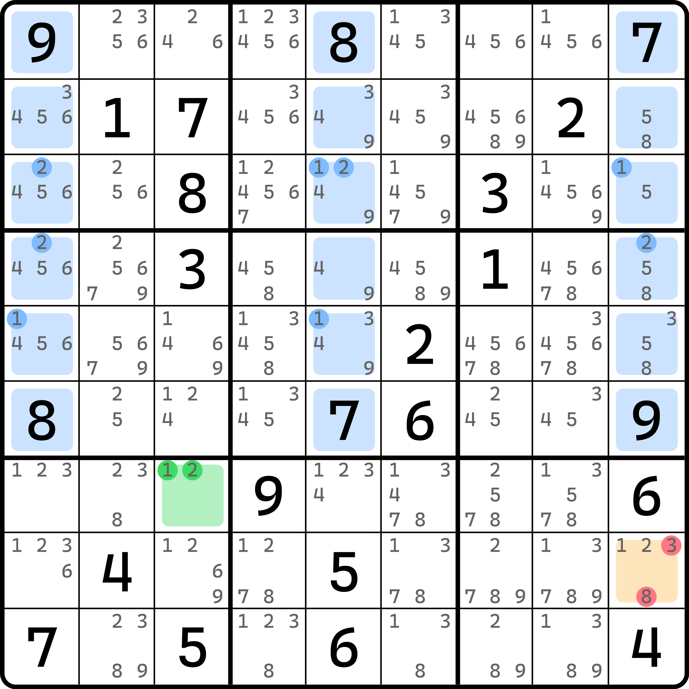
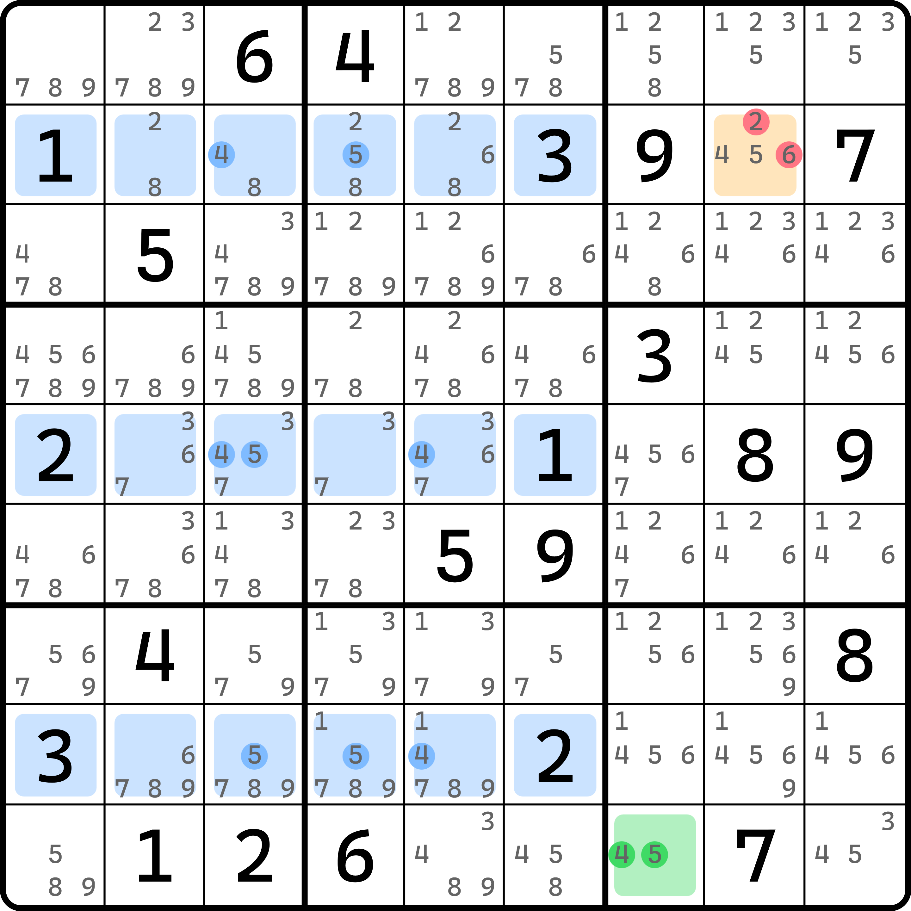

# 单基准单元格

下面我们来看基准单元格只有一个单元格的情况。

<figure><figcaption>
只有一个基准单元格的例子
</figcaption></figure>

如图所示。这次基准单元格只有 `r7c3` 这一个单元格。推理过程完全一样，不过因为毕竟相貌不一样了，干脆我们还是再来一遍，巩固一下。

基准单元格只有 1 和 2 两个数字，于是我们针对两个数进行讨论。在交叉单元格 `r123456c159` 这 18 个单元格里，数字 1 和 2 都只能最多填入两个，所以，`r789c159` 这 9 个单元格里，数字 1 和 2 都必须最少填一次。

接着，假设 `r7c3` 填入了数字 $$a$$。那么，根据排除效果我们可以知道的是，`r78c1` 和 `r7c5` 都不能填 $$a$$。所以，唯一可以填 $$a$$ 的位置落入 `r8c9` 之中。所以，`r8c9` 必须是 $$a$$。故这个题的结论就是 `r8c9 <> 38`。

非常简单的例子。

我们再来看一个例子。

<figure><figcaption>
另外一个例子
</figcaption></figure>

如图所示。我们可以根据交叉单元格的 4 和 5 的分布得到 `r258c789` 里必须至少填一次 4 和一次 5。然后假设 `r9c7` 填 $$a$$，根据排除得到 `r2c8` 必须填 $$a$$，因为别的格子已经没办法填 $$a$$ 了。所以，结论就是 `r2c8 <> 26`。

这一篇的内容还是比较简单的。
