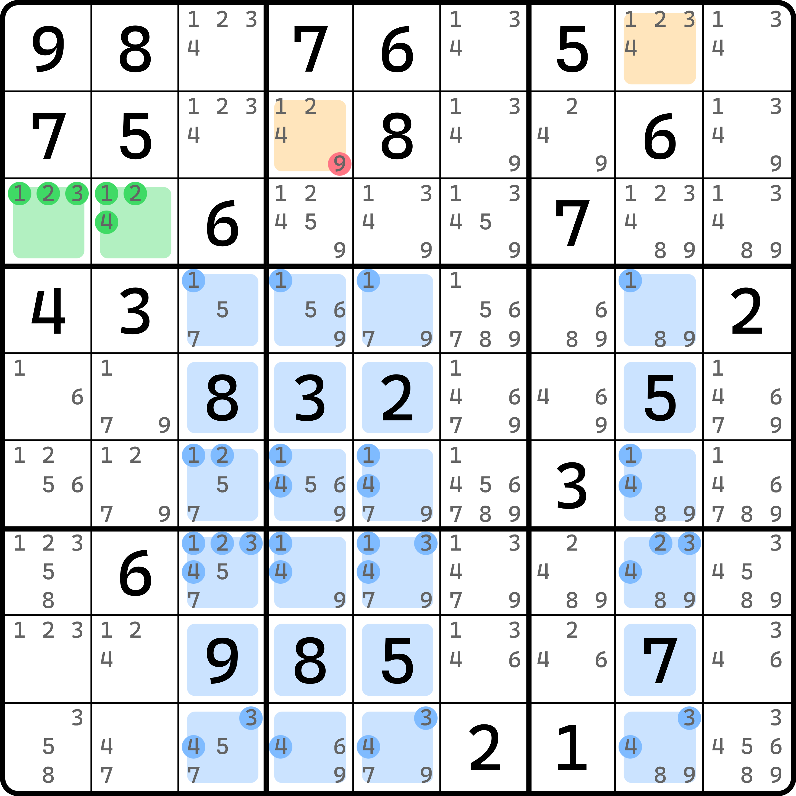

# 交叉单元格的拓展

之前我们看了一些改变规格的例子，例如改变目标单元格的数量，改变基准单元格的数量。下面我们来看改变交叉单元格数量的例子。

不过比较遗憾的是，这种改变成本比较高，以至于我这里就只有一个例子。

## 唯一的例子 

<figure><figcaption>
水母飞鱼
</figcaption></figure>

如图所示。这是一个**四阶飞鱼**（Jellyfish Exocet），即交叉单元格用到四个行列的情况，类比于之前我们学的鱼的规格的命名。

首先，基准单元格 `r3c12` 用到的数字是 1、2、3、4，于是我们转去看 1、2、3、4 在交叉单元格 `r456789c3458` 这 24 个单元格里的分布。显然，每一个数字都只能最多填 3 次。比如 1，它出现的位置是 `r46c3458` 和 `r7c345` 这 11 个位置里。显然安排到三个不同行列上去，1 就是最多可填的情况。所以，显然最多可以填 3 次数字 1；当然，2、3、4 也都如此。

按照如此的讨论，我们可以得到，如果基准单元格选取了其中两个数 $$a$$ 和 $$b$$ 填入（其中 $$a$$ 和 $$b$$ 是 1、2、3、4 的其二），则根据排除效果可知，在 `c3458` 的余下 12 个单元格 `r123c3458` 里，只有 `r1c8` 和 `r2c4` 可以填 $$a$$ 和 $$b$$。所以，`r2c4 <> 9`。

可以看出，按照如此讨论，交叉单元格的规格并不一定非得只有三个行列，四个也是可以的。甚至两个也可以。不过两个的例子理论也存在，但一来是它非常容易被低阶技巧代替，二来是确实没有例子。
