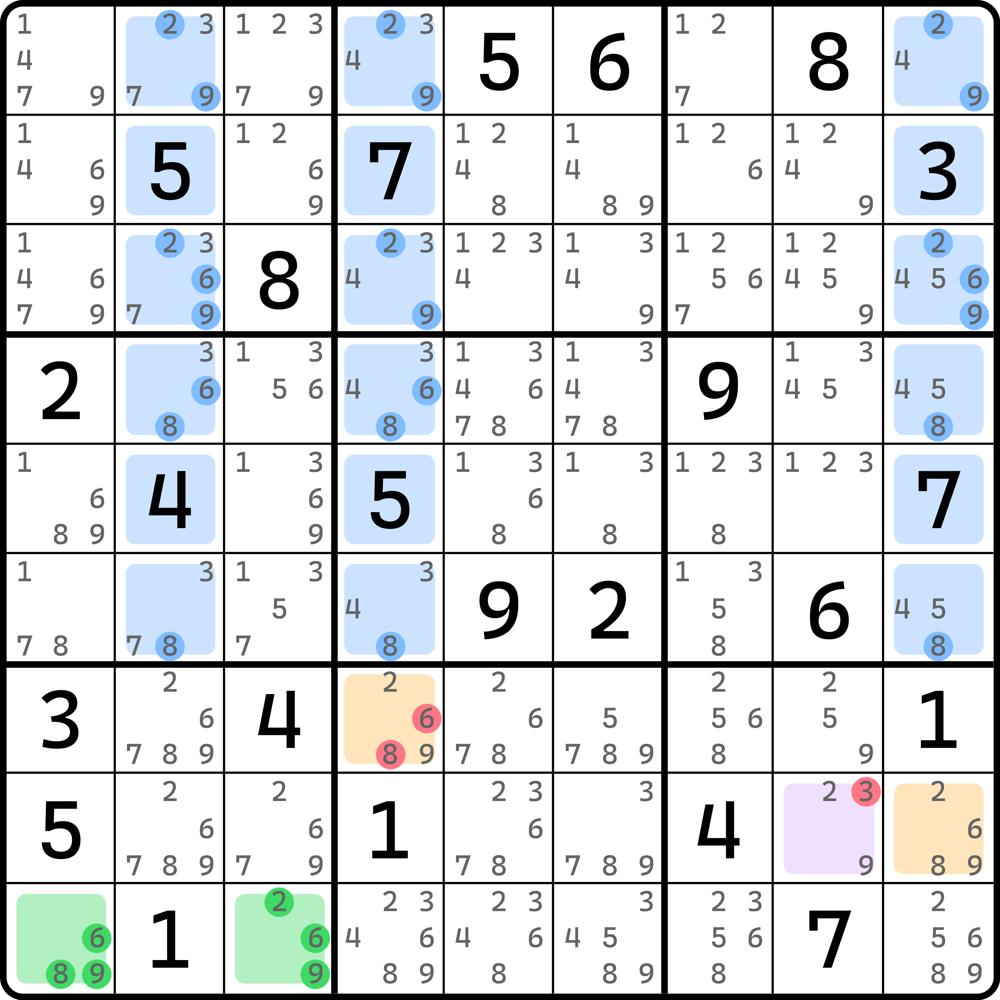
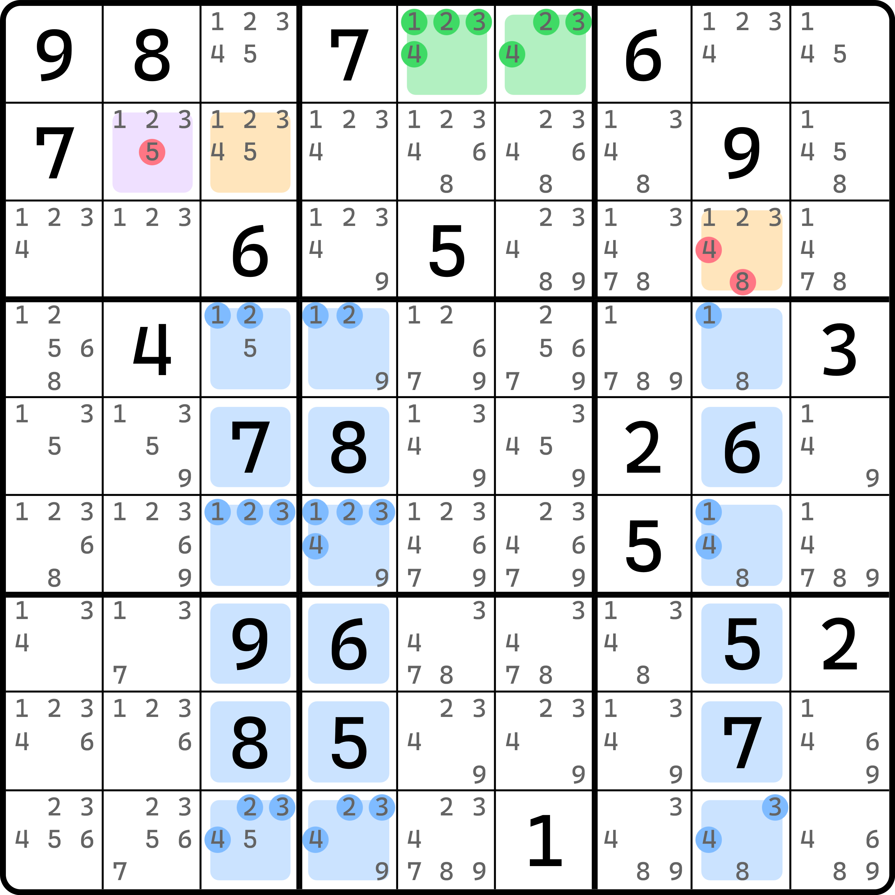
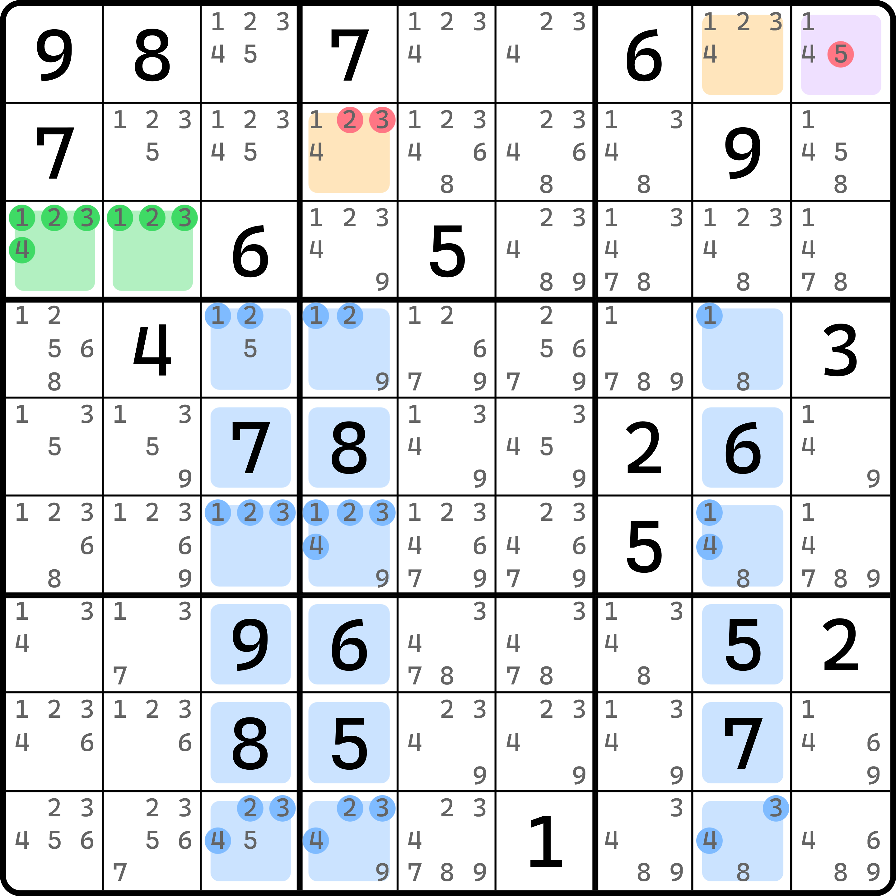

# 镜面格同步

镜面格的使用远没有上一期内容这么简单。今天我们来看的是镜面单元格结论的回传逻辑。

## 镜面格和目标格同步 

<figure><figcaption>
同步到目标格
</figcaption></figure>

如图所示。这个例子里 `r8c8` 是镜面单元格。按照前一节的内容的结论可以知道，`r8c8` 必须填入 2、6、8、9 的其一，因为另一个镜面格 `r8c7` 是 4，压根跟 2、6、8、9 无关。

由于此时它必须填 2、6、8、9，所以里面的 3 就可以被删除。比较容易引起进一步思考的是，`r8c8` 只有 2 和 9 了，这说明什么呢？因为它一定填的是 `r9c13` 里所选取的两个数，所以按代数的思路，`b8` 里填和 `r8c8` 一致的这个数的位置只能落入目标单元格 `r7c4` 之中。为什么呢？因为这个结论是出在目标格之后的。换言之，我们要先得到 `r7c4` 和 `r8c9` 这两个目标格填的和 `r9c13` 一样的数之后，才会有从镜面格推回来的这个结论——原本 `r7c4` 同事包含候选数 2、6、8、9 是没有问题的；但因为镜面单元格的结论，所以我们知道 `r8c8` 这个格子填的数一定等于 `r7c4` 的填数；同理，`r7c56` 里填了和 `r9c13` 里相同的数字，也会落入到 `r8c9` 之中（只不过这组镜面单元格 `r7c56` 是两个格子，我们无从直接下手罢了）。

所以，既然我们确定了 `r8c8` 和 `r7c4` 填数一致，那么我们就可以认为，`r7c4` 也只能是 2 或 9，毕竟 `r8c8` 压根就不含 6 和 8。所以，这个题的结论是 `r8c8 <> 3` 和 `r7c4 <> 68`。

我们把这个操作称为**同步**（Sync）。这个同步的行为更多会用在代数的思路里。在标准数独里，同步的操作用处并不算多，这是为数不多的其中一个同步用法；同步更多还是在变型数独的计算和范围假设里。

我们再来看两个例子。两个例子出自于同一个题目，不过因为基准单元格和目标单元格不一样，所以删数也不一样。

## 其他例子 

### 例子 1 

<figure><figcaption>
例子 1
</figcaption></figure>

如图所示。本题没有列举 `r2c3` 的删数，因为主要讲的是 `r2c2` 和 `r3c8` 这两个位置。

### 例子 2 

<figure><figcaption>
例子 2
</figcaption></figure>

如图所示。
