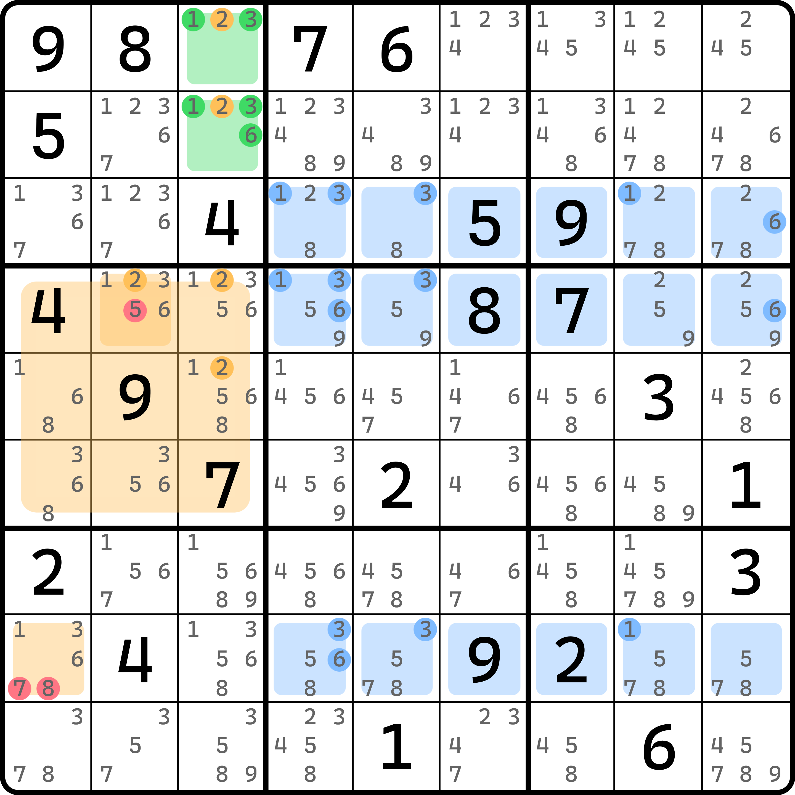
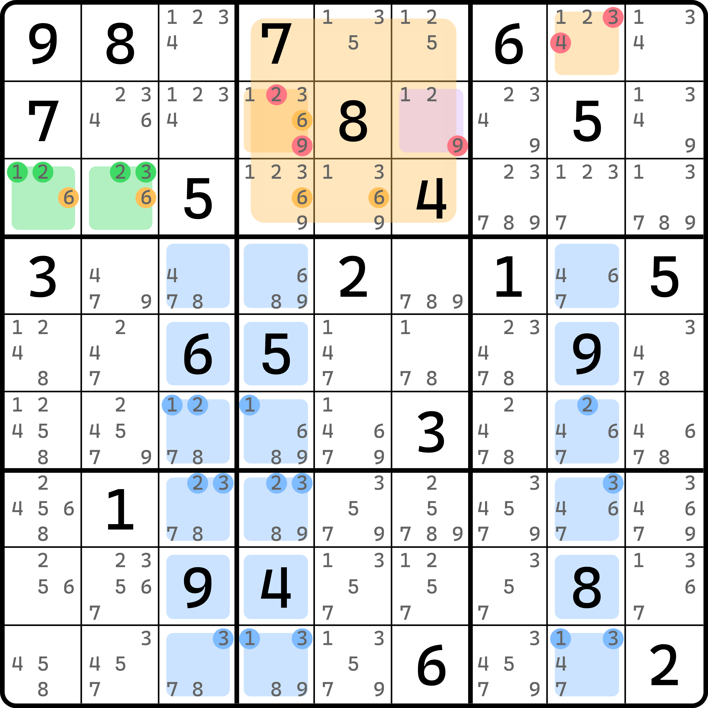
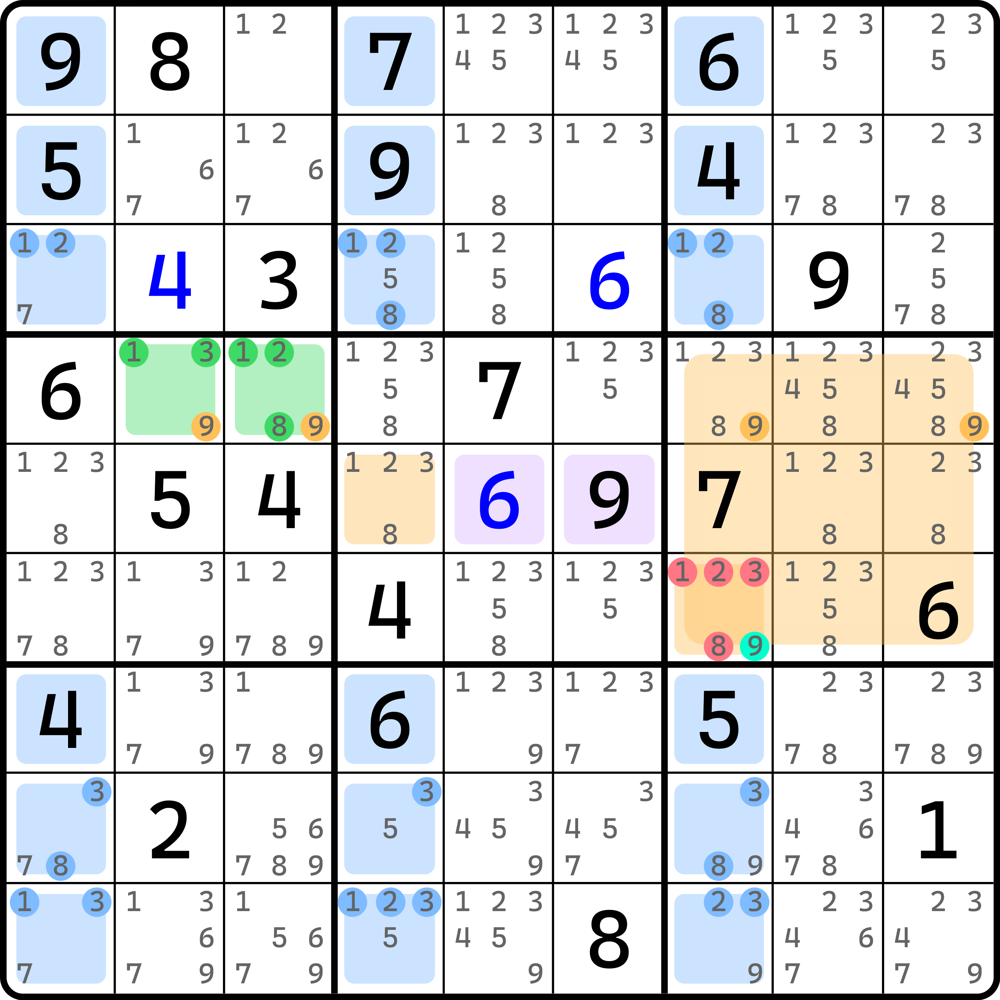
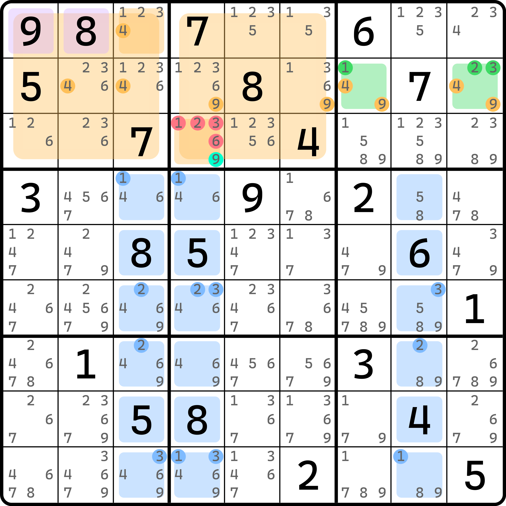

# 锁定成员

## 锁定成员的概念 

<figure><figcaption>
锁定成员的概念
</figcaption></figure>

如图所示。这个题用到的基准单元格是 `r12c3`，包含 1、2、3、6 四种数字。但是实际上我们要推理的飞鱼结构只需要用 1、3、6 这三种数字，2 是需要特殊处理的。

可以看到，交叉单元格里，`r8c7` 是以提示数形式存在的数字 2。这个 2 在基准单元格里出现过，它会影响我们推理，于是我们无法继续假设（至少我们无法快速得到 2 的填数次数最多多少个）。所以，为了方便我们推理，我们强行按这个数字 2 的真假进行讨论。

* **如果基准单元格里没有 2**，则 1、3、6 符合交叉单元格最多两次的出现条件，所以目标单元格里可以按 1、3、6 的飞鱼进行删数；
* **如果基准单元格里有 2**，则 2 可当区块处理，于是 `r45c3 <> 2`。而 `b4` 里只有三处可填 2 的位置，于是我们就得到了 `r4c2 = 2` 的结论，所以 `r4c2(5)` 仍然可以删除。进一步地，因为 `r12c3` 里有一个是 2，所以另外一个单元格仍然是 1、3、6 的其一，于是飞鱼结构退化为单基准单元格的情况，目标单元格也刚好只能是 `r8c1`。所以 `r8c1` 只能是 1、3、6，故 `r8c1 <> 78` 亦成立。

综上所述，不论基准单元格是否含有 2，飞鱼结构都成立，只不过一个是按双基准单元格成立的（基准单元格不含 2），一个是按单基准单元格成立的（基准单元格含 2）。

对于此题里，我们把这个 2 称为**锁定成员**（Locked Member）。所谓锁定成员，其实就是要影响飞鱼结构成立的数字，它需要按基准单元格是否存在并借用区块得到结论的特殊推理手段。锁定成员的这个说法来自于区块的英文单词 Locked Candidates，因为都“锁定”了嘛。

有了概念的理解之后，我们来看两种锁定成员的使用方法。上面这个例子其实已经展示了其中一种了，所以还有一种借用镜面单元格同步的用法。我们都来看看。

## 锁定成员的两种用法 

### 用法 1：锁定成员 + 单双基准单元格 

<figure><figcaption>
第一种用法
</figcaption></figure>

如图所示。这个例子的推理思路完全和前面的例子一样，这里就不多说了。这里主要要讨论的点是 `r2c6` 这个镜面单元格。这个格子是可以删 9 的，但对端的镜面单元格 `r1c9` 却不能删 4。这是为什么呢？

这是因为我们在讨论和假设锁定成员 6 的时候，会出现两种情况，其中有一个情况会用到单个的基准单元格，此时 `r1c8` 会作为目标单元格出现。此时，镜面单元格不存在可用结论。所以，`r1c9` 正是因为这个情况的存在，所以无法删数；但 `r2c6` 却可以，因为我们知晓 `r1c8` 只能是 1、2、3 的其一，所以 `r2c6` 必须是 1 和 2；而通过镜面单元格同步的逻辑反过来我们还能得到 `r1c8` 只能是 1 和 2，所以这个题的结论一共有 5 个删数：`r1c8 <> 34`、`r2c4 <> 29` 和 `r2c6 <> 9`。

### 用法 2：锁定成员必为真 

另外一种是利用锁定成员的特征，假设为假后反倒发现它不可能成立，所以必为真的特殊用法。

<figure><figcaption>
第二种用法
</figcaption></figure>

如图所示。这个例子看起来有点复杂，不过也和刚才的假设一样。这个题的基准单元格已经有 5 个数字了。

如果基准单元格里没有 9，则 1、2、3、8 符合条件，飞鱼结构成立，于是结论就是 `r6c7 <> 9`。但是，如果这样的话，我们无法正常填写镜面单元格的填数。为什么呢？因为没有 9 意味着我们只能把 1、2、3、8 视为飞鱼结构的数字。那么对于镜面单元格 `r5c56` 而言，这俩一个 1、2、3、8 的数字都不是。我们反复说过，镜面单元格的填数一定要和对端目标单元格里的填数要一致。但是，这一点显然是无法保证的。你也可以自己试试假设基准单元格填入两个代数字母，然后可以顺利得到 `r5c4` 和 `r6c7` 是这两个字母。但是，有一个字母是无法填的，比如你假设了 `r5c4` 填 $$a$$，而 `r6c7` 填 $$b$$ 之后，由于基准单元格有一个 $$b$$ 的关系，所以 $$b$$ 在 `b5` 里找不着合适的位置放（唯一一个放的位置 `r5c4` 此时是填的 $$a$$）。这就矛盾了。

所以，原来的假设不成立。原来的假设是让 `r4c23` 不含 9，那么它不成立就意味着 `r4c23(9)` 是区块。所以，`r4c79(9)` 为假。于是借用锁定成员 9，可以得到 `b6` 里填 9 必须出现在 `r6c7` 上。故 `r6c7 = 9` 是这个题的结论。

### 混合使用 

显然，因为整个大行列有 3 个宫构成，所以锁定成员肯定不一定只能是一个的。下面我们来看同时有两个锁定成员的飞鱼结构是如何造成删数的。

<figure><figcaption>
混合使用
</figcaption></figure>

如图所示。这个例子稍微复杂一些。

我们讨论下基准单元格 `r2c79` 里的填数情况。因为基准单元格里的数字一共有 5 个，但是其中 4 和 9 显然对于我们选取的交叉单元格来说不符合条件（4 是直接在交叉单元格上就有明数出现，9 则是最多可以出现三次），所以我们这两个数都得去掉来进行讨论，于是这个例子变为如下的可能情况：

* **如果 `r2c79` 没有 4 也没有 9**，则 1、2、3 符合飞鱼特征，故飞鱼结构成立，得到 `r1c3` 和 `r3c4` 直接只能是 1、2、3。但是借用镜面单元格的特性我们发现，`r1c12` 都不是 1、2、3 的数字，所以这个情况直接是不可能成立的；
* **如果 `r2c79` 有 4 但没有 9**，则可得 `r1c3 = 4` 的结论。与此同时，基准单元格里因为有一个是 4，所以另外一个只能安排 1、2、3 的数，此时结构退化为单基准单元格的飞鱼，目标单元格恰好也只有一个落在 `r3c4` 上，所以此时 `r3c4` 只能是 1、2、3 的其一；但因为另外一个不是 9，所以假设的 $$a$$（$$a$$ 是 1、2、3 的其一）在 `b2` 里必须落在 `r3c4` 上，于是根据排除可得 `b1` 无法正常填入 $$a$$，因为唯一一个可以填 $$a$$ 的位置 `r1c3` 都被 4 给占了，所以这个情况也是不可能成立的；
* **如果 `r2c79` 有 9 但没有 4**，则可得 `r3c4 = 9` 的结论，直接造成 `r3c4 <> 1236` 的结论成立；
* **如果 `r2c79` 是只能是 4 或 9**，则因为 9 的条件成立，故可直接规约到第三种情况（基准单元格有 9 但没有 4），删数亦成立。

所以，四个情况排列了之后发现其实仍然只能有一个合理情况可以利用——`r3c4` 只能是 9。所以，这个题的结论就是 `r3c4 = 9`。
