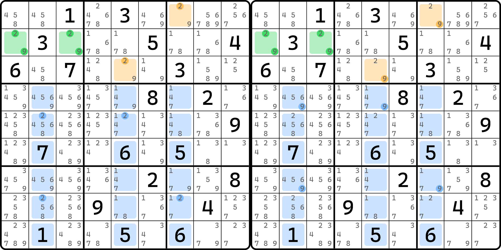
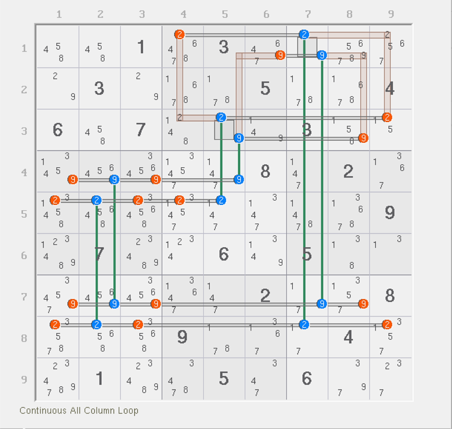

# 交叉格三阶解鱼

之前我们介绍过了目标单元格形成跨区数对的特征。倘若我们知晓基准单元格里一定是某两种数字的话，那么跨区数对也就直接可以形成；于是，删数除了可以得到前面说到的那些以外，还有一处不是很容易被发现的地方——交叉格。

## 拆分视角 

<figure><figcaption>
三阶鱼，拆分视角
</figcaption></figure>

如图所示。此例子的基准单元格 `r2c13` 原本有三种数字 2、8、9，但是为了介绍此例子所以强行去掉了 8。实际上这个 8 是可以删除的，不过需要更复杂的内容，这个我们以后介绍。我们还是先来看这个跨区数对。

目标单元格只有 2 和 9，这是显然的，因为基准单元格只有 2 和 9，这里是同步的。我们将 2 和 9 在交叉单元格里的出现位置全部标注出来，于是就有了图上给的这两个拆分视图。

不过要注意的是，由于 `r1c7` 和 `r3c5` 是跨区数对，所以他们填入的数字不能相同。因此，单看其中一种数字的话，他俩既成强链关系又成弱链关系（毕竟确实不同真也不同假嘛），那么我们不妨利用这一点来看看有没有别的结论。

这里我们使用一下秩理论的知识点构造一个结构出来。我们拿数字 2 为例。交叉单元格的特征是只能最多填两次。“最多”暗示的是秩理论的弱区域，于是填两次的机会显然分配给了 `r5` 和 `r8`。所以，我们将 `2r58` 视为弱区域。那么强区域呢？`2c257`。图中交叉单元格里有 4 个 2，算上目标单元格里的俩 2，这 6 个就刚好用 `2c257` 所覆盖；弱区域只取了 `2r58` 显然还缺少 `r1c7(2)` 和 `r3c5(2)` 未被覆盖，所以我们需要覆盖一下。刚好我们缺少一个弱区域，所以我们这里利用虚拟弱区域将他俩连接起来，于是 6 个候选数 2 均被覆盖，强区域 3 个，弱区域也是 3 个，且每一个候选数都精确被一个强区域和一个弱区域覆盖，因此是精确覆盖的，于是可利用基础的秩的公式求得这个结构的秩为 0。秩为 0 意味着结构的弱区域都均可用于删数，于是这个 2 还可以删掉 `2r58` 上的余下的位置的数字 2。同理，数字 9 也可以这样做。

所以呢？所以这个题的结论有这些：

<figure><figcaption>
此结构的删数
</figcaption></figure>

如图所示。这里要注意的是，强区域是按列看的，弱区域是按行看的。而目标单元格 `r1c7` 和 `r3c5` 在图中体现的是跨区数对，但我们用的是虚拟弱区域构造的结构。

是的，我们利用飞鱼构造了解鱼结构，得到了特殊的删数，这是本内容想要告诉你的内容。

## 飞鱼构造的解鱼一定得是三阶的吗？ 

显然，答案是否定的。由图中这样的飞鱼构造的解鱼结构，因为结构本身用到了三个列构成交叉单元格，所以目标的解鱼结构显然也就只能是三个列构成，故肯定是三阶的。但是，在之前的内容里我们说过，飞鱼是可能有四阶（交叉单元格用四个行或四个列）的情况的，也就不一定非得是三阶。

只不过，因为飞鱼技巧在普通的题目里出现频率极低（主要还是用于技巧研究），所以也就很难有真正的例子可用，只是见不到罢了。

好了，至此我们就把基础的一些推理过程就介绍完了。下面有一篇本身也可以放在这里的内容要说，但是考虑到证明较为复杂所以就单独拿出去了。
