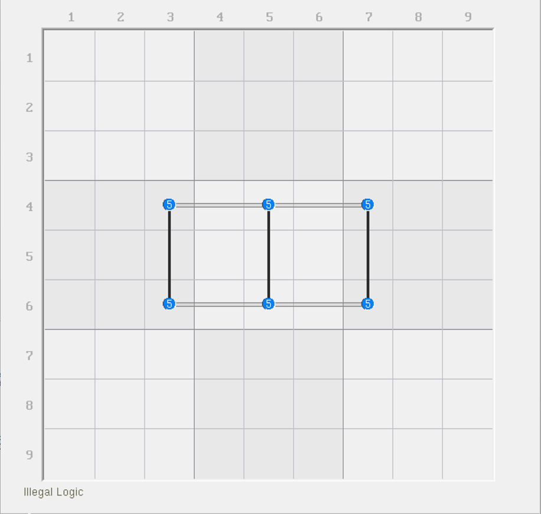
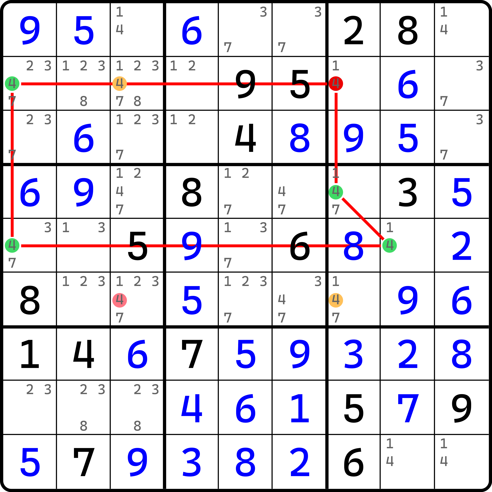
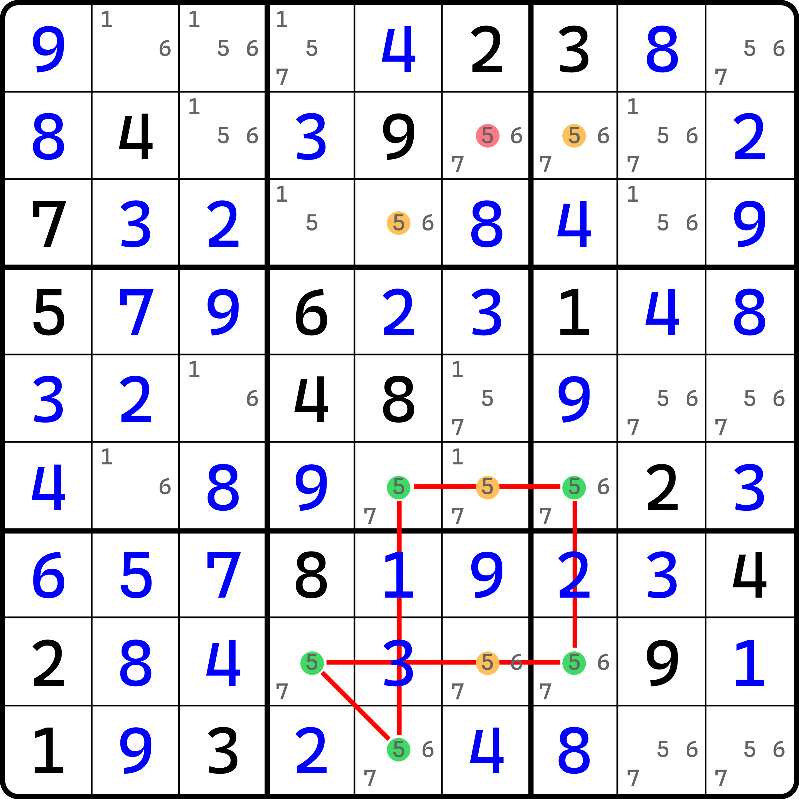

# 负秩结构

今天我们来看最后一种情况，秩为负数的情况。

显然，一个正确的结构是不允许秩为负数的，因为它内部的填入状态将导致直接矛盾，所以它必须需要依赖特殊的部件才可稳定存在。

## 负秩的通用结构 

<figure><figcaption>
负秩结构的通用构型
</figcaption></figure>

如图所示。这是一个最普通的负数秩的情况。按照秩的分析方式，弱区域一共有两个，但强区域却有三个。强区域意味着你必须往结构里填 3 个数；但弱区域又只能让你往里面填最多两个数。最多俩肯定是达不到 3 的基础条件的，所以是矛盾的。我们就把这种显而易见存在矛盾的、秩为负数的情况称为**负数秩结构**或**负秩结构**（Negative-Rank Pattern）。显然，负数秩结构是非法的结构，即本身就是矛盾的。

## 守护者（Guardian） 

<figure><figcaption>
守护者
</figcaption></figure>

如图所示。这个结构还挺特殊的，所以我们得稍微讨论一下。

> 可以发现配图风格临时回归了。这是因为 XSudo 对负秩的讨论不是很友好，所以这里使用原始配图的方式作介绍。

如果你忽略其中橘黄色的 `r2c3(4)` 和 `r6c7(4)` 的话，此时你会发现，所有用共轭对连起来的部分都会真正意义上成为共轭对，那么意味着你必须在 `r25`、`c17` 和 `b6` 这五个区域里填入足够数量的 4 才能使得结构稳定。

但是假设忽略了那两处橘黄色的 4，你会发现，它会形成一个奇数长度的回环，且环上任意相邻两个节点都是强链关系。按照强链的定义，我们知道他们一定不同假。换言之，用秩的说法就是，强区域里只能提供恰好一次的出数。可问题在于，每一个环上的节点都是被两个强区域所覆盖的，这将会存在非常大的问题：如果我往其中任意一处位置填上 4，那么它都会因为同时占有两个强区域的关系，强区域数量就会少 2 个单位，而非 1 个。这个讨论方式实在是过于复杂，因此我想换个思路介绍。而对于上面所说的“占位”的说法，以后我们也是会遇到的，不过我们在此暂且不过多说明。

因为是奇数长度的，所以虽然标注为强区域，但是实质上我们并不会把每一个强区域都会用作强区域；就像是链一样，有些时候两个数会同时符合强链关系和弱链关系的定义，但具体是取决于你在使用时它体现出来的交替规则是哪一个。对于这里也是一样，你每填一个数，那么它相邻的节点就不能填了；然后不填之后因为下一次又是强链关系，于是下一轮又会填，所以整个回环是可以存在交替填数的状态的。

那么我们来思考一下这个问题。整个环是奇数长度的，这意味着我们交替会出现显而易见的矛盾。因为真假的交替意味着只有偶数长度的环才能周而复始地延续下去；但是奇数长度的环，一旦假设一个真之后，最后那个节点就必须为真；反之，如果假设的是一个假，那么绕一圈回来就会发现，最后那个节点则也会为假。

也就是说，奇数长度的环任选一个节点作为头，那么头尾的两个节点一定是同真假性的。可问题是，这可是强链关系。同真不可取，同假也不可取。同真意味着同一个区域下同时填两个相同数字；而同假意味着这个区域下没有这个数字可填的位置。这显然都不对。

所以，奇数长度的回环自身就是矛盾的。换言之，橘黄色两处候选数就一定不能同假。所以，它俩可以用于删数排除。那么，很明显的是，`r2c7(4)` 和 `r6c3(4)` 是这个题的结论。

这个技巧有个单独的名字，叫做**守护者**（Guardian）。而这个守护者这个名字也时常指代图中 `r2c3(4)` 和 `r6c7(4)` 这两处候选数。他们没了，结构就会直接挂掉，所以他们是在守护者结构的稳定性。

## 守护者和负秩结构的关系 

那么，这个结构到底和负秩结构有什么关系呢？其实，拿掉那两处候选数 `r2c3(4)` 和 `r6c7(4)` 之后，剩下的结构的秩是等于 -1 的。

怎么算出来的 -1 呢？因为我们要往结构里填的最多的合理填数次数是 2 个（任何时候你插入进第 3 个数，结构都会出现矛盾），但是，你在填数时，因为你迫不得已需要在拿掉那两处候选数进行填数，所以你又需要安排 3 个数进去，这样你才能确保每一个强区域都有所覆盖。

你如果只填两处强区域的话，因为它是奇数环长度，你每填入一个数都会覆盖两个强区域，这样只能得到 $$2n$$ 个强区域（其中 $$n$$ 是你填入数字的总次数），但实际上你还有一个强区域没有被覆盖，所以强区域数是 $$2n  + 1$$ 个，因此你又不得不去覆盖它才能完整完成对全部强区域填充数字的过程。所以，你需要填 $$n + 1$$ 个数字进去。

对于这个题而言，整个环的长度是 5，所以可以得到 $$n = 2$$，所以你要填 $$n + 1 = 2 + 1 = 3$$ 个。显然，你只能最多填 2 个，但你又必须填 3 个才能覆盖全部的强区域，这样算下来显然等于 -1。

尽管这么说有些奇怪，但很明显这个例子本身长得就不太像是能用正常的推算规则算出来的。以后我们还会反复遇到这种东西，所以不用担心你现在看不懂它。这个例子反倒好在，每一个数都不用弱区域覆盖，而只需要研究其强区域就行。它跟前文正秩结构是倒过来的：正数秩结构里，删数是被若干的弱区域覆盖而不被强区域覆盖，这玩意儿又是被强区域而又不被弱区域覆盖。

下面我们再来看一个例子。

<figure><figcaption>
守护者，另一个例子
</figcaption></figure>

如图所示。这是另一个守护者的例子。这个就自己看了。
