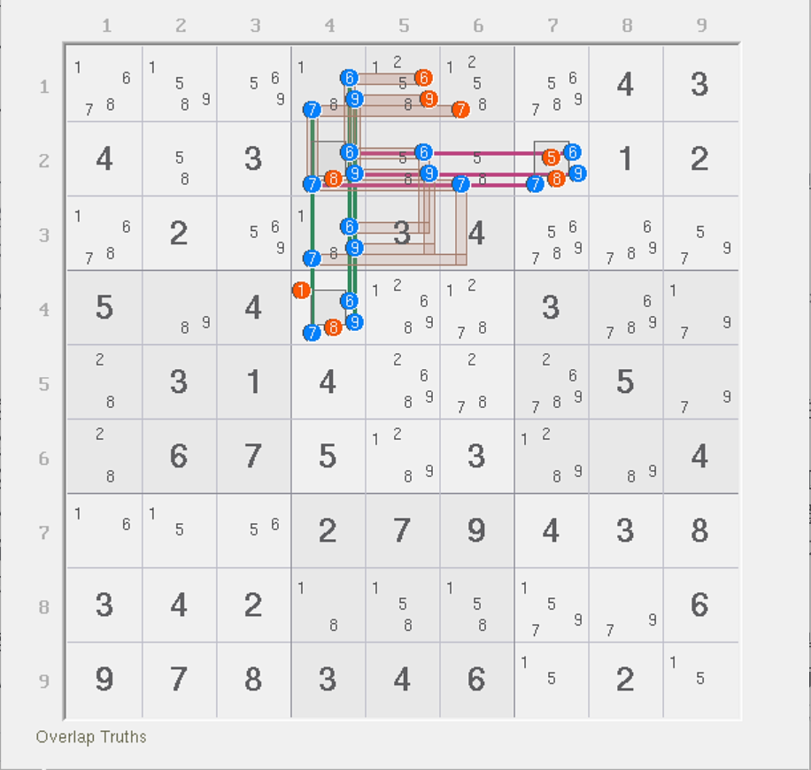

# 强三元组的例子

## 例子 1：动态链 

<figure><figcaption>
动态链
</figcaption></figure>

如图所示。本题有一个强三元组 `r3c4(2)`。我们需要讨论它的真假性。

如果它为真，则很显然，`2c4` 这个弱区域会用于删数；而如果它为假，则其余位置没有任何一个候选数出现三元组的特征，所以退化为普通的结构。此时数一下强区域数量和弱区域数量。强区域数量有 5 个，弱区域数量也有 5 个（因为三元组不占位时并不会影响强弱区域的数量造成变化）。所以，整个结构的秩为 0，故所有弱区域均可以用于删数。

那么，两种情况都可以删除的自然都包含 `2c4`，所以这个题的弱区域 `2c4` 可以用于删数，故有 `r1c4 <> 2`。

## 例子 2：烟花三数组 

<figure><figcaption></figcaption></figure>

如图所示。本题讨论起来稍微复杂一些。

> 另外，顺带一说，`r4c2` 是可以通过排除得到填 9 的结论的。但是这个数出了之后会影响右侧结构（少一个候选数）。这个少的候选数对于结构完整性来说比较重要，初学的话我还是留着这个 9 保证三个单元格候选数全部完整出现会方便学习和上手这个结构的推理，所以我才故意没填的。

好在强三元组挤在了同一个单元格上。思考一个问题。这个题有三个强三元组的话，那么实际能占位的始终只有一个数。于是这个结构只会出现两种占位状态：

1. `r2c4` 不占位（不出现 6、7、9 任意一个数为真）；
2. `r2c4` 占位（出现 6、7、9 的其一为真）。

我们用秩的角度讨论，就是之前说的占位与否来讨论。鉴于结构的特殊性，数字 6、7、9 在填充效果上一样的，你随便认为其中哪一个数占位填入都可以，就不用三种数每个都假设一次填入占位了。我们假设极端一些，假设 `r4c2` 不被 6、7、9 里的任意一个数所占位，那么此时结构就不存在任何的强三元组，但我们要确保此时 `r4c2` 必须填一个数进去，所以它只能填跟题目无关的数进去，于是，强三元组不存在后，填了一个无关的数，强区域数量没有发生变化；但是，弱区域少了一个，因为 `r4c2` 被无关数字占位了。因为此时结构剩余候选数均被一个强区域和一个弱区域覆盖，所以可以用之前的秩的公式计算。计算发现，5 - 6 = -1，所以矛盾。换言之，`r4c2` 必须被 6、7、9 的其一占位。

得到这一点之后，我们可以使用代数的视角继续。因为此时 6、7、9 随意哪一个数占位填充到 `r4c2` 造成的效果（强弱区域减少之类）均是一样的。

不论填了什么，竖向和横向均有三个强区域。其中一个数被安排在 `r2c4`，所以横向和纵向都还必须填入一个数进去。不管如何排列，我们应知道的是，此时 `679r2` 出两个数，`679c4` 出两个数，还有一个数放 `2n4` 刚好凑齐结构摆放。所以，这个结构虽然看起来有 6 个强区域，但因为推演后发现必须占位，所以只能摆 5 个数进去。

我们再次数一下弱区域数。此时 `2n4` 已经填了数，所以原本 6 个弱区域现在还剩下 5 个。结合前面说的，我们实际也就能放 5 个数进去，这意味着什么？这意味着每一个弱区域都会被安排一个合适的数字填入到结构之中。因此，所有删数均可用于删除。虽然看起来有强三元组，但被我们修正了填充状态后可知，它实际上达不到看起来这么多的强区域数量（6 个）这么多个的数都填入进去。

请记住这个例子的推演过程，这是一个伏笔。

## 例子 3：四个强三元组的结构 

<figure><figcaption>
四个强三元组的结构
</figcaption></figure>

如图所示。本题比较复杂，一共有 10 个强区域和 10 个弱区域，要是用穷举的话会有 50 多种填法组合，每个都看一遍肯定是不现实的。

我们找出这个题里不符合正常覆盖逻辑的地方。这个题一共有 4 个强三元组：`r4c8(157)` 和 `r5c8(7)`。我们直接讨论占位的状态即可。因为有两个不同的单元格可用于占位，所以占位状态一共就只有如下的三种：

1. `r45c8` 均不使用三元组占位；
2. `r4c8` 或 `r5c8` 其中一个被三元组占位；
3. `r45c8` 都被三元组占位。

通过强三元组基础的占位思路来理解的话，我们知道，强三元组在不占位的时候是不影响强弱区域总数的，就是说在不占位时，强区域的总数和弱区域的总数并不会因为不占位而发生变化。所以我们可以直接利用这一点分析这三种情况。

首先是都不占位。都不占位意味着强弱区域数都是 10（不变）的同时，没有任何一个数是特殊的覆盖逻辑，全都是一个强区域一个弱区域的标准覆盖规则，所以结构可以按最开始的计算规则算出秩为零的结果，所以结构为零秩的，所以所有弱区域都可以用于删数，`r4c8 <> 8` 此时属于删数的一部分，成立。

其次是 `r4c8` 或 `r5c8` 其一占位。先来看 `r4c8`。显然，它占位可以直接删数。所以此时 `r4c8 <> 8` 可以成立。再看 `r5c8`。这次，`r5c8` 占位的话，因为我们这个情况的假设是互斥的，所以 `r4c8` 此时就不能有占位。多亏这一点，我们才能得到结论：因为 `r4c8` 不被 1、5、7 三元组所占位，而 `r5c8` 占位，所以总体强区域数量只会少两个（`r5c8` 连进来的这两个 7 的强区域），但弱区域数量只会少一个，就是这个 `5n8`。此时，强区域数量变为 8 个，弱区域数量变为 9 个。因为弱区域数量仍然更多，所以秩为正数，所以无法得到矛盾。

但是实际上这还是矛盾的。因为 `r5c8 = 7` 之后，`2c8` 上只能让 `r3c8 = 2`。而 `1c8` 也恰好只有两处位置。因为 `r4c8` 不占位，数字 1 也在其中，所以 `r4c8 <> 1`；而唯一一个可填 1 的位置 `r3c8` 却在这种情况下被 2 所“占领”了，1 此时没有任何地方可以填入，所以就矛盾了。或者你倒过来看也行：因为 `r4c8` 不占位，所以 1 必须填在 `r3c8`，然后 2 就必须填在 `r5c8`；但 `r5c8` 此时我们假设它必须填的是强三元组占位的数字 7 而不是 2，所以矛盾。总之就是，此时只让 `r5c8` 被 7 占位，而 `r4c8` 又不被任何强三元组占位是根本不可能成立的。

还需要分析第三个情况吗？显然不需要了。因为第三个情况不管成立与否，`r4c8 <> 8` 的结论都可以得到了。因为第三个情况会假设 `r4c8` 成立其中一个强三元组占位的情况，而这已经在前面第一点就讨论过了——它能直接引发同单元格上的删数。所以，这个题的结论就是 `r4c8 <> 8`。
