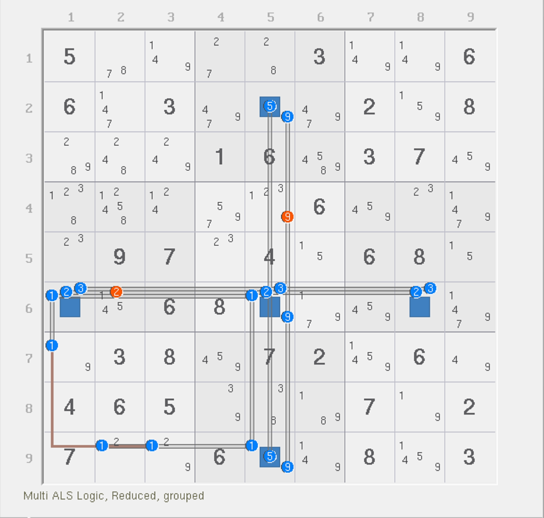
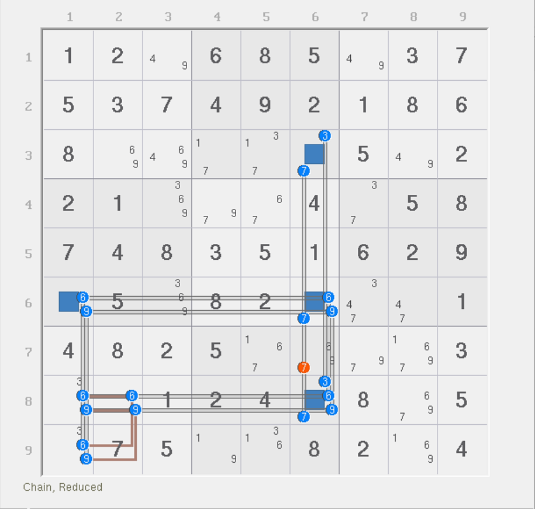
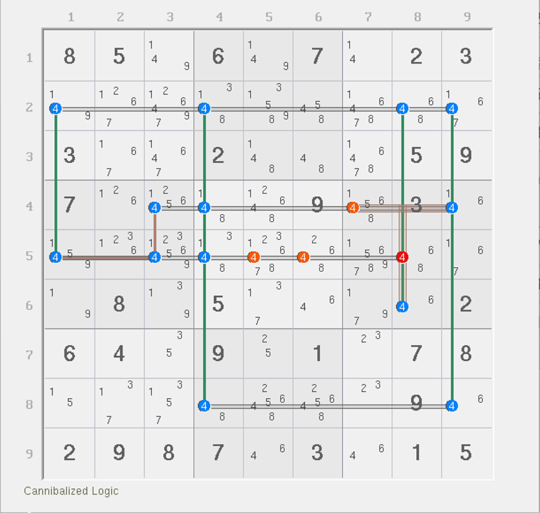
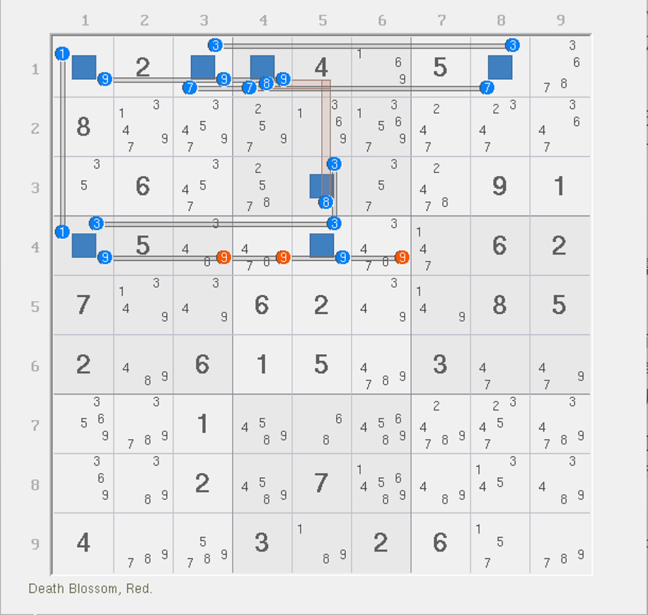

# 弱三元组的例子

## 例子 1：胖姨环（Fat Ring） 

<figure><figcaption>
胖姨环
</figcaption></figure>

如图所示。这个题别看有三个弱三元组，但分析起来其实相对比较容易，所以放在第一个例子介绍。

这个题有 6 个强区域和 8 个弱区域，但是有三个弱三元组分别位于 `r6c15` 和 `r9c5`。很显然，直接上手讨论是不太有效的，所以我们得想点套路来解决它。

我们不妨单独提出数字 1 来看看它实际能填几次。我们强行只看 1，别的数我们一个都不关心，那么这个结构里 1 脱离出来之后，我们按 `r6c5` 来讨论 1 的可填状态。

如果 `r6c5 = 1`，则 `r6c1` 和 `r9c5` 都不能填 1，此时弱三元组只有 `r6c5` 一处占位；而剩下两端弱三元组都不占位，所以 1 借用 `1b7` 的强区域，由于它必须出一个数字 1，所以 `r6c5 = 1` 时，一共会填两次 1。

如果 `r6c5 <> 1`，则我们也无法确保 1 是否能填入 `r6c1` 和 `r9c5`，因为 `r6c5` 引出的两端是弱区域而非强区域。但是，因为 `1b7` 的强区域告诉我们，1 只能要么填在 `r7c1` 上，要么填在 `r9c23` 上，所以不论哪个情况成立，剩下的两个弱三元组总有一个会被占位（如 `r7c1` 填，则 `r9c5` 占位；如果 `r9c23` 填，则 `r6c1` 填）。所以算上 `1b7` 强区域填一次 1，所以这个结构此时仍然一共填了两次 1。

所以，不论 `r6c5` 的数字 1 是否占位，整体 1 只会填两次。其他数字均为普通的覆盖规则，所以鉴于 `1b7` 会有一个数字 1 的出现，所以 `r6c15` 和 `r9c5` 只能拿一个位置（也必须拿一个位置）填 1。

这样算起来，2、3、5、9 还在结构之中，刚好还剩下四个位置，所以直接按照不违背数独规则的模式摆放，2、3、5、9 就可以放满所有的单元格，并满足所有剩余四个单元格的强区域。换言之，例子里五个构成十字形的单元格强区域其中四个是 2、3、5、9 各一个，剩下一个填 1，然后 `1b7` 里填一个 1，就填满了 6 个位置。

那么删数怎么看呢？显然生效的是 2、3、5、9，因为他们必须填，而 1 确实不确定：你不知道最终 1 填在 `r6c15` 和 `r9c5` 的哪一个位置上。因此，这个题的删数只有 2、3、5、9 对应行列上的弱区域可以用于删数。

我们把图中这种十字形单元格外加强区域的结构（技巧）称为**胖姨环**（Fat Ring）。这个技巧的理念也是由探长提出，不过早期这个结构并非使用秩理论进行分析，是暴力分析的，所以并不体系；考虑到体系化的这一点，我们也是放在了这里才讲它。

> 这个题虽然有 8 个弱区域，但实际上就能填 6 个数字进去，也是很特殊。不过，胖姨环一般都具有这种效果。

胖姨环的本质就是这种特殊的多个同数字的弱三元组，通过独立出结构，就可以算出它实际的填充次数其实是比看起来弱区域数量要少的。另外，胖姨环是走 XYZ 环拓展得来的，不过这一点看起来很明显，所以我就不解释为什么了。

我们再来看一个例子。

<figure><figcaption>
另外一个胖姨环
</figcaption></figure>

如图所示。这个题有 6 和 9 两种数字出现此弱三元组的规则。

和前面讨论的方式完全一样，我们把 6 和 9 分别单独提出，只看他们自己内部的填充状态。

可以发现，此时提出之后，6 和 9 都只能填两次。然后数一下这个题的强区域数量。这个题有 4 个单元格强区域和两个宫强区域，一共要填 6 个数。我们要填的 6 和 9 都只能各自填俩（这就 4 个了），所以剩下的 3 和 7 刚好在 `r368c6` 里找到合适的位置填进去就可以足够放满 6 个位置。

所以这个题的删数就是 `37c6` 这俩弱区域可以用于删数了；因为 6 和 9 比较特殊，我们无法确定最终 6 和 9 的位置，所以也就无法确定删数。

请记住这两个例子。这两个例子用到的推演方式，和强三元组里出现烟花数组的那个推演过程都是教程的伏笔。

## 例子 2：复杂鱼 

<figure><figcaption>
复杂鱼
</figcaption></figure>

如图所示。这个题里有一个强三元组和两个弱三元组（如果 `r4c7(4)` 也算弱三元组的话），共有 5 个强区域和 5 个弱区域。

先讨论强三元组占位。如果 `r5c1` 确实填 4，那么 `4r5` 显然可以用作删数。但是请注意，此时虽然 `r5c8` 也在其中，但它是强区域的一部分，所以不能直接用作删数；讨论它删数的成立与否是需要稍后继续细致分析的。

如果 `r5c1` 不填 4，则这个结构的强区域则不存在重叠填一次满足两个位置的情况，所以强区域实打实会让结构填 5 个数进去。而安排的时候，因为强区域每一个要出一个位置填，本着避免违背数独规则的约定，所以我们必须为 4 都安排上合理的位置。

显然，当 `r5c1` 不填 4 时，此时 `b6` 比较特殊。因为它能覆盖到一些本来就已经覆盖过的单元格，比如图中的 `r4c7`。我们继续讨论一下它的占位状态。注意，此时我们是基于 `r5c1` 已经不填 4 了才讨论的，这一点别忘了。

因为 `r4c7` 占位后，`4r4` 和 `4b6` 两个弱区域都会消失，但强区域一个没少，所以整体弱区域数量会比强区域数量要少，导致矛盾。

那么，`r5c8` 为什么能删呢？原因很简单：因为它是正宗的弱三元组。但我们需要从刚才推理的过程之中完全独立出来分析。

如果 `r5c8` 占位填 4，则强三元组 `r5c1` 无论如何都不能占位，此时结构没有任意一处是不满足基础覆盖的规则的（一个强区域一个弱区域覆盖，`r4c7` 和 `r5c8` 又同宫，所以也因为 `r5c8` 填 4 而消失）。而此时 `r5c8` 填 4 之后，强区域数量减少 1，弱区域数量减少 2，弱区域数仍然会比强区域数量更少，导致矛盾。所以，`r5c8 <> 4` 是这么来的。

最后是 `r5c56(4)`。当前面两个删数成立之后，`4b6` 就不存在弱三元组的特征了，因为出现影响的地方都被我们干掉了，所以直接讨论。`r5c1` 占位填 4 直接删掉；如果不占位后，结构全部位置均为标准覆盖规则，所以秩为零，直接按零秩结构删数即可。所以，`r5c56 <> 4` 是能够被覆盖到的删数。

所以这个题一共有两种不同的删数原因：一个是弱三元组占位导致秩为零，一种是根据强三元组占位分析零秩状态来得到删数。

## 例子 3：有点复杂的结构 

<figure><figcaption>
有点复杂的结构
</figcaption></figure>

如图所示。这个题有 7 个强区域和 8 个弱区域。其中 `r4c5(3)` 是本题里唯一一个弱三元组。

由于 7 个单元格只能填 7 个数， 我们试着讨论弱三元组的占位来看看有什么结论。

如果 `r4c5` 填 3 占位，那么此时弱区域数量少两个，强区域数量少一个，此时结构剩余的部件刚好强弱区域数量一样，也都只是普通的覆盖规则，所以可按零秩结构的删数逻辑进行删数。

但是，如果 `r4c5` 不填 3，看起来强弱区域数量都没有发生变化。但是，别忘了单元格自己是一个强区域。`r4c5` 是强区域，但如果它不填 3，那么它就只能填 9。此时，9 也可以用作删数。

总之就是，要么零秩删数可以删 `9r4`，要么直接通过强区域得到 `r4c5 = 9` 也可以删数。所以这个题的结论是 `r4c346 <> 9`。

至此，我们就把三元组的内容介绍完了。之后我们会带着大家进入到秩理论的综合运用的板块里，例子都比较简单，所以学起来肯定会很轻松。
