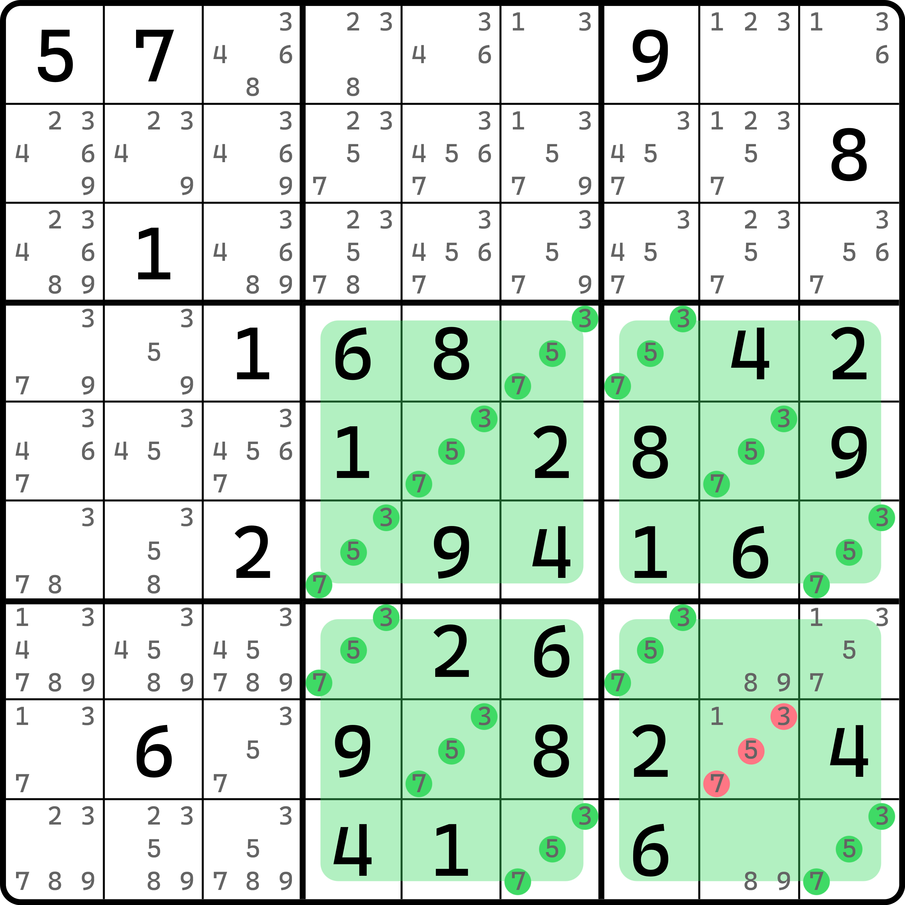
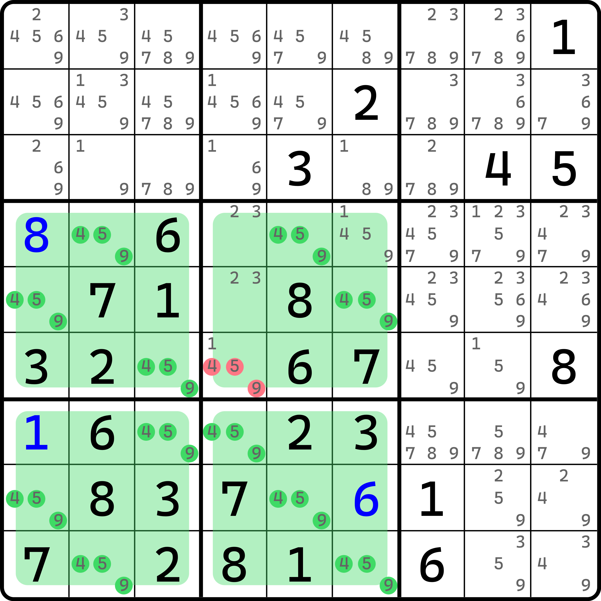
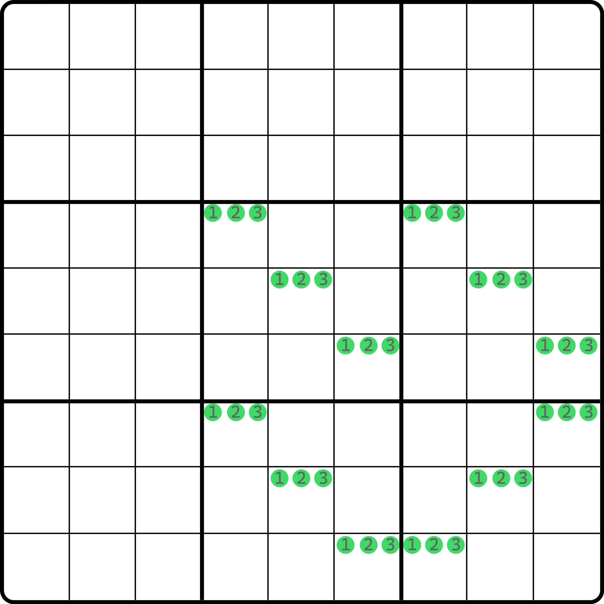
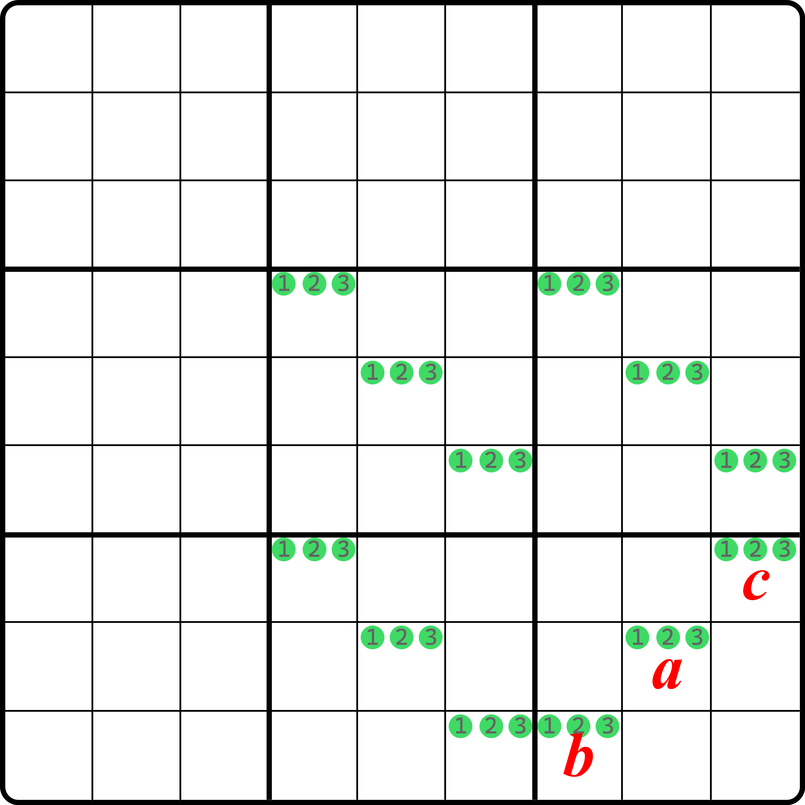
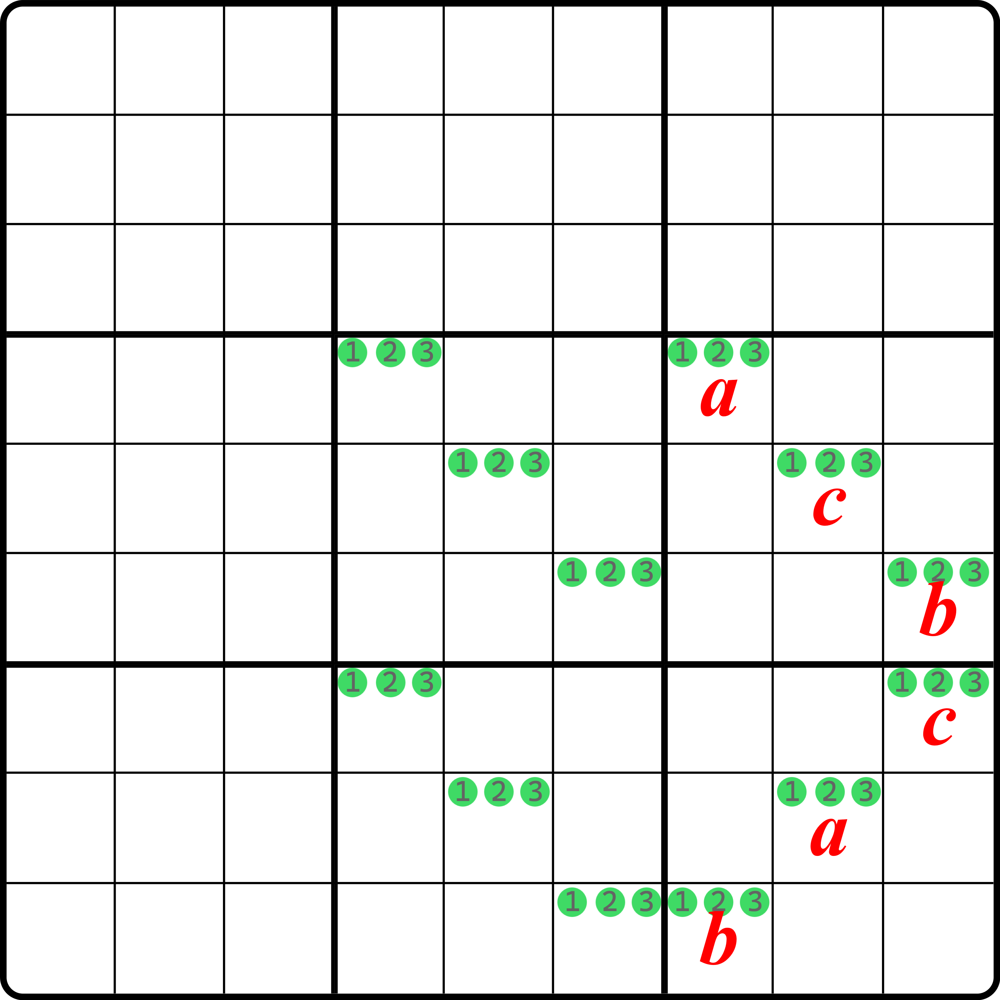

# 三值死环

前文的内容里我们介绍了三顺一逆现象的出现，以及为什么它会造成矛盾，今天我们继续加以推广，将死环从两种数字推广到三种数字。

## 三值死环类型 1（Trivalue Oddagon Type 1） 

<figure><figcaption>
三值死环类型 1
</figcaption></figure>

如图所示。我们发现这个题的 `b5689` 非常诡异。这个结构一共用了 12 个单元格，其中只有 `r8c8` 除了 3、5、7 以外还有一个多的数字 1。

如果 `r8c8` 只有 3、5、7 的话，此时这个结构会造成和死环完全一样的矛盾，即奇数长度的环存在于 12 个单元格的其中若干单元格之中，且无法避免。所以，`r8c8` 必须填非 3、5、7 的其他数字，故这个题的结论就是 `r8c8 <> 357`。

我们把利用三个数字的、跟死环矛盾效果一样的结构称为**三值死环**（Trivalue Oddagon）或**雷神之锤**（Thor's Hammer）。

三值死环倒还行，但是这个雷神之锤反而显得有点脱裤子放屁的意思。你把头稍微歪一点来看这个图就会发现这个结构确实跟个锤子似的。

我们再来看一个例子。

<figure><figcaption>
三值死环类型 1，另一个例子
</figcaption></figure>

如图所示。这个例子稍微别扭一些，因为 `b457` 显然就不再编排得那么容易看出来了。不过，如果你知道数独的变换等价规则的话，你应该知道这个结构仍然是符合矛盾规则的摆放的。

## 三值死环的矛盾 

那么，这个结构为什么也能造成和死环一样的矛盾呢？下面我们对这个结构进行证明。

<figure><figcaption>
三值死环的矛盾-1
</figcaption></figure>

如图所示。这是一个三值死环结构。我们先针对 `b9` 进行假设。

<figure><figcaption>
三值死环的矛盾-2
</figcaption></figure>

如图所示。接下来我们无路可走，因为根本就没有啥用。我们只好继续假设。

不过好在结构是对称的，所以你按字母假设就不需要每个情况都讨论一次，比如说 `r4c7` 填 $$a$$ 还是 $$c$$ 其实都可以，我们先假设填 $$a$$ 就行。然后我们不难通过三个数字直接得到 `b6` 所有单元格的填数：

<figure><figcaption>
三值死环的矛盾-3
</figcaption></figure>

如图所示。其实这里已经造成矛盾了，不过不容易看出。

对于剩下两个宫而言，因为数字 $$a$$ 只能填入在 `r47c4` 和 `r69c6` 里，而 $$b$$ 只能填入在 `r47c4` 和 `r58c5` 里，而 $$c$$ 只能填入在 `r58c5` 和 `r69c6` 里。仔细数数不难发现，每一个数剩下的都是只有 4 个可填位置的。但是我们无论怎么安排填数，剩下的 6 个位置都是放不下两次 $$abc$$ 的。

这可能有点难理解。我想避免穷举去解释，所以我这里给出一个稍微数学一些的说辞。从数学的角度来说，每一个数都会占用两个不同行列的位置，所以它至少需要两个编号的行和列作为目标坐标；而每一次填入一个位置，就会同时影响到这三个数字的其中剩下两种的摆放。换言之，比如你填了一个 $$a$$，那么这样对于某个剩下未填的单元格里就会少一个填 $$a$$ 的机会，而 $$b$$ 和 $$c$$ 同理。但是请注意的是 $$abc$$ 三种数字可摆放的位置并非是一样的，它受到之前填充的宫（即 `b69`）填的数字的影响，最终余下两个宫的摆放是略微不同的（就是上一段落里描述的每一种数字只剩下 4 个可填位置）。

仔细观察这些坐标不难发现，对于 `r47c4` 而言，这两个单元格席位同时会被数字 $$a$$ 和 $$b$$ 竞争，而 `r58c5` 是 $$b$$ 和 $$c$$、`r69c6` 则是 $$a$$ 和 $$c$$。倒过来看的话，一旦填入一个位置，那么其实剩下两个数字里就一定会有一个数字的位置会被确定下来只能填这里；再传递下去的话，最后剩下的那个数就没有摆放位置了，即“$$1 \rightarrow 0 \rightarrow -1$$”个可填单元格的状态变动。

其他的情况我这里就不展示了。不过因为是对称的，所以你可以随便试试，肯定矛盾最终都会出现。

## 导致矛盾的本质原因 

不难发现，这个结构肯定是无法正常填充数字的。那么，是什么本质原因促成了它真正无解的局面呢？

不知道你有没有发现，它其实就是三顺一逆的推广。三顺一逆现象是 8 个单元格，在四个宫里；而三值死环则是 12 个单元格，也在四个宫里，所以看起来确实比较相似。但这并不足以让我们知道它和结构无解局面是挂钩的。

这是一个比较难以用数学语言解释、但凭感觉却非常容易知晓矛盾肯定会出现的点。在前一节里，8 个单元格的死环造成矛盾的根本原因在于余下那个倾斜方向不同的宫的两个单元格会同时被两个不同的数字所看见。而这么去思考的话，12 个单元格里，`b9` 因为倾斜方向不同，所以三个单元格均会被两侧的宫 `b58` 的两个单元格所看见。假设 `b9` 的倾斜方向也是正确的的话，那么 `b9` 的填充只需要照着 `b5` 对应位置填一样的数字就可以规避矛盾，因为每一个空格都会被两个填数不同的单元格所看见，而整好摆放是对称的，所以每个空格都看到的是不同的数字对；但是对于摆放错误的情况而言，因为它打乱了所看到的单元格的情况，所以它必然会造成有两对看起来完全一样的位置看到两个不同的格子（比如 $$a$$ 和 $$c$$ 同时看到两个不同的格子），这样的话，它俩自然就都只能填相同的数字。但是显然它们在同一个宫里，所以这便形成了矛盾。

不过，这个技巧因为用到的格子数量比较多，所以在平时使用之中比较少见，所以也不需要严格意义上的掌握。
