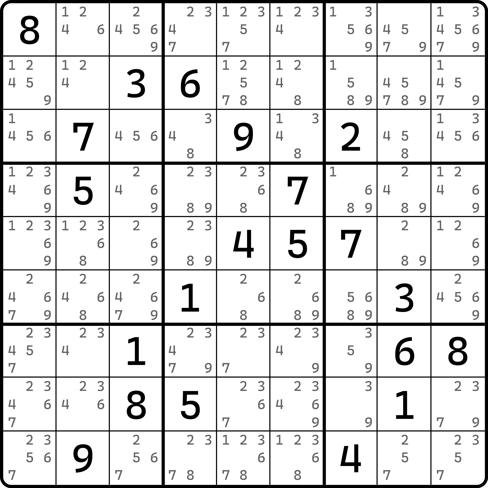
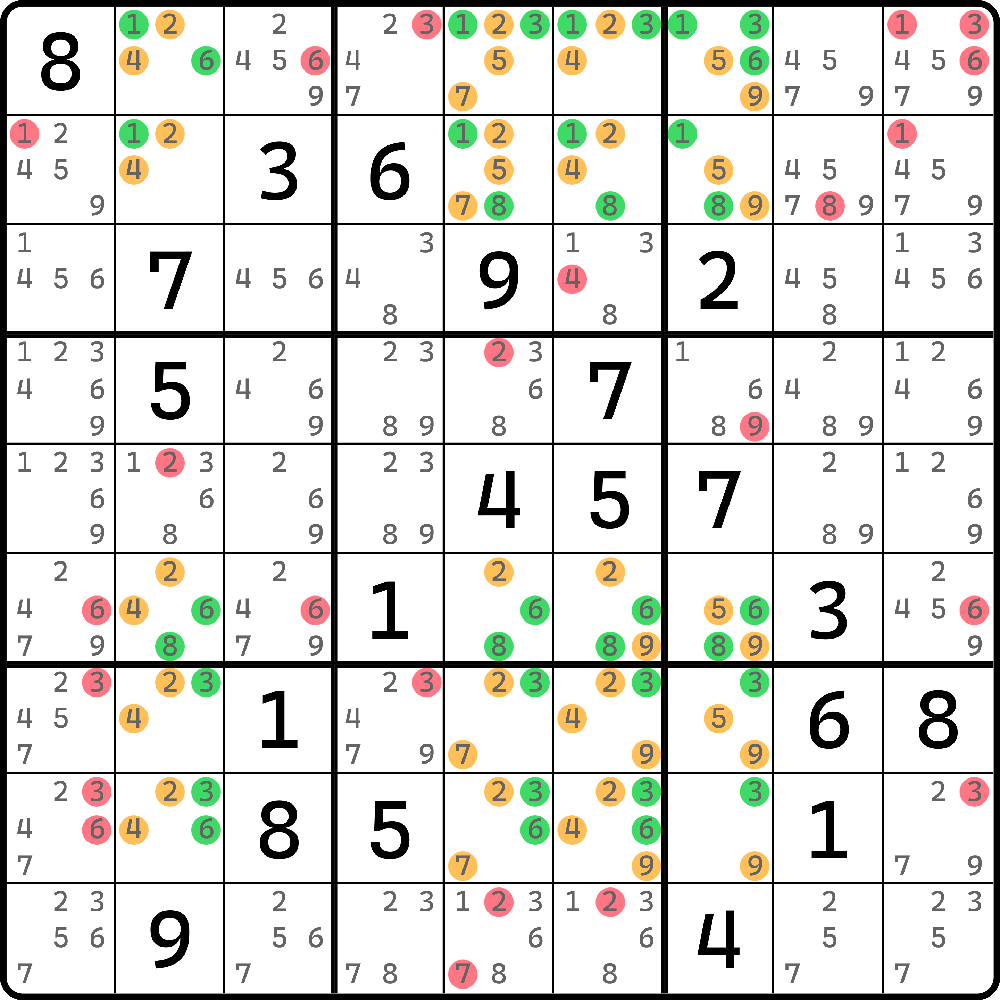
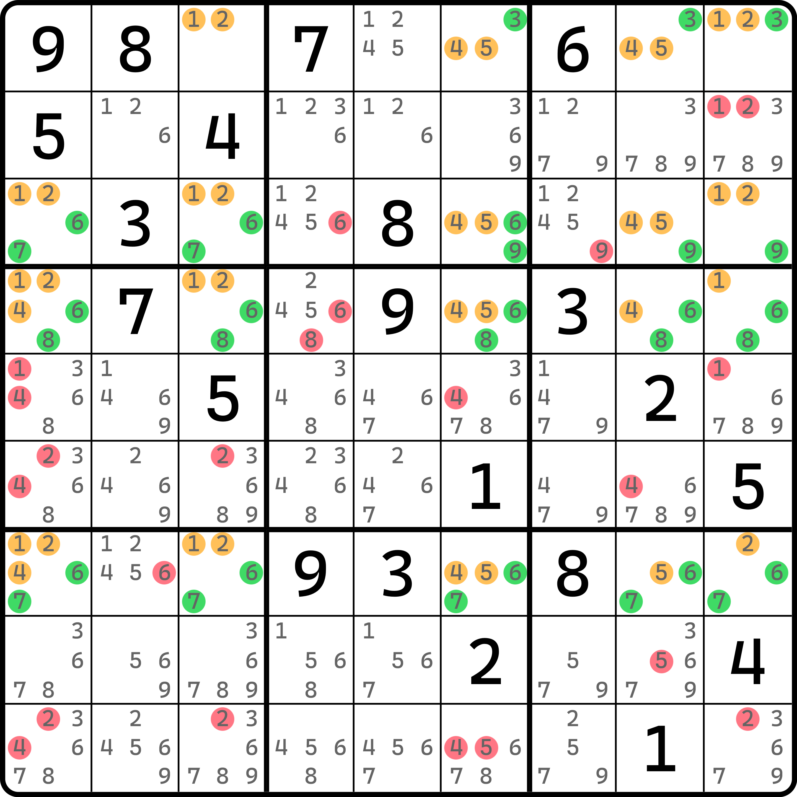
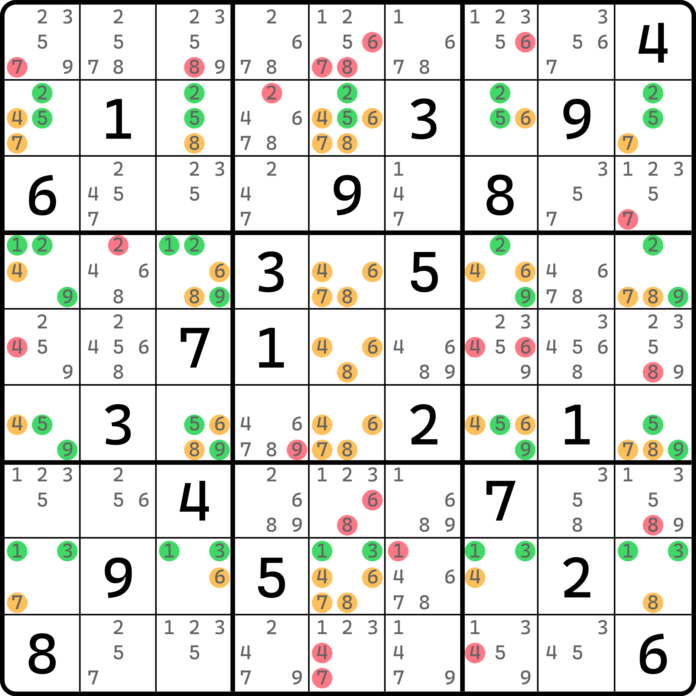
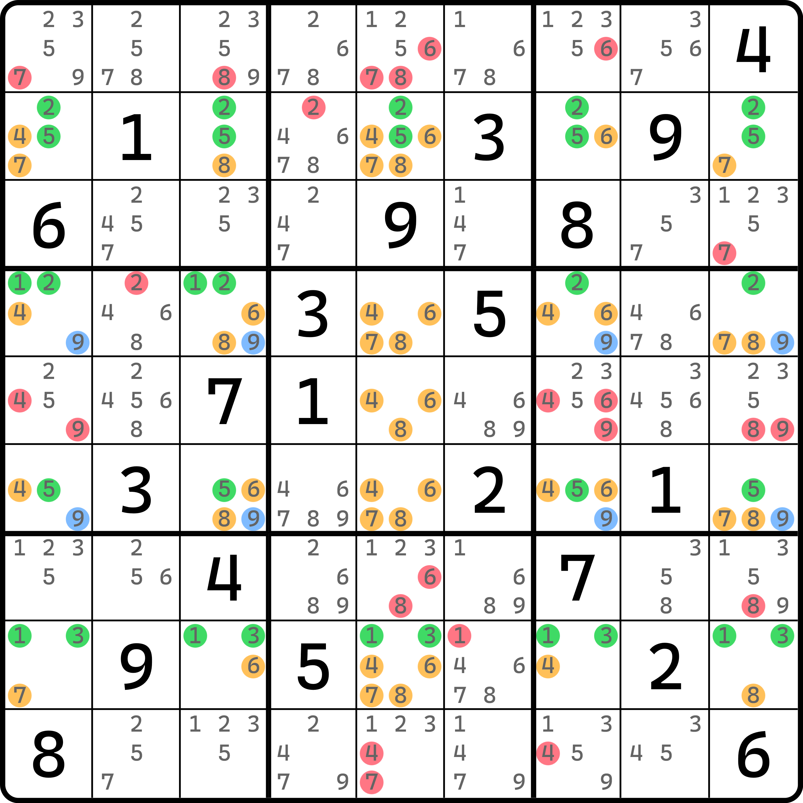
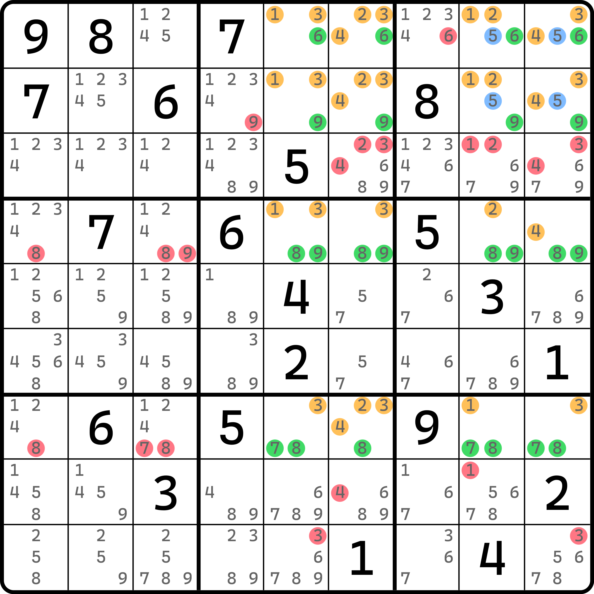

# 网的基本推理

前文的内容我相信已经给各位阐述了一个比较清晰的推理过程。下面我们正式进入这个板块的内容的学习。

## 一个看着就很唬人的题 

在中国的数独论坛里老是流传着这么一道数独题，据说是由芬兰的一位数学家自己研制的数独题目，它具有唯一解，但却无法采用合适的技巧进行解题。

<figure><figcaption>
所谓“世界最难数独题”
</figcaption></figure>

如图所示。这道题被过度抬高，甚至被广泛称为“最难数独题”，一度吓死不少孩子。我们要对题目有一个正确的认知，数独技巧确实并非是万能的，对于越大的结构确实越难以出现；但这个题的存在其实是反倒打破了这一点。这道题会用到一个非常大的结构，比前一节的多米诺环 16 个单元格还要大，但它却是零秩结构。

<figure><figcaption>
网结构
</figcaption></figure>

如图所示。本题要用到 `r12678c2567` 这 20 个单元格。它巧妙就巧妙在这 20 个单元格刚好是矩形的分布，因此非常便于分析。

在前一节的内容里，我们有一个对结构的认知，大概是将结构的涉及的数字进行归纳和分组，让每一个数都发挥出作用，且都用于一个固定的行、列、宫。比如之前的分段融合待定数组里，我们经常会用到同宫里的两个数，它最终会在宫里形成数对结构，只是位置不定。这个题也是如此，不过这个题交织的情况则更为繁琐。这个题里数字的分布应该这么去看：

* 按行
  * `136r1`
  * `18r2`
  * `68r6`
  * `3r7`
  * `36r8`
* 按列
  * `24c2`
  * `257c5`
  * `249c6`
  * `59c7`

可以数数看，这么分配的话，所有的数字全部可以派上用场。按照秩理论的看法就是，强区域一共有 20 个（全是单元格）；弱区域也有 20 个（10 个行上的弱区域，10 个列上的弱区域）。因为本题所有数字均只会被一个强区域和一个弱区域所覆盖，所以均为精确覆盖，故这个结构可以按秩的公式计算得到为 0 的结果。所以这个结构整体是零秩的。

因为是零秩的，所以所有弱区域均可用于删数。对于此题而言，所有 20 个弱区域均可用于删数，于是就可以得到图上的这些位置。

我们把这个纯单元格当强区域，而相关连接用弱区域关联起来构成的零秩结构称为**网**（Multisector Locked Set，简称 MSLS）。这种结构在朴素情况下是矩形形态，比如这个题里的是一个 5 行 4 列的矩形。

## 例子 1：缺了单元格的网 

我们再来看一个例子。

<figure><figcaption>
不够完美的网
</figcaption></figure>

如图所示。这个题只用了 19 个单元格。原本正常的网结构由于 `r1c1` 被提示数占位导致不能再用了。所以这个网结构缺了一个单元格。不过也没问题，因为它仍然符合网结构的定义规则和特征：单元格为强区域，行列宫用弱区域关联所有数字，且零秩仍然成立。这次就不带着大家数了。

## 例子 2：补了单元格的网 

我们再来看一个需要补单元格才能构成网的结构。

<figure><figcaption>
补了 r5c5 的网结构
</figcaption></figure>

如图所示。这个题用了 21 个单元格，而弱区域呢？也是 21 个，所以是零秩的。所以图中所有弱区域都可以用作删数。这个题必须算上 `r5c5` 不是没原因的。如果我们不计算在内，则 20 个单元格必须使用最少 21 个弱区域才能精确覆盖，即使 `r5c5` 不纳入也是如此。此时结构不是零秩，也就无法用于删数；当纳入 `r5c5` 之后，因为它自身只有 4、6、8 三种候选数，也恰好是所在列上的弱区域所用数字，所以恰好可以纳入计算之中，在不破坏结构的情况下使得结构称为零秩结构。哦我们把这种差一点形成网（但还没有构成零秩的结构）通过补充和删掉单元格、篡改弱关系的走向等使其变为零秩的网结构的过程称为对网结构的**修正**（Fix）。

顺带一提，我们趁着这个例子继续介绍一下宫内的弱区域效果。前文给的例子稍微都比较正常，因为都用不上宫的弱区域类型。下面我们来看使用了宫作为弱区域的变体。

<figure><figcaption>
宫弱区域
</figcaption></figure>

如图所示。我们将 `9r46` 的两个弱区域改成 `9b46`。这样数字 9 的覆盖情况并未发生变动（仍然是精确覆盖）的同时，弱区域数量也不会变，所以这种改的方式是可以的。

不过这么改了一下之后，弱区域因为不同了，所以删数就不一样了。此时 `b46` 里别处的 9 就可以用于删数了；相反，因为 9 不再是行上的弱区域，所以行上的弱区域在这个情况下就不能删除了。

我们再来看一个例子。

## 例子 3：带宫弱区域的网 

<figure><figcaption>
带宫弱区域的网
</figcaption></figure>

如图所示。这个例子就自己看了。
