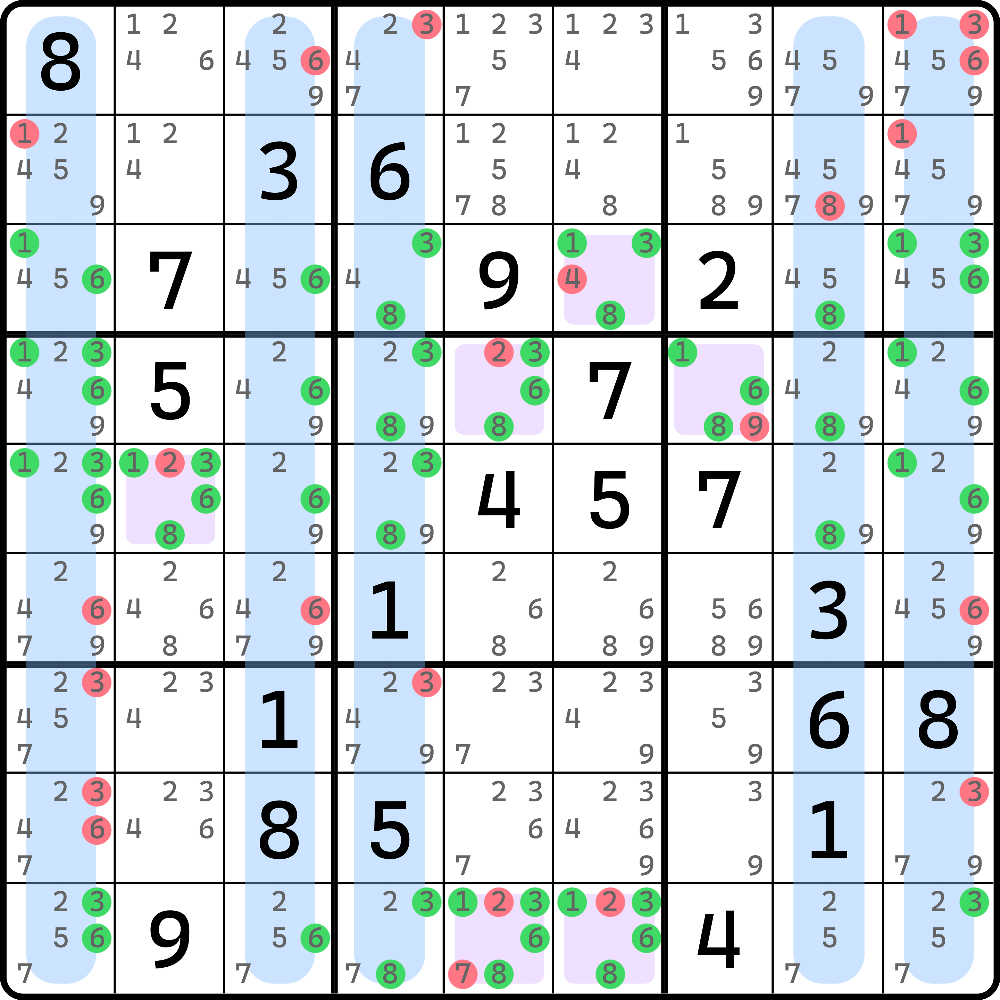
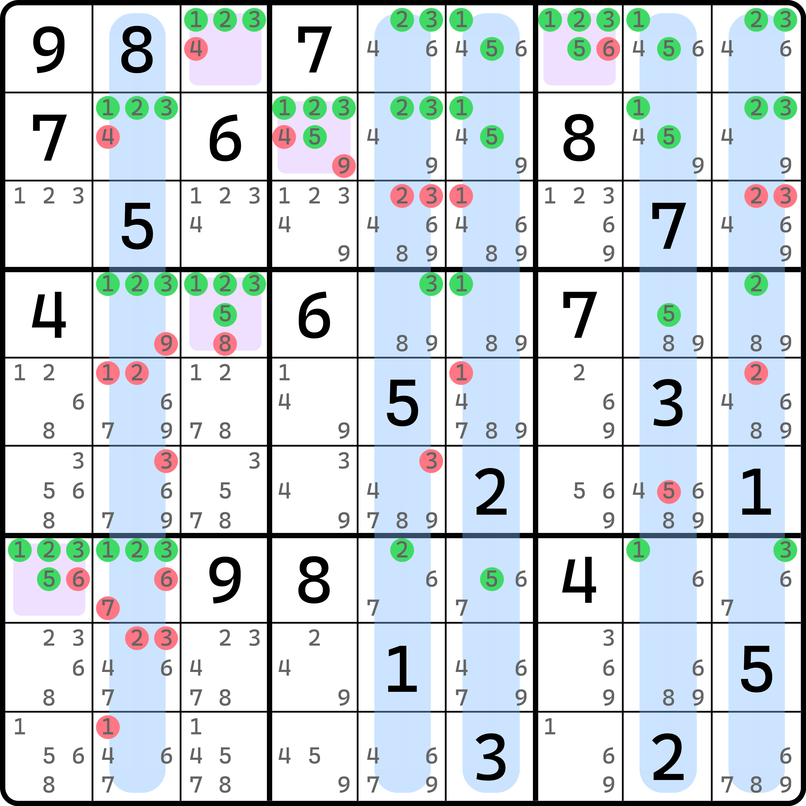
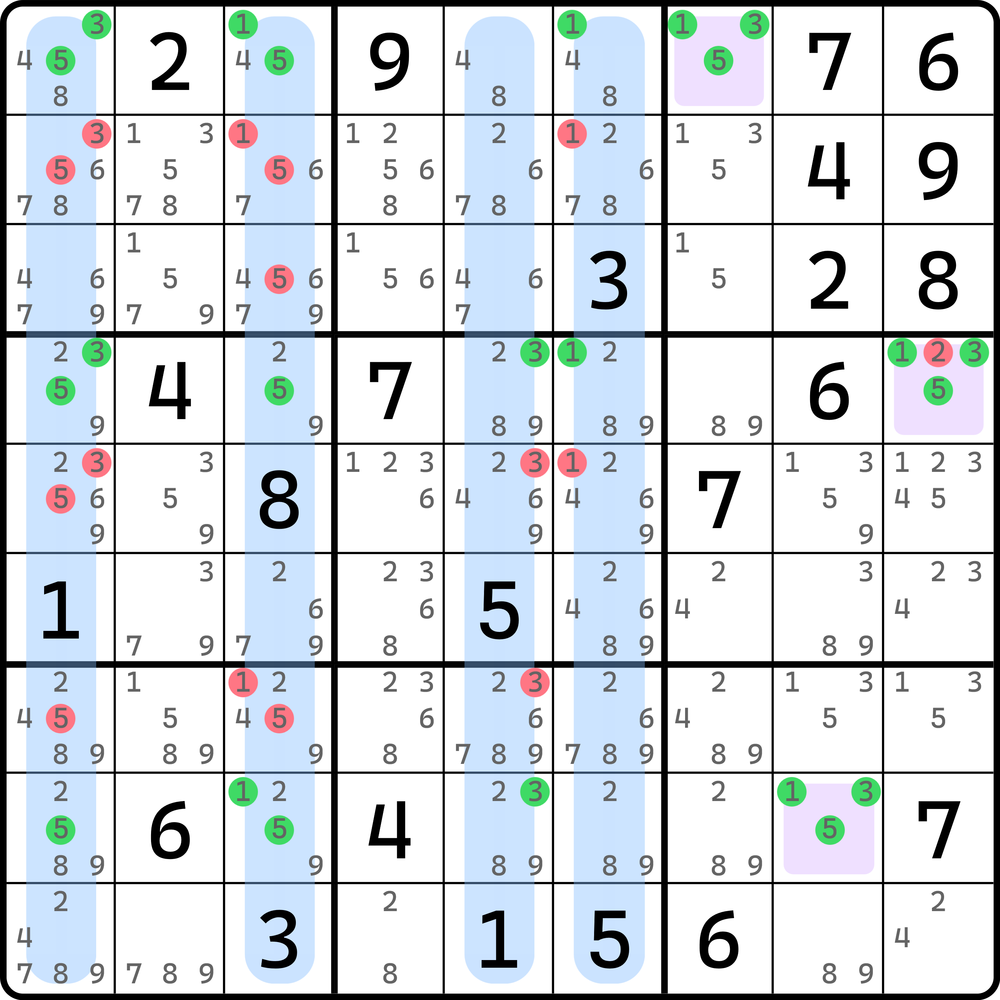
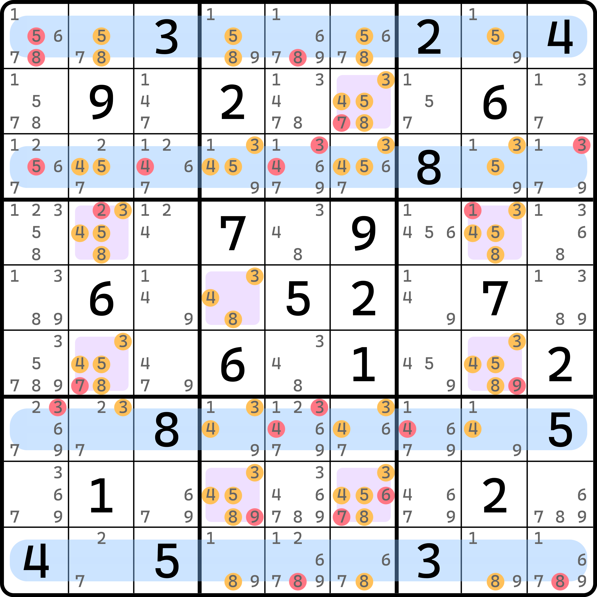

# 复数鱼的基本推理

## 旧题新解 

<figure><figcaption>
还是那道题，但是又换了个画法
</figcaption></figure>

如图所示。这个题之前已经出现过两次了（在基础讲解和直观里介绍过）。今天是第三次遇到这个题了。

这次我们将视角改成看数字，类似鱼那样。我们横着数一下数字 1、3、6、8 四种数字的出现情况。比如 `r3` 里，所有 1 出现的位置包含 `r3c169` 这几个单元格，而 3 则是 `r3c469` 这几个单元格，6 和 8 也是若干的单元格。其他的行也会有 1、3、6、8 的出现，我们全部将其提取出来，就会有图上这些绿色的候选数标记。

显然，在 `r3459` 里，1 必须出现一个，3、6、8 也一样，所以很明显这四个行里一共得出现 16 个数；换言之，这 4 行会产生 16 个强区域，关于 1、3、6、8 的。

接着，我们再来找弱区域。我们竖着将 1、3、6、8 出现的位置进行覆盖，可以发现 `c13489` 选取后，可以覆盖到 1、3、6、8 里绝大部分的候选数，但仍然有一些无法被覆盖到。不过好在他们在同一个单元格里出现得会比较紧凑一些，因此余下的我们直接按单元格取弱区域即可，即图中的 `r3c6`、`r4c57`、`r5c2` 和 `r9c56` 这些单元格。

数一下弱区域数量。`c1` 有 1、3、6 被覆盖，`c3` 只有 6 被覆盖，`c4` 有 3、8 被覆盖，`c8` 覆盖了 8，`c9` 覆盖了 1、3、6。这一共覆盖了 10 次数字；算上单元格也是 6 个，一共也是 16 个单位的覆盖，即 16 个弱区域。

此时我们发现，因为强区域数和弱区域数此时达成一致（都是 16 个），且每一个被涂绿色的候选数都被精确覆盖到，所以这个结构是零秩结构。那么删数呢？自然就是所有弱区域覆盖到的地方了，故这个题的删数有图上红色的这些位置。

我们把这种零秩结构称为**复数鱼**或**多鱼**（Multifish），因为它的视角是按鱼的强弱区域来看的。另外，它和之前的网结构是互补的，这一点即使不用严谨的证明你应该也可以知道它的原因：你把强区域对应的这些行改成单元格上的强区域，而不再是去覆盖 `r3c6` 这些单元格，然后将改成了单元格之后，原本未覆盖到的候选数（如 `r3c1(45)` 这些候选数）均改成按列方向的弱区域，就是原本的网结构了。

## 其他示例 

我们再来看几个例子。

### 例子 1：和前面例子一样多的强弱区域 

<figure><figcaption>
例子 1
</figcaption></figure>

如图所示。这个例子和刚才的看法完全一样，就不多重复了。这个题也有 16 个强区域和 16 个弱区域。

### 例子 2：只有 9 个强区域 

<figure><figcaption>
例子 2
</figcaption></figure>

如图所示。这个题相比前面的例子来说要少很多强弱区域。这个题只用了 9 个强区域和 9 个弱区域。

### 例子 3：按列方向覆盖 

<figure><figcaption>
例子 3
</figcaption></figure>

如图所示。这次我们要把视角改成列上。这个题的所有强区域是列方向而非行方向的。

## 涂色方式说明 

图中按整行和整列染色是为了标识删数是按列来进行删数的，也就是说这几个列有背景色表示的是它是弱区域所用到的列。后面的例子也会进行如此方式的染色。

其中，强区域是用候选数为单位染色，弱区域是按区域类型或单元格进行染色。另外，强区域会有四种不同的配色方案：

* <mark style="color:green;">绿色</mark>是行强区域；
* <mark style="color:orange;">橙色</mark>的列强区域；
* <mark style="color:blue;">蓝色</mark>是宫强区域；
* <mark style="color:purple;">紫色</mark>是单元格强区域。

其中的后两种情况会在下一篇的内容里出现。
