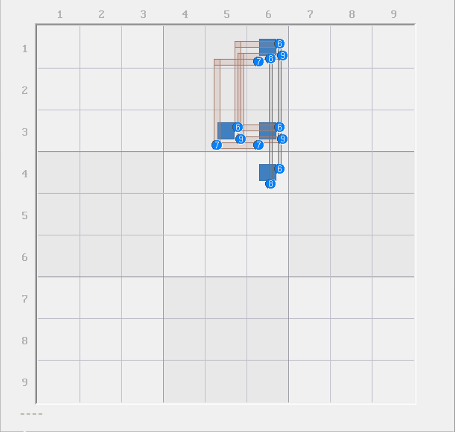
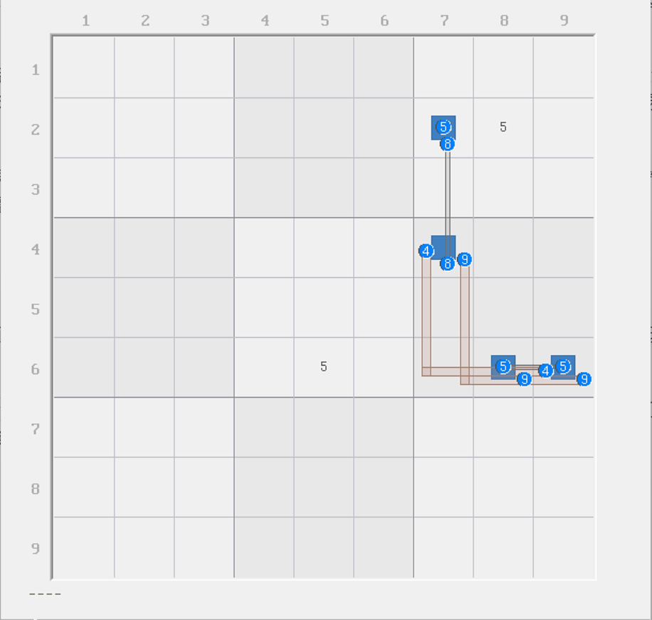

# 虚拟区域

在学习内容之前，我们有必要介绍新的定义类型：**虚拟区域**（Virtual Set）。

一个虚拟区域指的是，通过其他技巧结构推算可得的一组候选数，即使他们从位置关系上没有任何关系，但仍具有强弱区域类似的规则。

## 虚拟强区域 

### 引例 

<figure><figcaption>
虚拟强区域
</figcaption></figure>

如图所示。这是一个基础的伪数组结构，不过我们换了个画法——用秩的视角。

我们再次使用秩理论的视角去看它。我们可以看到的是，数字 6、7、8、9 四个数字在四个单元格里出现，只有数字 6 会有跨区出现的可能。换言之，6 是唯一一个可以出现两次的数，而 7、8、9 最多只能出现一次。

按照秩理论的话，6 有两个弱区域构成，7、8、9 各有一个弱区域构成；而结构四个单元格构成四个强区域，所以是一个 5 个弱区域、4 个强区域的特殊结构，而此时 `r13c6(6)` 是作为弱三元组存在。

从秩的角度上理解，因为有 5 个弱区域和 4 个强区域，而有弱三元组存在，所以我们需要分析占位状态。之前说过，我们可以利用之前强行将这个结果当成秩的思维去理解它：虽然我们知道 5 和 4 不能直接相减，但我们可以从数值上证明出矛盾。由于弱三元组同时消失（都不占位）后，所有候选数均为精确覆盖的同时，强区域一个没少。所以弱区域数量会少 2 个单位，但强区域数量不变。于是，1 的结果会变为 -1，且这个 -1 代表的是精确覆盖情况下的弱减去强的结果，所以这个数就是余下的结构的秩，而 -1 又暗示了这个余下结构造成矛盾。

这说明什么？这说明两个弱三元组不能同时都不占位。这是我们通过秩去理解的结果。不过，就只有这个结论吗？不是的。

### 强区域定义推广 

之前的强区域我们知道一点的是，由于强区域要么是一个单元格，要么是一整个行列宫，所以这些被选择出来的候选数之间显然是无法同真的。换言之，按照弱区域的互补定义的话，弱区域是最多只能填一次，那么强区域理应被定义为“最少填一次”。可问题是，强区域天生的结构长相就无法允许它填两次及以上，所以只能规定成填入恰好一次，故这是两者定义上不对称的地方。

但是，请你仔细看上面的结构。如果我们把这 4 个 6 强行算成强区域呢？它里面能一个 6 都不填吗？这显然是不能的，因为前面我们说过了，四个 6 里都不填暗含了“弱三元组 `r13c6(6)` 不占位”这个情况，而这个情况一定造成矛盾，所以四个 6 也就不可能都不填。所以，这四个 6 看成一起的话，那么它至少填 1 次 6、最多填两次 6。

从这个角度来看，它似乎符合强区域的定义，即使强区域天生定义不和弱区域对称。那么我们现在就让定义推广成对称的样子：

* **当任意一组候选数里，至少存在一个数为真，则这一组候选数构成一个强区域。**
* **当任意一组候选数里，最多存在一个数为真，则这一组候选数构成一个弱区域。**

这个定义很关键，这甚至派生出了一个新的秩理论的理解视角。这便是下一篇内容里要介绍的内容。不过现在我要继续把内容说完。先继续看这里。

我们把这里四个候选数 `{r134c6, r3c5}(6)` 也称为一个强区域，一个推广了定义之后才有的强区域。我们也称这个新构造出来的强区域为**虚拟强区域**（Virtual Truth）。

> 需要注意的是，当如果遇到虚拟强区域时，由于定义变为“至少一次”而非“只能一次”，因此在可能造成多次填数时的时候需要小心计算总可填次数（可能并非定值）。不过，之后的若干例子考虑到教程的学习难度，暂时还都不会涉及复杂的次数计算，所以暂时不用太担心。但是，还请留意此点。

## 虚拟弱区域 

### 引例 

<figure><figcaption>
虚拟弱区域
</figcaption></figure>

如图所示。这还是一个伪数组，不过长得不太一样。这不重要。

我们仔细观察两处没有任何强弱区域连接的孤立候选数 `r2c8(5)` 和 `r6c5(5)`。如果这两个候选数同时为真会如何？由于目前 `r24c7` 和 `r6c89` 四个单元格只有 4、5、8、9 四种不同的数字，而且除了 5 以外都还只能出现最多一次，所以 5 非常关键：它也必须最少出现一次。

那么从这个视角来说的话，外部的 `r2c8(5)` 和 `r6c5(5)` 就无法同真了。因为同真之后，他们会直接排除掉伪数组里的全部 5 的可填位置，这使得结构直接少一个数字，显然 4、8、9 是放不满四个单元格的（毕竟刚刚我们就知道了，这三个数最多都只能填一个）。所以，这肯定会造成矛盾。

因此，这两个 5 不同真。那么既然它俩不同真，那么我们可以把它俩视为一个整体，和前面虚拟强区域一样。不过，这次我们发现，这两个 5 是不同真，也就是不能同时填两次，那也就是最多一次。这符合弱区域的定义，因此我们将这两个候选数 `{r2c8, r6c5}(5)` 看成一个**虚拟弱区域**（Virtual Link）。

好了。这就是我想说的。下一篇内容我们就来学习如何使用好虚拟区域。
