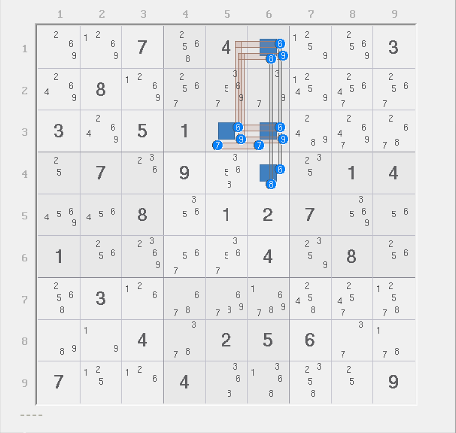
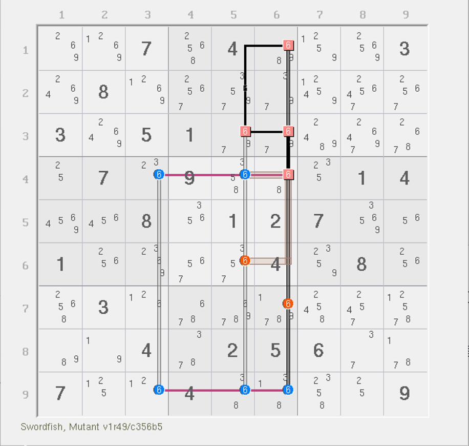
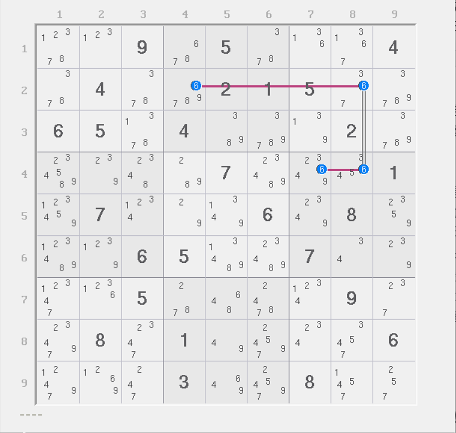
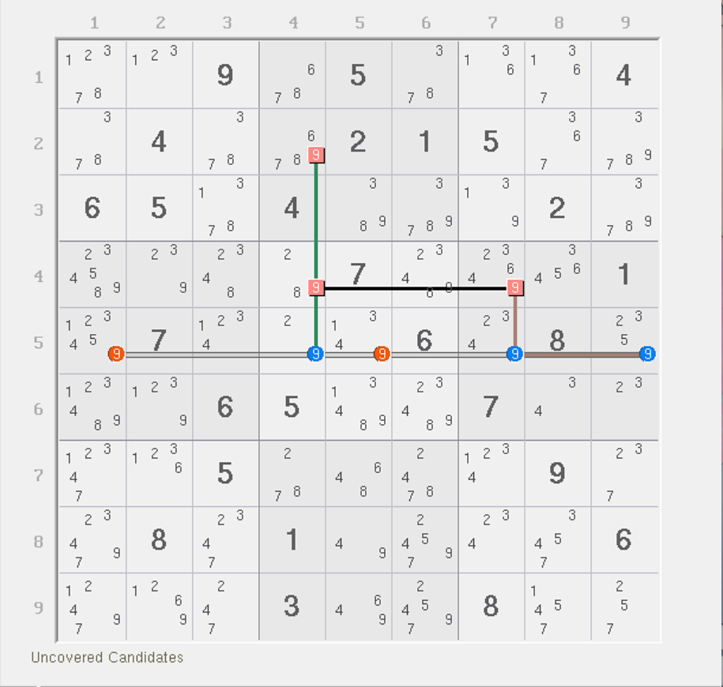
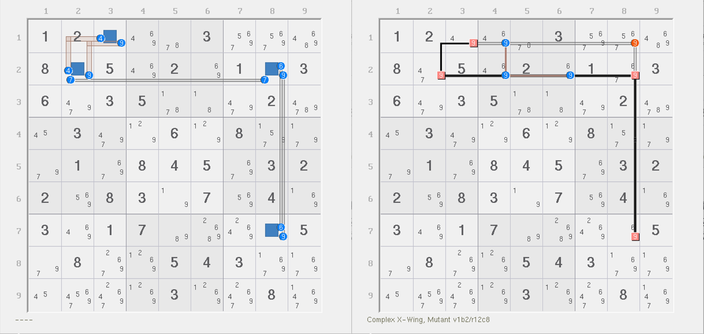
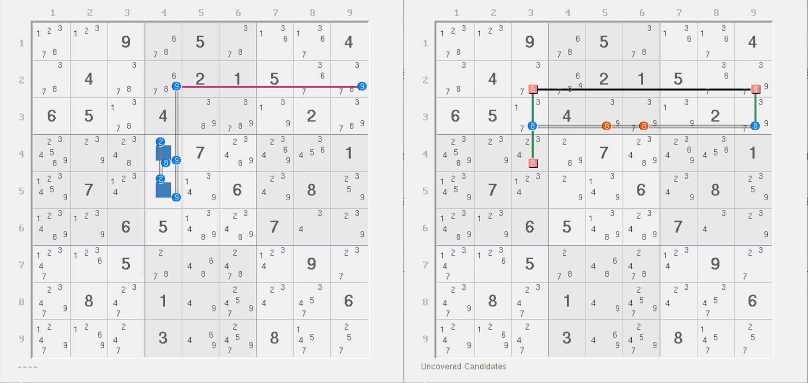
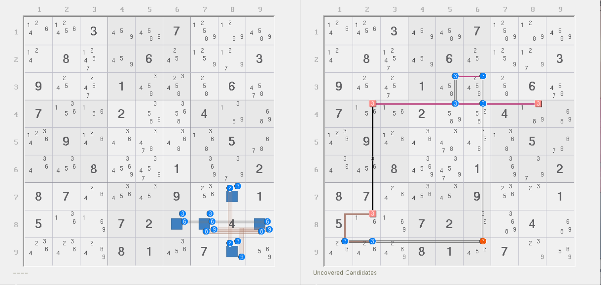
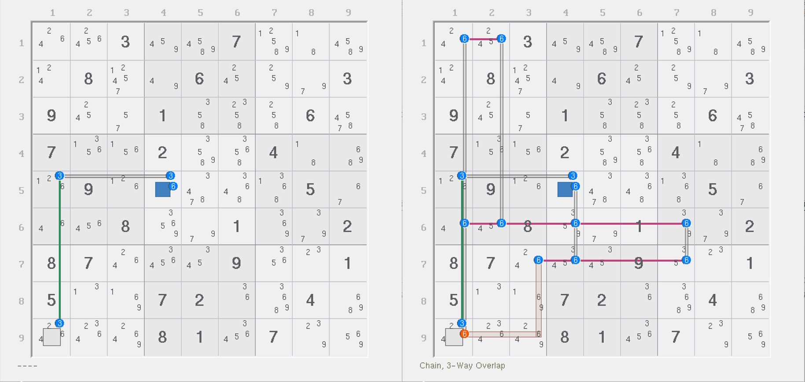
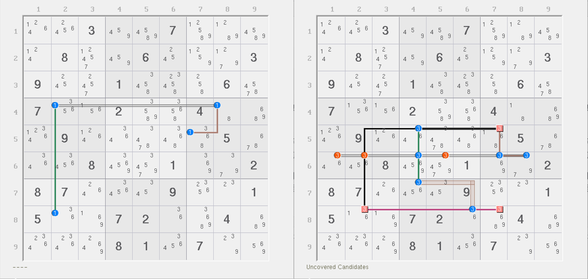

# 解鱼的基本推理

前面我们介绍了虚拟区域的概念。下面我们来看如何将其使用到结构里去。

## 强区域解鱼 <a href="#jye-fish-with-virtual-truth" id="jye-fish-with-virtual-truth"></a>

<figure><figcaption><p>伪数组构造虚拟强区域</p></figcaption></figure>

如图所示。这是一个伪数组。从伪数组的视角来看，`r2c6(6)` 是可以直接通过伪数组就可以删的，所以我直接删掉它了，因为它不是下面我要说的东西。

显然，这个结构里的所有四个数字 6 构成一个强区域，所以我们提取此强区域，于是就有下面这个结构：

<figure><figcaption><p>强区域解鱼</p></figcaption></figure>

如图所示。我们将图中实线黑色线条组看成是一个虚拟区域。数一下它的强弱区域数量。强区域数量是 3 个，弱区域是 4 个。

如果这个时候我们用秩理论来看，`r4c6(6)` 同时被两个强区域和两个弱区域覆盖，而 `r4c5(6)` 则被两个弱区域和一个强区域覆盖。这样数起来判断会比较复杂，所以我们用鱼的视角来看。

鱼的强区域是虚拟区域和 `r49` 这三个，弱区域是 `c356` 这三个。这样的话，`r4c6` 因为属于两个强区域的交点，所以它按鱼的定义是可以算成内鱼鳍的。而 `r4c5(6)` 这个候选数此时就不用再去特殊处理了。讨论内鱼鳍的真假性：

* 如果内鱼鳍为真，则可按排除删除所在行列宫里其余位置的 6；
* 如果内鱼鳍为假，则没有任何一个强区域里包含重叠位置。按秩理论的说辞就是精确覆盖，而按鱼的视角来看，这就直接退化为了一个宫内鱼。所以删数就是三个弱区域 `c356` 上不是结构的其余位置的候选数 6。

将两者联立起来可以得到，`r6c5(6)` 和 `r7c6(6)` 是可以删数的。另外，从鱼的视角来看，`r2c6(6)` 照样能删，只是它可以优先被伪数组删掉。

我们把利用虚拟区域构造出来的新的复杂鱼结构称为**解鱼**（Jye's Fish 或 Skewed Fish）。这个思想虽然其实早就有了，不过好在被中国的数独玩家“解素商”（昵称）整理总结出完整的使用方式，这里则直接沿用了玩家本人对此思路的整理和命名。

> 虽然本人使用的名称“解鱼”的“解”指的是昵称里的这个“解”字，不过在该技巧里，它体现的是将鱼结构化解为强弱区域的秩理论可推算的范畴，有“解决”、“解释”、“化解”、“求解”的含义，更类似数学上经常用到的“解三角形”的“解”的含义，属于一字多义，怎么理解都符合这个技巧的推算过程和思想，所以我个人非常喜欢这个名称。
>
> 另外，解鱼的其中一个英文名 Skewed Fish 来自于**对角线数独**（Sudoku X 或 Diagonal Sudoku）里的鱼技巧。对角线数独是变型数独类型，它新增了两条对角线作为额外的限制——也需要包含完整的一套 1 到 9。而因为对角线作为新的限制条件，所以鱼结构只要利用了对角线作为强区域的约束条件的话，这种鱼就称为 Skewed Fish。因为此鱼技巧拓展了强区域的类型，而这一点和解鱼技巧的思维如出一辙，所以英文名也沿用了此说法。

另外，图中为 `6c6` 涂上了零秩区域的配色。请自己思考一下为什么 `6c6` 是零秩区域。

## 弱区域解鱼 <a href="#jye-fish-virtual-link" id="jye-fish-virtual-link"></a>

利用虚拟弱区域的解鱼也挺常见的，不过稍微和直接使用和构造有所不同。

<figure><figcaption><p>链构造虚拟弱区域</p></figcaption></figure>

如图所示。这个是一个不能用来删数的链结构。

因为头尾一个是 `r2c4(6)` 一个是 `r4c7(6)`，看似没有删数，但实际上我们可以利用构造弱区域的方式让这个链有别的用法。我们观察这两个单元格。如果我们让 `r2c4` 和 `r4c7` 同时填 9，是不是链就矛盾了？因为两个 9 同真之后，链的两头 6 就会同时消失。而我们知道链理论有个重要结论是，链的头尾至少有一个数是为真的。如果我们让 9 同真，这两个 6 就无法保证至少一个为真，所以就矛盾了。

别急。我们现在知道 `r2c4(9)` 和 `r4c7(9)` 是不同真的，而数独规则可以直接得到 `r2c4(9)` 和 `r4c4(9)` 不能同真，以及 `r4c4(9)` 和 `r4c7(9)` 不同真的结论，所以三者两两不同真。这是不是就意味着他们三个候选数整体就是一个弱区域（即整体只能最多有一个为真）？是的。这非常神奇。于是，我们借用此点，可以构造一个鱼结构出来：

<figure><figcaption><p>弱区域解鱼</p></figcaption></figure>

如图所示。这是一个解鱼结构，由两个强区域（`c4` 和 `b6`）和两个弱区域（虚拟弱区域和 `r5`），因为所有候选数都是精确覆盖，因此直接按鱼就可以得到它的零秩结构，因此所有弱区域均可用于删数。不过要注意的是，这三个弱区域上的 9 并没有删数，因为两两不同真并不能得到什么有效信息：因为你不知道到底具体是哪里可以为真，反映到题里就是无法确定具体是哪一个行列宫或单元格里有固定结论。

## 一些例子 <a href="#some-examples" id="some-examples"></a>

下面我们来看一些例子。

### 例子 1：强区域解鱼 <a href="#example-1" id="example-1"></a>

<figure><figcaption><p>例子 1</p></figcaption></figure>

如图所示。左图是一个 ALS-XZ 结构，可以得到四个 9 不同假的结论。其本质是通过 ALS-XZ 得到链：

```
9r27c8=7r2c8-7r2c2=9r1c3|r2c2
```

因为链的结论是头尾不同假，所以整体来看就是两个区块节点不同假，即四个候选数整体不同假，故为一个虚拟强区域，于是就有了右图的结论。

右图是一个鱼结构，强区域是 2 个，弱区域 3 个，是一个鳍鱼。其中，`r1c3(9)` 和 `r7c8(9)` 都是鱼鳍。

* 如果 `r1c3 = 9`，则可删除 `r1c8(9)`；
* 如果 `r7c8 = 9`，则也可以删除 `r1c8(9)`；
* 如果鱼鳍 `r1c3` 和 `r7c8` 均不填 9，则余下 5 个候选数可被强区域 `9b2` 和虚拟强区域（2 个强区域），和 `9r12`（2 个弱区域）精确覆盖，故整体是一个二阶鱼，弱区域都可以用于删数，`r1c8(9)` 仍然可以删除。

所以，这个鱼结构的结论是 `r1c8 <> 9`。

### 例子 2：弱区域解鱼 <a href="#example-2" id="example-2"></a>

<figure><figcaption><p>例子 2</p></figcaption></figure>

如图所示。左图是一个链：

```
8r4c4=9r45c4-9r2c4=9r2c9
```

因为两头 `r4c4(8)` 和 `r2c9(9)` 不同假，所以我们可以构造一个不同真的关系：`r4c3(8)` 和 `r2c9(8)`。注意，这里是图上没标记的数字 `r4c3(8)`，而不是图上标了的那个 `r4c4(8)`，不要看错了。

因为 `r4c3(8)` 和 `r2c3(8)` 不同真，`r2c3(8)` 又和 `r2c9(8)` 不同真，再加上刚才我们才得到的 `r4c3(8)` 和 `r2c9(8)` 不同真的结论，所以这三个候选数构成一个“不同真三角”，和前文一样，三个数完整地算成一个弱区域。于是就有了右图。

右图是一个二阶鱼，强区域是 `8c39`，弱区域是虚拟弱区域和 `8r3` 就可以精确覆盖，所以可直接按鱼删数，得到 `r3c56 <> 8` 的结论。

### 例子 3：利用秩为负证明删数的解鱼 <a href="#example-3" id="example-3"></a>

<figure><figcaption><p>例子 3</p></figcaption></figure>

如图所示。左图是一个伪数组，可构造出 `r4c8(3)` 和 `r8c2(3)` 不同真。结合 `r4c2(3)` 可以得到三个数两两不同真，故形成弱区域。

于是就有图上的鱼，强区域是 3 个（`3r34` 和 `3b7`），弱区域是 4 个（虚拟弱区域、`3c56` 和 `3r9`）。到这个地方反而不好看了，这个时候我们可以用一下秩结合一下。

如果 `r34c6(3)` 和 `r9c12(3)` 同为假（或者说 `r9c6 = 3` 的话）会如何？这四个候选数同假则余下结构只有 5 个候选数。保留强区域数量还有 3 个，但弱区域少了两个，只剩下 2 个了。看下余下的结构，都是精确覆盖的。所以，秩变为 -1 直接造成矛盾。所以，删数是 `r9c6 <> 3`。

> 额外需要注意这个题的 `r4c5(3)` 看起来是在 `r4` 上的，但是它在强区域里会被统计到 `3r4` 里，弱区域会被统计到 `3c5` 里，虚拟弱区域是不计算它的，因为虚拟弱区域只有三个候选数，没有它的席位。所以，`r4c5(3)` 不是弱三元组，不要看错了，造成推理错误。

### 例子 4：利用造成互斥证明删数的解鱼 <a href="#example-4" id="example-4"></a>

这个题因为 XSudo 标注不出来，所以我们换一个画法。

<figure><figcaption><p>例子 4</p></figcaption></figure>

如图所示。左图是一个链：

```
3r9c1=3r5c1-(3=6)r5c4
```

因此我们可以知道，当 `r9c1 = 6` 的时候可以得到 `r5c4(6)` 为真。但实际上 `r5c4(6)` 和 `r9c1(6)` 是不能同真的。难道这是假象吗？

不是的。这需要依赖右图的逻辑。右图里展示了一个鱼结构，强区域是 `6r167`，弱区域是 `6c1247` 和 `6b7`。数一下，强区域 3 个，弱区域却有 5 个。肯定是不能直接用的。

不过也没事。倘若让 `r5c4(6)` 和 `r9c1(6)` 同真之后，`r67c4(6)` 被 `r5c4(6)` 排除，`r16c1(6)` 和 `r7c3(6)` 被 `r9c1(6)` 排除，余下的所有数字均为精确覆盖的同时，强区域数量仍然未发生变动，但弱区域少了 3 个（`6c1`、`6b7` 和 `6c4`），变为 2 个，于是秩结果为负数，故结构矛盾。所以，实际上这个 `r9c1(6)` 和 `r5c4(6)` 不能同真。

左图我们可以得到 `r9c1 = 6` 的时候 `r5c4 = 6`，而右图我们可以得到 `r9c1 = 6` 的时候 `r5c4 <> 6`，同一个数引发了两种互斥的结论，这只能说明，`r9c1 = 6` 假设就是有问题的。所以，`r9c1 <> 6` 是这个题的结论。

### 例子 5：不算难的小练习 <a href="#example-5" id="example-5"></a>

<figure><figcaption><p>例子 5</p></figcaption></figure>

如图所示。这个例子就自己看了。
